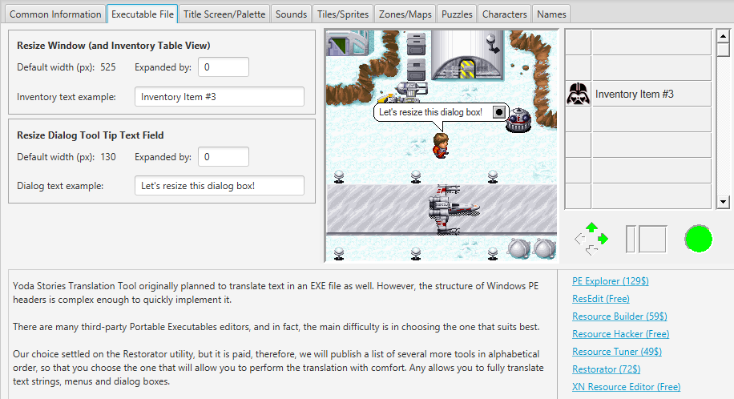

# Yoda Stories Translation Tool

Utility for translation and comparison the Yoda Stories game.
 
* Editing graphics, zones and tiles
* Save text in DOCX format for easy translation
* Ability to change window dimensions and font size 

Утилита для перевода и исследования игры Yoda Stories.
 
* Редактирование графики, зон и тайлов
* Сохранение текста в DOCX формате для удобства перевода
* Возможность менять габариты окна и размер шрифта

* [Read Yoda Stories Translation Guide](documents/translation-guide.md)
* [Руководство по переводу Yoda Stories](documents/ru/translation-guide.md)
* [An original Delphi version](https://github.com/LeonisX/YExplorer)

Powered with [Kaitai structure format from Cyco](https://github.com/cyco/kaitai_struct_formats/blob/add-yodesk/game/yodesk.ksy).

Uses modified code from http://image4j.sourceforge.net project.

## Docs

* [Introduction](documents/introduction.md)
* [Versions comparison summary](documents/summary.md)

### Releases

* [USA v1.0](documents/usa-10.md)
* [USA v1.1](documents/usa-11.md)
* [USA v1.2](documents/usa-12.md)
* [Demo version](documents/demo.md)
* [Patch 6](documents/patch6.md)
* [United Kingdom](documents/uk.md)
* [Australia](documents/australia.md)
* [France](documents/france.md)
* [Germany](documents/germany.md)
* [Netherlands](documents/netherlands.md)
* [Italy](documents/italy.md)
* [Spain](documents/spain.md)
* [Brazil](documents/brazil.md)
* [Japan](documents/japan.md)
* [Taiwan](documents/taiwan.md)
* [Korea](documents/korea.md)
* [Russia](documents/russia.md)
* [Game Boy](documents/gameboy.md)

### Boxes, disks

* [Boxes: front side](documents/box-front.md)
* [Boxes: back side](documents/box-back.md)
* [Jewel Cases: front side](documents/jewel-case-front.md)
* [Jewel Cases: back side](documents/jewel-case-back.md)
* [Disks: front side](documents/disk-front.md)

### Game

* [Yoda Stories rules](documents/rules.md)
* [Compatibility issues](documents/compatibility.md)
* [In-game dialogs](documents/dialogs.md)
* [Color palette](documents/color-palette.md)
* [INI file](documents/ini.md)
* [Cheats, tips, secrets](documents/cheats.md)
* [Credits](documents/credits.md)

### YODESK.DTA

* [Format](documents/dta-format.md)
* [VERS](documents/dta-vers.md)
* [STUP](documents/dta-stup.md)
* [SNDS](documents/dta-snds.md)

### Download

* [Download](documents/download.md)

## Other Yoda Stories / Desktop Adventures solutions

* https://www.webfun.io/
* https://github.com/cyco/WebFun
* https://github.com/cyco/deskfun-preview
* https://github.com/kaitai-io/kaitai_struct_formats/pull/403
* https://github.com/a-kr/jsyoda
* https://github.com/mikepthomas/yoda-stories
* https://github.com/shinyquagsire23/DesktopAdventures
* https://github.com/IceReaper/DesktopAdventuresToolkit
* https://github.com/digitall/scummvm-deskadv
* https://github.com/auselen/SWYodaStories
* https://github.com/Archenoth/yodesk-notes
* https://github.com/kirbysayshi/yoda-stories-docker

## Other links and resources

* [Resources](documents/resources.md)

## TODO List

* Italy - Resize dialog tool tip text field :(. Also changes inventory font
* France - Resize dialog tool tip text field :(. Also changes inventory font
* Germany - Resize dialog tool tip text field :(
* Spain - Resize dialog tool tip text field :(
* Almost all fails on Resize dialog tool tip text field

* Sounds editor (table: id, name). add, remove, as tiles
* Actions cleaner, visualizer, interpreter
* Dump all secrets (show tiles, ...)
* Release 1.0
* Correct output from different threads - OK/False + task name in logs + dialog
* Zone editor - sticky tiles (not need to drag-drop)
* Resolve all TODO
* When add/delete/replace tiles, gender - CatalogEntry bytes[] don't change. Dump only unchanged data.
* graphics-translation-guide: link to Russian translation

### Other tasks

* Paste from clipboard (good idea)
* Think how to drag-drop from UI from Windows Explorer (Open file)\

(c) Leonis, 2014-2022