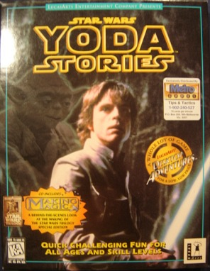

Star Wars - Yoda Stories (Australia) & Making Magic
===================================================

* Region: `Australia`, most likely New Zealand and with a small probability Brunei, Hong Kong, Malaysia, Singapore, Thailand and the Philippines.
* Language: `English`
* Publisher: [`Playcorp PTY. Ltd`](http://web.archive.org/web/19981201201808/http://www.playcorp.com/) (more precisely, a division of [`Metro Games`](http://web.archive.org/web/19981205025924/http://www.metrogames.com.au/))
* Release date: `14.04.1997`
* ACB (Australian Classification Board) rating: `General (G)` (suitable for everyone, content is very mild in impact)

The exact release date is unknown, but it was on April 14 that the game [received an age rating](https://www.classification.gov.au/titles/yoda-stories).

The Metro Games website has links to distributor websites. Information about Yoda Stories could not be found there,
but the design and decoration involuntarily evoke a nostalgic tear.