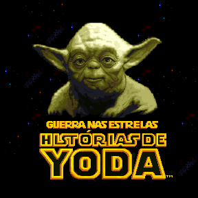

Star Wars - Yoda Stories (Bra) & Making Magic
=============================================

* Оригинальное название: `Guerra nas Estrelas: Histórias de Yoda`
* Регион: `Бразилия`
* Язык: `португальский`
* Издатель: [`BraSoft Produtos de Informatica Ltda`](http://web.archive.org/web/19980214043915/http://www.brasoft.com.br/)
* Дата выпуска: `июнь-июль 1997` года
* Возрастной рейтинг: `отсутствует`
* Стоимость: `37 реалов`

`Guerra nas Estrelas: Historias de Yoda` - единственная версия Yoda Stories из 90-х,
в которой переведено практически всё, включая и название самой игры.
Из-за этого, в частности, данный релиз долгое время не удавалось найти.

Возрастного рейтинга на упаковке нет.

Игру продемонстрировали 04.07.1997 на 11-й выставке `Fenasoft`.

В настоящее время не известно, продавалась ли игра в большой коробке, или в виде обычного jewel case. 

Диск:

* Дата записи: `19.06.1997 11:28:54`
* Volume Space Size (LBA): `328861`
* Volume Identifier: `YODABRAZIL`
* Числа на диске: 0824.04.0 06/97

Игра была готова ещё в мае, поэтому непонятно, чем была вызвана задержка в 1 месяц.

Содержимое диска:

* `Star Wars: Yoda Stories (Brazil)`
* `Star Wars: Making Magic (Brazil) (FA1.04 от 28.01.1997)`
* `Star Wars: Rebel Assault II Demo (Brazil) (DX1.15 от 06.02.1996)`
* Тематические курсоры, иконки, обои и звуковые эффекты для Windows.

`Star Wars - Making Magic` на этом диске тоже отличается от предыдущих.
Интерфейс полностью переведён, в остальном же энциклопедия не отличается от Испанской,
за исключением языка и ссылки на домашний сайт. Версия демки игры `Rebel Assault II` так же уникальная.

The Brazil version vs Spanish version
-------------------------------------

We can say that this is the most complete translation of Yoda Stories, 
not counting the modern translation of the game into Russian by Leonis.

`Guerra nas Estrelas: Histórias de Yoda` is the only version from the 90s 
that even translated the title of the game on the loading screen and Zone 0.
However, the quality of the graphics in the title screen is very mediocre. 
In addition, the translators have managed to modify the background.
There are no stars under the letter A in the word YODA, but star clusters 
have been added to the right of the word "DE" and to the left of Yoda's ear.

Language differences aside, these versions are otherwise identical.

**Tiles**:

So many tiles were not required even in the [French version](france.md), this is a real record!
The developers did not translate the original splash screen tiles, but added new ones.

* Changed: 2090-2108
* New: 2123-2152

These tiles used in zones `0, 76, 77`.

**Zone 0**

 

Apart from the text, three of these tiles have been replaced:

* [1; 3]: `1084` -> `1077`

 

* [2; 8]: `1084` -> `1079`

 

* [3; 8]: `1084` -> `1078`

 

**Zone 3**

Three changes made for an unknown purpose. The background became more heterogeneous.

On the left side is the original sprite, on the right is its replacement:

 

* [10; 4]: 0 -> 5
* [11; 5]: 0 -> 5
* [11; 10]: 0 -> 5

**Zones 76-77**:

 

We will not even pay attention to differences in the structure of TGEN.
