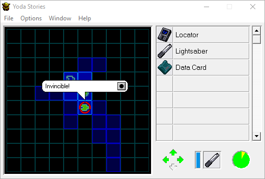
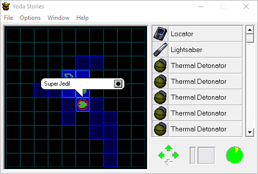

Cheats and secrets
==================

There are only two cheats available in the game, which can be performed from the `Locator` screen.

When entering these passwords, remember that this screen should be opened with the mouse by clicking on the `Locator`.
If you open the screen with the "`L`" key, then the extra letter will be taken into account as part of the password and nothing will work.

* `goyoda`: invincibility
* `gojedi`: get five `Thermal Detonators`, as well as `Blaster Rifle`, `Blaster` and `THE FORCE`.

 

Most cheat sites are rife with misinformation about cheat codes
such as `BLASTERS` and `OBJECTS` that supposedly fill the inventory with all items.
The game executable doesn't even mention these passwords,
it's just a myth, and we'd be interested to know who ran it.

Cheat dialogs
--------------

The game has several [cheat dialog windows](dialogs.md),
but in the final version they are all non-working.

However, it remains possible to activate the debug window.

`Dialog 191` is opened by the key combination `Ctrl+F8`.
It shows the current zone number, coordinates and `E` value.

Unused collision metadata
-------------------------

On map 0 (opening cut scene), Yoda's head, body, and the text "Yoda Stories" are obstacles, like walls.
But they go unnoticed due to the fact that the game runs the map's `IACT` script on a startup and then exits the map, preventing the player from exploring it.
