Yoda Stories Demo Version Comparison
===============================

1.1 vs Demo version
-------------------

Самое время посмотреть на то, что именно вырезали из демо-версии Yoda Stories.
Различий достаточно много поэтому мы вероятно опустим несколько наименее значимых.

Нельзя сохраняться и загружаться.

* Executable file
* Startup screen
* Tiles
* Zones
* Puzzles
* Characters

**Executable file**

Modified About dialog.


Yoda(tm) Stories Demo

Deactivated menu items:

* Replay Story
* Load World
* Save World
* World Control
* S&tatistics

Причём, даже если их активировать, то игра в процессе загрузки отключит их снова.


**Startup screen**

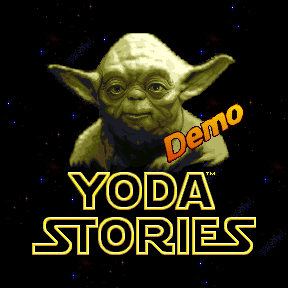

Надпись "Demo".

**Tiles**

Тайлы - очищены тайлы, связанные с пустыней и лесом.
Фактически тут один уровень во льдах. Neshtab.

Так что, даже если восстановить полную функциональность, большинство уровней будут выглядеть голыми и будут непроходимыми.

* 0-6
* 8-17
* 19-84
* 86-111
* 115-149
* 151-154
* 156-162
* 235-250
* 281-284
* 311-343
* 345-350
* 356
* 364-372
* 642-647
* 879-897
* 1184-1185
* 1188-1195
* 1215-1217
* 1282-1283
* 1309
* 1344-1347
* 1353
* 1357-1359
* 1399-1402
* 1451-1473
* 1484-1517
* 1519-1539
* 1581-1595
* 1619-1624
* 1631-1645
* 1663-1664
* 1667-1672
* 1756-1760
* 1813-1814
* 1872-1879
* 1890-1893
* 2059-2074

Заменены тайлы:

* 855
* 872
* 874-875
* 877-878
* 902
* 961
* 1170
* 2121-2122 (Demo)

Добавлены тайлы:

* 2123-2127 (Demo)

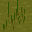

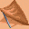
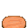 original


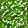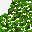


 demo


**Zones**

Поскольку в демо версии должны быть недоступны планеты с пустынями и джунглями, и были удалены тайлы, связанные с ними,
то из всех соответствующих зон эти тайлы были так же удалены (заменены на прозрачные тайлы).

Так же стиранию подверглась часть снежных локаций.

**Zone 0**: +1 instruction for Action 0


Поскольку фраза "Demo" выводится на верхнем слое, её нижний тайл убирается во время полёта X-Wing.

`remove-tile: 5 5 2 0 0 ""`

**Zones 76-77**: добавлено Demo.

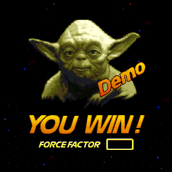 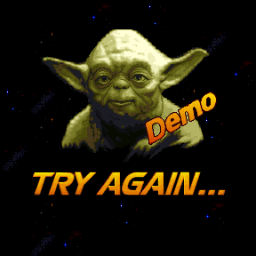

**Zones 93-96**: убраны все мини-квесты от Йоды, сцена его похищения.

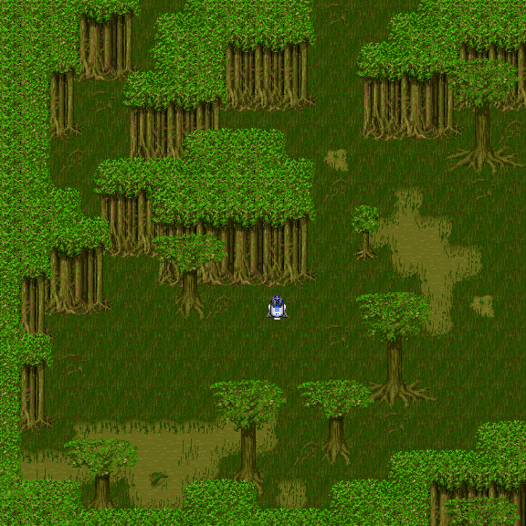   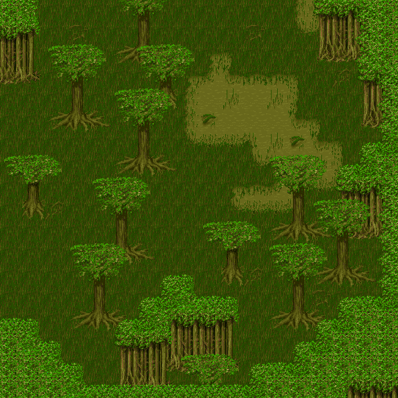

Убрана фраза: Dagobah! Yoda must be around here somewhere. I better find him and see what's on his mind...

izx4._unnamed2: 1 -> 0

**Zone 115**: removed DROP_ITEM [12; 11] enabled: 1; argument: 1198


Странное решение, поскольку, это пустынная локация.

**Zone 146**:


В этой локации квестовые предметы никогда не появятся.

**Zone 151**: космопорт.

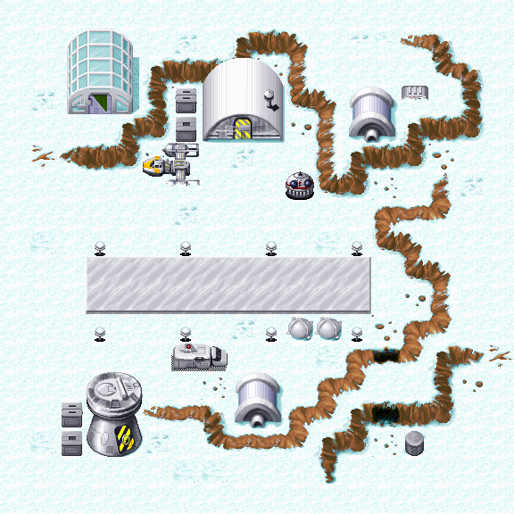

This is the tiny Spaceport on Neshtab. In a real game, I might find myself in the DESERT or a RAIN FOREST as easily as here, but the DEMO is all ICE, and there's only one ending...

Новые действия, выполняемые по прилёту:

```
Action 16
if
    standing-on: 8 11 997 28789 19488
then
    remove-tile: 8 10 1 21280 28257 ""
    remove-tile: 9 10 1 109 29772 ""
    remove-tile: 7 11 1 109 32412 ""
    remove-tile: 8 12 1 0 0 ""
    remove-tile: 9 12 1 0 0 ""
    set-rect-needs-display: 7 10 9 12 20500 ""
    speak-hero: 0 0 0 0 0 "This is the tiny Spaceport on Neshtab. In a real game, I might find myself in the DESERT or a RAIN FOREST as easily as here, but the DEMO is all ICE, and there's only one ending..."
    disable-action: 8 0 25924 28525 24916 ""
```

```
Action 18
if
    enter-by-plane: 321 0 0 0 0
    hero-is-at: 8 11 0 24964 321
then
    place-tile: 8 10 1 355 0 ""
    place-tile: 9 10 1 355 30972 ""
    place-tile: 7 11 1 355 0 ""
    place-tile: 8 12 1 355 0 ""
    place-tile: 9 12 1 355 30309 ""
    set-rect-needs-display: 7 10 9 12 8249 ""
    disable-action: 0 0 0 0 31164 ""
```

izx4._unnamed2: 1 -> 0

Убран сугроб: [11; 1]

**Zone 152**:

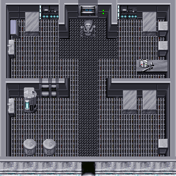

Greetings, sir! Welcome to our DEMO. If you need my services, please don't hesitate to visit."

Greetings, sir! Welcome to our DEMO!
I'm a MEDICAL DROID, General Practitioner Class 2-1B, fully qualified to treat all injuries and wounds. If you need my services, please don't hesitate to visit.
Meanwhile, this is dangerous country, so stay on the lookout for WEAPONS! You can never have too many.
I like my patients well- equipped... that way they stay healthy, and I can relax."

Greetings, sir! Welcome to our DEMO!

**Zone 160**:

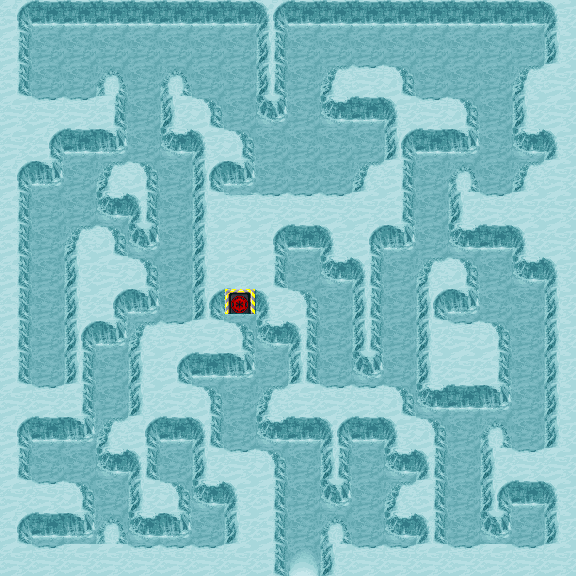

izx4._unnamed2: 1 -> 0

**Zone 176**:


izx4._unnamed2: 0 -> 1

**Zone 203**:


izx4._unnamed2: 1 -> 0

**Zone 204**:

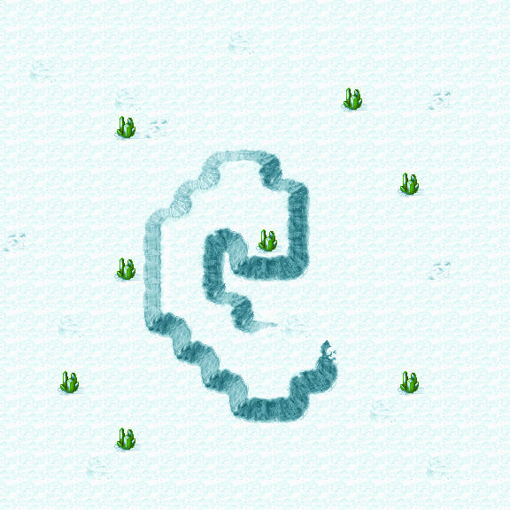

Type: EMPTY -> FIND

Modified hotspot: DROP_QUEST_ITEM [9; 8] enabled: 1; argument: 65535

**Zone 210**:

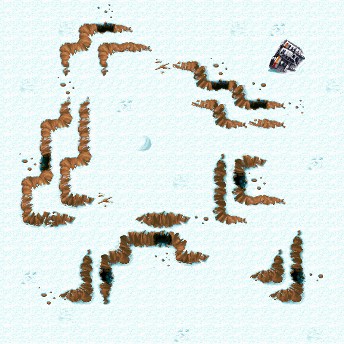

Removed all provided items.

izx4._unnamed2: 1 -> 0

**Zone 246**:


izx4._unnamed2: 1 -> 0

**Zone 258**:


Removed all required and provided items.

**Zone 263**:

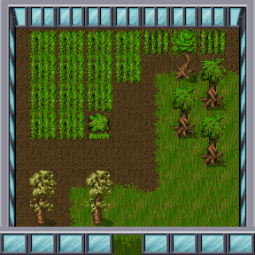

This isn't the real game. It's only a DEMO.

izx4._unnamed2: 1 -> 0

**Zone 264**:

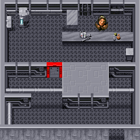

izx4._unnamed2: 1 -> 0

If you want WEAPONS or MEDICINE, drop something on the table here, and I'll give you a DEMO of how the system works...

Nice junk. Say, if you enjoy this DEMO, why not buy the real game? Then you can thaw out in some warmer terrain...

**Zone 294**:

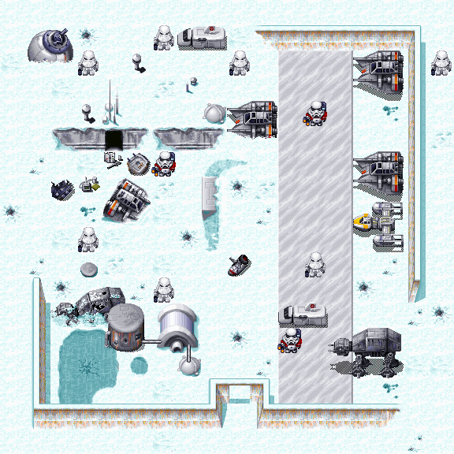

Removed all provided items.

**Zone 316**:

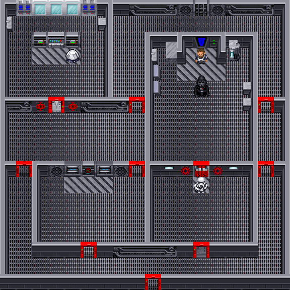

Небольшое изменение проверки - убрано условие `tile-at-is: 444 4 3 1 12346`. Зачем? Shield Generator же есть на карте.
Если эта проверка успешная, то далее Люк говорит: "Hey! that's the ship's shield generator over there... If I could disable the thing, it might cause a distraction..."


**Zone 317**:

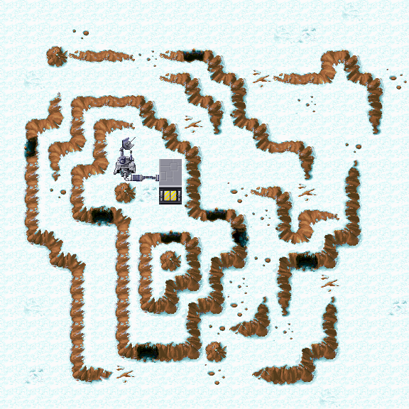

izx4._unnamed2: 1 -> 0

**Zone 326**:


izx4._unnamed2: 1 -> 0

**Zone 327**:

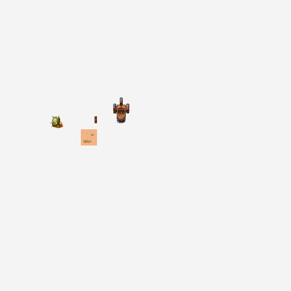

izx4._unnamed2: 1 -> 0

**Zone 328**:

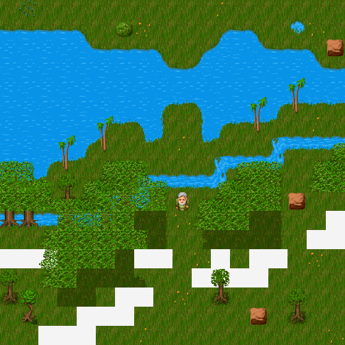

izx4._unnamed2: 1 -> 0

**Zone 336**:


izx4._unnamed2: 1 -> 0

Playing the DEMO of LucasArts' new Desktop Adventure, I see. Well, we're peaceful snow farmers. Go away!

**Zone 385**:


Отключено завершение квеста по прилёту.

**Zone 407**:


Отключено завершение квеста.

`mark-as-solved: 0 0 0 0 0 ""`

**Zone 462**:

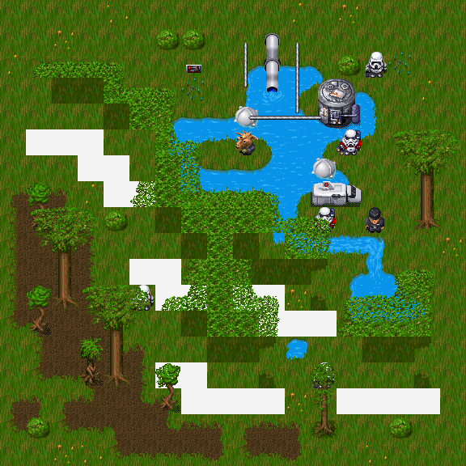

Эта зона не может появиться в игре, однако, текст в ней немного отличается от финальной версии:

Было:

* Instruction 0: Good work, stranger! For rescuing me, I'll show you where I hid the ¥ that I stole from those stormtroopers!
* Instruction 1: All right... where?
* Instruction 2: Just follow me...

Стало:

* Instruction 0: Good work, stranger! What can I possibly give you in return for rescuing me?
* Instruction 1: You mentioned something about a ¥...?
* Instruction 2: That's right; I did. Well, follow me...

**Zone 465**:


Removed all required items.

**Zone 489**:

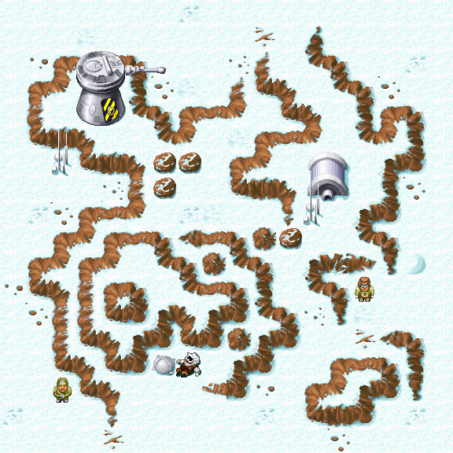

Added one required item: 

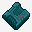

**Zone 535**:

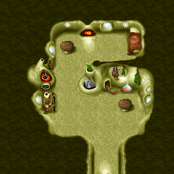

Хижина Йоды

Убраны все мини-квесты и Фетт

izx4._unnamed2: 1 -> 0


**Zone 596**:

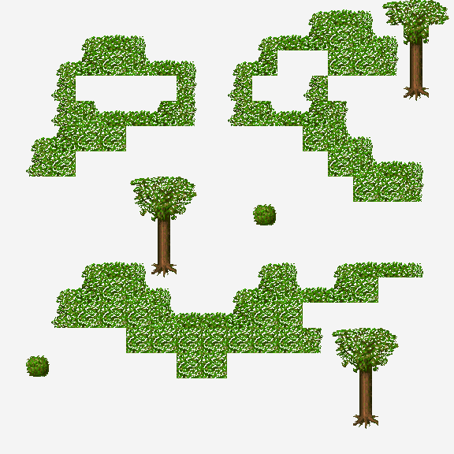

Ещё одна лесная зона.

move-hero-to: 10 8 0 0 0 ""

заменено на 

change-zone: 595 0 0 0 0 ""

move-hero-to: 10 8 12576 8224 -26528 ""

change-zone: 595 8 8 0 30561 ""

**Zone 605**:

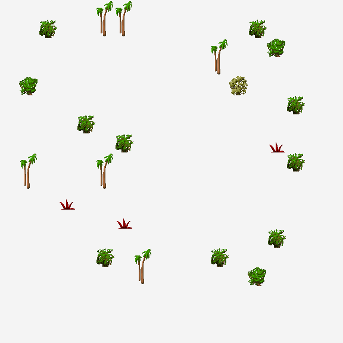

Whoa... dark in this hovel. And what's that scuttling noise???"

Whoa... dark in this hovel. And what's that scuttling noise???."

**Zone 642**:

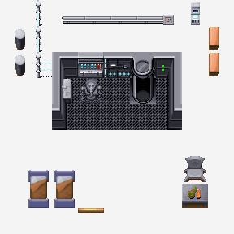

Очередная невидимая зона. Место, где Люк приходит в себя после того, как его подбили истребители.
В демо-версии она выглядит достаточно сырой, в финале её достаточно сильно переработали.

Удалена половина действий, остальные переработаны.

**Puzzle 108**:

Было:

Luke! Time it is for your training to advance a step...[CR2]The Empire has set up a HIDDEN FACTORY in the snowy wastes of planet Neshtab, where they are building stormtrooper droids. These robots could tip the balance against the Rebel Alliance.[CR2]Find this factory you must! Destroy it you must! [CR2]Here! Help you finish what you start, this will...

Стало:

Hello! A ripple in the Force I feel... you are playing a DEMO of LucasArts' new Desktop Adventure, mmm? I thought so... fool Yoda you cannot! If you enjoy it, why not buy real game from your local retailer, mmm?[CR2]Now then, Luke! Time to continue your training...[CR2]The Empire has set up a HIDDEN FACTORY in the snowy wastes of planet Neshtab, where they are building combat droids. These robots could tip the balance against the Rebel Alliance.[CR2]Find this factory you must! Destroy it you must! [CR2]Here! Help you finish what you start, this will...

**Characters**:

Tank-Wander

frame1: [2120, 1959, 2120, 2119, 1959, 2120, 1958, 1959] -> [2119, 1959, 2119, 2119, 1959, 2119, 1958, 1959]

Tank-Patrol

frame1: [2120, 1959, 2120, 2119, 1959, 2120, 1958, 1959] -> [2119, 1959, 2119, 2119, 1959, 2119, 1958, 1959]

Зачем это было сделано неясно, но в некоторых зонах эти танки так же поменяли местами.

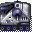 

    