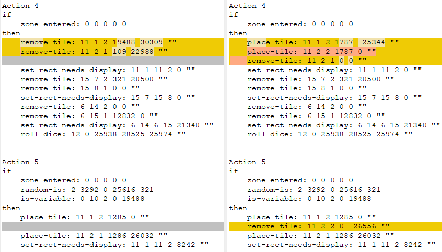
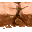
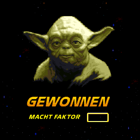

Yoda Stories Version Comparison
===============================

We know and have identified the following versions of the game:

* Star Wars - Yoda Stories (14.02.1997) (Eng) (v1.0)
* Star Wars - Yoda Stories (14.02.1997) (Eng) (v1.0) (Patch v6)
* Star Wars - Yoda Stories (18.02.1997) (Eng) (v1.1)
* Star Wars - Yoda Stories (18.02.1997) (Eng) (Demo)
* **Star Wars - Yoda Stories (10.08.1998) (Eng) (v1.2) (Patch v6)**
* Star Wars - Yoda Stories (22.05.1997) (Spa)
* Star Wars - Yoda Stories (25.06.1997) (Ger)
* Star Wars - Yoda Stories (13.12.2001) (T-Spa_Selva Translators)
* Star Wars - Yoda Stories (12.11.2006) (T-Rus_PRO)
* TODO My translation

They are identified by the checksums of the yodesk.exe and yodesk.dta files.

The release dates don't match the real release dates for the games. These are the dates of the last modification of the game files before it was published.

Please note that version (v1.0) (Patch v6) was not available for sale. This is the result of using the Patch 6
on the first version of the game. By the way, it, as well as the combination with the patch, are the most common versions in Web.

The DTA file from the game version 1.2 completely coincides with the DTA file from the game version 1.0 with the patch applied.

Game version 1.1 is the rarest English-language version. On its basis, a demo version was compiled, which, due to its freeness, is very widespread.

Selva Translators only changed the About screen in the Spanish version of the game.

The Spanish and German versions of the game have all the critical fixes from Patch 6, and if you fix 3 more bytes, then the correct melody will play in the quest locations.

The existence of two more localized versions of the game for France and Italy is known for certain.
If you still have them, please send them to us for study. E-mail: tv-games@mail.ru

Since comparing changes in EXE files is quite time consuming, we will focus our attention on the differences between DTA files.

1.0 vs 1.1
----------

Several differences in zones.

**Zone 151**: Actions 4, 5

It was:

* Hide tile [11; 1; 2] (x, y, z coordinates)
* Hide tile [11; 2; 1]

Became:

* Show tile 1787 at [11; 1; 2] (x, y, z coordinates)
* Show tile 1787 at [11; 2; 2]
* Hide tile [11; 2; 1]


This is a story with a Tauntaun randomly appearing on the right side of the screen.
Nice secret, you can find something in the equipment of that two-legged riding animal.



Changed snowdrifts at the top of the map (pink areas).


**Zone 176**: new Monster 61 [7; 6] loot: 65535; dropsLoot: 0


Added a robot of the R2 series, I do not remember whether something falls from it or not.
Much more interesting is the following fix:

`izx4:_unnamed2: 1 -> 0`

So far, one can only guess what the developers have changed here.

**Zone 203**: new Monster 61 [1; 3] loot: 65535; dropsLoot: 0


Another R2 robot in a snowy location.

Also, in two places, tile 678 was replaced with tile 680, but in fact these files are identical.

 

**Zone 430**: Action 4: fix in a rather long action, specifically in the NPC dialogue:


Invalid Y coordinate of the dialog.


**Zone 535**: New Action 50 conditions: 1; instructions: 3


```
Action 50
if
    placed-item-is: 5 5 1 780 809
then
    play-sound: 0 0 19968 184 0 ""
    remove-item: 809 0 3956 184 0 ""
    speak-npc: 5 5 0 0 0 "Han! Good to see him safe. Friends you cannot forget, mmm?"
```

 

The code is easy enough to understand. Yoda (tile 780) is located at coordinates [5, 5, 1].
If you give Han to him (tile 809), then this tile is removed from the inventory,
and Yoda delivers his speech.


1.1 vs 1.2
----------

* The following zones have been officially fixed: `72, 236, 407, 473, 474, 572`.
* The following zones have actually been fixed : `72, 236, 266, 267, 271, 407, 472, 572`.

Differences found in : Tiles, Zones, Characters.

**Tile 1543**:

The fix is pretty funny, check it out for yourself. Below are the tiles - original, corrected and difference.

  

Easter egg?

**Characters**: changes in the unused part of the character names. This value has a fixed length of 16, that is,
the maximum name length is 15, and the last byte is 0x00.
If the length of the character's name is less than 15, then unused data looks out.
They are ordered and are probably some kind of overwritten data structure. Examples:

```
1F440002000000 804CBE00 -> 1F440002000000 0072BE00
1F440002000000 304DBE00 -> 1F440002000000 B072BE00
```

In the demo version of the game, by the way, the address is much smaller, for example: `207ABD00`.

The only thing that can be added is that the distances between these offsets are 0xB0 (176).
Given that one Character record is 84 bytes long.


**Zone 72**: Action 14: + 1 instruction


The NPC drops the quest item at [10, 12].


**Zone 236**: There was a problem with the hotspot on the transport, apparently, it was not possible to take the item.


**Zone 266**: New Action 1:


When the zone is not initialized, the Mystery theme music plays. This, and two subsequent locations
Yoda shows Luke every 5 wins. After completing the quest, the young Jedi becomes stronger.

```
if
    zone-not-initialised: 0 0 0 0 0
then
    play-sound: 60 0 6368 128 0 ""
```

Action 14 (15):

Play Flourish theme song.


**Zone 267**: New Action 0:


When the zone is not initialized, the Mystery theme music plays.

```
if
    zone-not-initialised: 0 0 0 0 0
then
    play-sound: 60 0 6368 128 0 ""
```

Action 9 (10): 

Fixed sound here: Hello, Luke. Yoda has trained you well. May the FORCE be with you...!

Play Flourish theme song.


	
**Zone 271**: New Action 0:


Correction of sounds again.

```
if
    zone-not-initialised: 0 0 0 0 0
then
    play-sound: 60 0 6368 128 0 ""
```

Action 1 (2) - play-sound 58

A dianoga heart... eeuw! Sometimes I wonder about old Yoda!"


**Zone 407**: Small graphics errors


This is where the ice placement logic works until the zone is initialized.


Three permutations of tiles at the top of the map:

* [1; 3]: [678, 65535, 1248] -> [678, 681, 65535]
* [1; 4]: [678, 65535, 1248] -> [678, 681, 65535]
* [2; 5]: [678, 681, 65535] -> [2; 5]: [678, 65535, 1248]

They are not visible visually, since these tiles are identical.
Another thing is important - 2 obstacles appeared in the invisible part of the map, and one was removed.

**Zone 472**: a lot of fixes


This is a complex map, and a decent amount of errors and flaws crept into its work.
There is a bold assumption that not all errors have been found so far.
It is worth writing a script interpreter to be sure of this.

Action 6 is now numbered 3.

Actions 3, 4: depending on certain conditions, a tile with a crack is placed on the map: 


A lot of new actions:

```
Action 6
if
    zone-entered: 0 0 0 -30348 322
    is-variable: 1 16 4 0 0
then
    set-shared-counter: 1 0 25938 25697 121 ""

Action 7
if
    zone-entered: 0 0 0 -30348 322
    is-variable: 2 16 4 0 0
then
    set-shared-counter: 2 0 25938 25697 121 ""

Action 8
if
    zone-entered: 0 0 0 -30348 322
    is-variable: 3 16 4 0 0
then
    set-shared-counter: 3 0 25938 25697 121 ""

Action 9
if
    zone-entered: 0 0 0 -30348 322
    is-variable: 4 16 4 0 0
then
    set-shared-counter: 4 0 25938 25697 121 ""

Action 10
if
    zone-entered: 0 0 0 -30348 322
    is-variable: 5 16 4 0 0
then
    set-shared-counter: 5 0 25938 25697 121 ""

Action 11
if
    zone-entered: 0 0 0 -30348 322
    is-variable: 6 16 4 0 0
then
    set-shared-counter: 6 0 25938 25697 121 ""

Action 12
if
    zone-entered: 0 0 0 -30348 322
    is-variable: 7 16 4 0 0
then
    set-shared-counter: 7 0 25938 25697 121 ""

Action 13
if
    zone-entered: 0 6 0 25939 18292
    shared-counter-is: 1 0 0 0 0
    is-variable: 0 16 4 0 0
then
    set-variable: 16 4 0 1 7608 ""

Action 14
if
    zone-entered: 0 6 0 25939 18292
    shared-counter-is: 2 0 0 0 0
    is-variable: 0 16 4 0 0
then
    set-variable: 16 4 0 2 7608 ""

Action 15
if
    zone-entered: 0 6 0 25939 18292
    shared-counter-is: 3 0 0 0 0
    is-variable: 0 16 4 0 0
then
    set-variable: 16 4 0 3 7608 ""

Action 16
if
    zone-entered: 0 6 0 25939 18292
    shared-counter-is: 4 0 0 0 0
    is-variable: 0 16 4 0 0
then
    set-variable: 16 4 0 4 7608 ""

Action 17
if
    zone-entered: 0 6 0 25939 18292
    shared-counter-is: 5 0 0 0 0
    is-variable: 0 16 4 0 0
then
    set-variable: 16 4 0 5 7608 ""

Action 18
if
    zone-entered: 0 6 0 25939 18292
    shared-counter-is: 6 0 0 0 0
    is-variable: 0 16 4 0 0
then
    set-variable: 16 4 0 6 7608 ""

Action 19
if
    zone-entered: 0 6 0 25939 18292
    shared-counter-is: 7 0 0 0 0
    is-variable: 0 16 4 0 0
then
    set-variable: 16 4 0 7 7608 ""
```

**Zone 572**: Fixed two hotspots


This wooded area also became a source of errors when it was not possible to get a quest item.


1.1 English vs Spanish version
----------------------

The Spanish version of Yoda Stories is between 1.1 and 1.2. In particular, melodies for zones: 266, 267, 271 have not been added here yet.

In fact, it is enough to change only 3 bytes, and this game will receive all the fixes typical for Patch 6, 
because the code for playing the melody is already in place, but it plays melody number 0.

* Startup screen
* Tiles
* Zones
* Puzzles
* Characters
* Tile names
* Tile genders

**Startup screen**:

The pink areas show where the stars were.


It should be understood that there is a similar change in Zone 0.

**Tiles**:

To accommodate all text, the number of tiles has been increased from 2123 to 2126.

* Changed tiles: 2090-2108
* New tiles: 2123-2125

These tiles are used in zones 76-77.

**Zone 72**: fix identical to version 1.2

**Zones 76-77**:

 

**Zone 236**: fix identical to version 1.2

**Zone 407**: fix identical to version 1.2

**Zone 472**: fix identical to version 1.2*

In fact, if you compare the added scripts, you can see, a lot of
changes in unused arguments since 1.2. Most likely this is meaningless data.

* **Zone 572**: fix identical to version 1.2
* **Puzzles**: 100% difference in the text, but expected.
* **Characters**: differences only in unused data.
* **Tile names**: 100% difference in text, but expected.
* **Tile genders**: This is a new data structure, typical for languages that use the article to change the gender.


Spanish version vs German version
----------------------

Despite the fact that the German version is close to the Spanish version, it has one important difference - 
the loading screen and Zone 0 have not been corrupted. 
This could probably indicate that a different team was working on the Spanish translation, 
or that the German version was assembled earlier.

Language differences aside, these versions are otherwise identical.

**Tiles**:

This version has 1 more tiles than the English version.

* Changed: 2091-2095, 2097-2107
* New: 2123

These tiles are used in zones 76-77.

**Zones 76-77**:

 

**Zone 472**: differences among unused instruction arguments.


T-Rus
-----

Based on version 1.2 (aka Patch 6).

Two minor changes for unused action arguments in zones 562 and 578. Probably manual.

The graphics are not translated, and the tile names are only partially translated. 