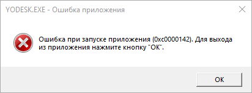

Compatibility Issues
====================

System requirements: IBM PC, Windows 95, i486/66, 8MB RAM, 2x CD-ROM.

Since the Yoda Stories game is of venerable age,
when running on modern operating systems, the problems described [here](http://web.archive.org/web/20220703101647/https://www.pcgamingwiki.com/wiki/Star_Wars:_Yoda_Stories) and [here](https://www.ntcompatible.com/compatibility/report/yoda-stories) began to occur.

When running on `Windows` operating systems `NT`, `XP` and above, errors occur:

* `Application Error (0xc0000142)`
* `Failed to write a block to device`

It's all about the outdated third-party library `WaveMix`. Fortunately, it can be updated:

1. Download the latest version of [`WaveMix`](https://www.compuphase.com/wavemix.htm#DOWNLOADS).
2. Overwrite existing `WAVMIX32.DLL` and `WAVEMIX.INI` files with new ones.

The `2 WaveOut Devices have been detected` error occurs due to incorrect `WaveMix` settings. Fix method:

1. Open the `wavemix.ini` file.
2. Change `ShowDevices=1` to `ShowDevices=0`.
3. Save the file and restart the game.
