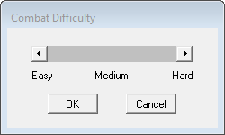
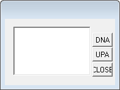
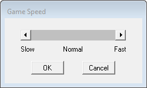
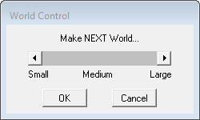
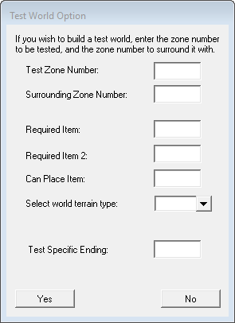
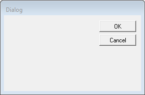
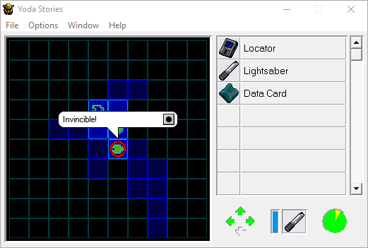

Системные требования: IBM PC, Windows 95, i486/66, 8MB RAM, 2x CD-ROM.

Проблемы совместимости

Были описаны [здесь](http://web.archive.org/web/20220703101647/https://www.pcgamingwiki.com/wiki/Star_Wars:_Yoda_Stories)
и [здесь](https://www.ntcompatible.com/compatibility/report/yoda-stories).

При запуске на операционных системах Windows `NT`, `XP` и выше случаются ошибки:

* Application Error (0xc0000142)
* Failed to write block to device

Всё дело в устаревшей сторонней библиотеке `WaveMix`. Её необходимо обновить.

1. Скачать последнюю версию [`WaveMix`](https://www.compuphase.com/wavemix.htm#DOWNLOADS).
2. Перезаписать имеющиеся файлы `WAVMIX32.DLL` и `WAVEMIX.INI` новыми.

Ошибка `2 WaveOut Devices have been detected` возникает из-а неверных настроек `WaveMix`. Способ исправления:

1. Открыть файл `wavemix.ini`.
2. Поменять `ShowDevices=1` на `ShowDevices=0`.
3. Сохранить файл и перезапустить игру.

Путь к файлу настроек игры:

`%WINDIR%\Yodesk.ini`

Однако, операционные системы Windows `Vista`, `7`, `10` и выше не позволяют писать в защищённые каталоги без прав администратора.
Любые попытки записи в `%PROGRAMFILES%`, `%PROGRAMDATA%` и `%WINDIR%` перенаправляются в `%LOCALAPPDATA%\VirtualStore`.

Для пользователя с никнеймом `user` файл настроек доступен по любому из следующих путей:

* `C:\Documents and Settings\user\AppData\Local\VirtualStore\Windows\yodesk.ini`
* `C:\Documents and Settings\user\Local Settings\VirtualStore\Windows\yodesk.ini`
* `C:\Users\user\AppData\Local\VirtualStore\Windows\yodesk.ini`
* `C:\Users\user\Local Settings\VirtualStore\Windows\yodesk.ini`

Диалоги

Большая часть этой информации найдена [здесь](https://tcrf.net/Star_Wars:_Yoda_Stories_(Windows)).

В файле YODESK.EXE находится 15 диалоговых окон, из которых 12 унаследованы из игры Indiana Jones and His Desktop Adventures, а 3 уникальных.

С нашей точки зрения интересно несколько диалогов, использовавшихся для отладки или ввода читов.
К сожалению, лишь один из них можно задействовать.

Диалог 100 открывается из меню Help -> About...

Диалог 111 открывается из меню Options -> Combat Difficulty...

Диалог 134 имеет неизвестное предназначение и недоступен в игре. Три кнопки: DNA, UPA, CLOSE и блок текста.
Не виден в большинстве редакторов ресурсов.

Диалог 147 недоступен в игре. Предназначался для быстрого перехода в требуемую зону.

Диалог 191 открывается комбинацией клавиш `Ctrl+F8`.
Он показывает номер текущей зоны, координаты и значение E.

Диалог 193 недоступен в игре. Предназначался для добавления предмета в инвентарь.

Диалог 204 недоступен в игре. Предназначался для назначения квестовых предметов определённому NPC.

Диалог 206 недоступен в игре. Назначение неизвестно. На нём расположен один компонент CTEXT.

Диалог 207 недоступен в игре. Назначение не совсем очевидное. Генерировались повторяющиеся миры. Видимо, возможность генерировать мир по уникальному номеру.

Диалог 215 открывается из меню Options -> Game Speed...

Диалог 218 открывается из меню Options -> World Control...

Следующие три диалога уникальны для Yoda Stories.

Диалог 223 недоступен в игре. Предназначался для создания и настройки тестового мира, а так же тестирования различных концовок.
   

Диалог 224 недоступен в игре. Назначение неизвестно.

Диалог 225 открывается из меню Options -> Statistics...

Диалог 30721 недоступен в игре. Вероятно, просто какое-то типовое окно.

Неиспользуемые метаданные столкновения

На карте 0 (начальная заставка) голова, тело Йоды и текст "Yoda Stories" представляют собой препятствия, вроде стен.
Но они остаются незамеченными из-за того, что игра запускает сценарий IACT карты при запуске и тут выходит из карты, не позволяя игроку исследовать ее.

Пароли

В игре доступно всего два чита, которые можно выполнить с экрана Локатора.

При вводе этих паролей надо помнить, что этот экран следует открывать мышкой, кликнув по Локатору.
Если открыть экран с помощью клавиши "L", то лишняя буква будет учтена как часть пароля и ничего не получится.

* goyoda: неуязвимость
* gojedi: получить пять `Thermal Detonators`, а так же `Blaster Rifle`, `Blaster` и `THE FORCE`.
    
 
