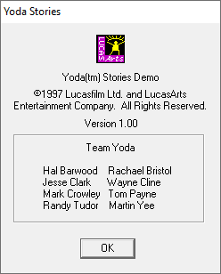
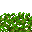
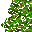
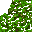
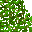
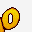
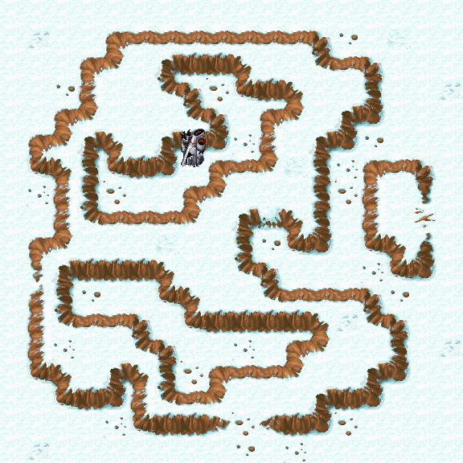

Star Wars - Yoda Stories (Demo) (18.02.1997)
============================================

Демонстрационная версия игры, которую можно было скачать совершенно бесплатно с сайта [lucasarts.com](http://web.archive.org/web/19980214043537/http://www.lucasarts.com/static/yodastories/yodastories.htm),
содержала только одну миссию по разрушению Имперского оружейного завода на скованной льдом планете Нештаб.

[Скачать yodademo.exe](download.md)

Самораспаковывающийся WinZip архив `yodademo.exe` занимает 3.2 Мб. 
Making Magic в комплекте отсутствует.

Неверная дата в PE заголовке файла `13.09.1996` не позволяет узнать точное время его создания.

Разработчики сберегли время хакерам и кроме изменения скриптов попросту удалили почти всю неиспользуемую графику, 
так что, восстановить демку до полноценной игры не получится.

Если судить по датам, то релиз стали готовить примерно 14-го февраля. Именно тогда был готов файл справки.
Доработка (вернее обрезка игры) заняла ещё 3-4 дня.

Самое примечательное то, что в это время готовилась версия игры `1.1`, но в демо-версию попали только исправления для зимних зон, 
что ещё раз подтверждает параллельную разработку этих версий.  

Так же можно смело предполагать, что пробничек формировался даже раньше версии `1.0`,
поскольку, при изучении списка различий найдены артефакты, исправленные к первому релизу игры.

* Исправленные зоны версии 1.1: `151, 176, 203, 430, 535`
* Исправленные зоны в демо-версии: `151, 176, 203`

В распакованном (установленном) виде демку можно встретить на многих сборниках того времени:

* `LucasArts Super Sampler, The (USA) (1997)`
* `LucasArts Super Sampler 2 (USA)`
* `Shamrock's Fall '97 CD-ROM (USA)`
* `Shamrock's Fall '97 CD-ROM (USA) (Older)` - по-сути, на этих двух дисках записан `LucasArts Super Sampler 2.1`
* `Computer Buyer Issue 75 CD-ROM`
* `PCGamer Demo Disc 3.4`
* `PC Gamer (Italian Edition) Coverdisc 021`
* `Personal Computer World Interactive - Disk 11`

и так далее...

Yoda Stories Demo Version Comparison
====================================

Demo version vs 1.1
-------------------

It's time to take a look at what exactly was cut from the Demo version of Yoda Stories.
There are many differences, so we will probably omit a few of the least significant ones.

In the process of studying this version of the game, 
I got the impression that the proofreaders had not yet had time to double-check the text, 
but several zone corrections were made here at the last moment. 
Specifically, all winter zones known at that time were corrected.

Differences are found in the following sections:

* Executable file
* Startup screen
* Tiles
* Zones
* Puzzles
* Characters

**Executable file**

Modified About dialog.



`Yoda(tm) Stories Demo`

Deactivated menu items:

* Replay Story
* Load World
* Save World
* World Control
* S&tatistics

Loading and saving gameplay is completely blocked.

Moreover, even if they are enabled in the PE resource editor, the game will disable them again during the loading process.

**Startup screen**


The inscription "Demo".

**Tiles**

Desert and Forest tiles have been erased.
In fact, there is one level in the winter, on the planet Neshtab.

So even if full functionality is restored, most of the levels will look bare and impassable.

* 0-6
* 8-17
* 19-84
* 86-111
* 115-149
* 151-154
* 156-162
* 235-250


* 281-284
* 311-343
* 345-350
* 356
* 364-372


* 642-647


* 879-897


* 1184-1185
* 1188-1195
* 1215-1217
* 1282-1283
* 1309
* 1344-1347
* 1353
* 1357-1359


* 1399-1402
* 1451-1473
* 1484-1517
* 1519-1539
* 1581-1595
* 1619-1624


* 1631-1645
* 1663-1664
* 1667-1672
* 1756-1760
* 1813-1814
* 1872-1879
* 1890-1893


* 2059-2074


Replaced tiles:

* 855
* 872
* 874-875
* 877-878
* 902
* 961
* 1170
* 2121-2122 (Demo)

Added tiles:

* 2123-2127 (Demo)




 (original)




 (demo)


**Zones**

Since planets with deserts and jungles are not available in the demo version, 
and the tiles associated with them were removed, 
these tiles were also removed from all the corresponding zones (replaced with transparent tiles).

Some snow locations were also erased.

Recall that in version 1.1 the zones were fixed: `151, 176, 203, 430, 535`.

The demo version does not contain a fix for zones `430` and `535`, that is, only `151, 176, 203` are fixed.


**Zone 0**: +1 instruction for Action 0


Since the phrase "Demo" is displayed on the top layer,
its bottom tile must be removed after the X-Wing has been flown.

`remove-tile: 5 5 2 0 0 ""`

**Zones 76-77**: added Demo.

 

**Zones 93-96**: removed all mini-quests from Yoda, the scene of his abduction.

   

This phrase is missing: `Dagobah! Yoda must be around here somewhere. I better find him and see what's on his mind...`

Изменение: izx4._unnamed2: 1 -> 0

**Zone 115**: removed hotspot: DROP_ITEM [12; 11] enabled: 1; argument: 1198


A strange decision, since this is a deserted location.
Скорее всего, эта зона содержит ошибку, и была исправлена в версии `1.0`.

**Zone 146**:



Quest items will never appear in this location. Absent all provided items.

**Zone 151**: spaceport.


Snowdrift removed: [11; 1]

New actions performed upon arrival. 
In theory, in Action 1, Luke's X-wing is displayed, and in the 16th Action it is hidden, and he makes a speech.
In fact, the loss of the starship is imperceptible.

```
Action 16
if
    standing-on: 8 11 997
then
    remove-tile: 8 10 1
    remove-tile: 9 10 1
    remove-tile: 7 11 1
    remove-tile: 8 12 1
    remove-tile: 9 12 1
    set-rect-needs-display: 7 10 9 12
    speak-hero: "This is the tiny Spaceport on Neshtab. In a real game, I might find myself in the DESERT or a RAIN FOREST as easily as here, but the DEMO is all ICE, and there's only one ending..."
    disable-action
```

```
Action 18
if
    enter-by-plane
    hero-is-at: 8 11
then
    place-tile: 8 10 1 355
    place-tile: 9 10 1 355
    place-tile: 7 11 1 355
    place-tile: 8 12 1 355
    place-tile: 9 12 1 355
    set-rect-needs-display: 7 10 9 12
    disable-action
```

Also in Action 5 the `remove-tile` command is inserted after `place-tile` and not before it.
This will not affect the gameplay, but it clearly makes it clear that the demo version
was corrected in parallel with the commercial implementation.

izx4._unnamed2: 1 -> 0

На самом деле поле `izx4._unnamed2` мне не даёт покоя.
Можно допустить, что оно не используется,
Но может быть и так, что это значение каким-то образом используется при генерации карты, или где-то ещё.

**Zone 152**:


Изменён монолог медицинского дроида.

`Greetings, sir! Welcome to our DEMO. If you need my services, please don't hesitate to visit."`

`Greetings, sir! Welcome to our DEMO!
I'm a MEDICAL DROID, General Practitioner Class 2-1B, fully qualified to treat all injuries and wounds. If you need my services, please don't hesitate to visit.
Meanwhile, this is dangerous country, so stay on the lookout for WEAPONS! You can never have too many.
I like my patients well- equipped... that way they stay healthy, and I can relax.`

`Greetings, sir! Welcome to our DEMO!`

**Zone 160**:


izx4._unnamed2: 1 -> 0

**Zone 176**:


This zone received a fix similar to version 1.1.

izx4._unnamed2: 0 -> 1

**Zone 203**:


This zone received a fix similar to version 1.1.

izx4._unnamed2: 1 -> 0

**Zone 204**:


Zone type changed: EMPTY -> FIND

Added hotspot: DROP_QUEST_ITEM [9; 8] enabled: 1; argument: 65535

It turns out that in this zone you can now find a quest item.

**Zone 210**:


Removed all provided items.

izx4._unnamed2: 1 -> 0

**Zone 246**:


izx4._unnamed2: 1 -> 0

**Zone 258**:


Removed all required and provided items.

**Zone 263**:


Было:

`speak-npc: 4 4 "I'm not really a farm droid. I belong in the big city."`

Стало:
 
`speak-npc: 4 4 "This isn't the real game. It's only a DEMO."`

izx4._unnamed2: 1 -> 0

**Zone 264**:


izx4._unnamed2: 1 -> 0

It was:

`speak-npc: 6 1 "If you want WEAPONS or MEDICINE, drop something on the table here, and maybe we'll do business..."`

It became:
 
`speak-npc: 6 1 "If you want WEAPONS or MEDICINE, drop something on the table here, and I'll give you a DEMO of how the system works..."`

It was:

`speak-npc: 6 1 "Nice junk..."`

It became:
 
`speak-npc: 6 1 "Nice junk. Say, if you enjoy this DEMO, why not buy the real game? Then you can thaw out in some warmer terrain..."`

**Zone 294**:


Removed all provided items.

**Zone 316**:


Small check change - removed the `tile-at-is: 444 4 3 1` condition. What for? The Shield Generator is on the map.
If this check succeeds, Luke then says, `"Hey! that's the ship's shield generator over there... If I could disable the thing, it might cause a distraction..."`

Вероятно это устаревшая часть игры, котороа впоследствии была доработана.


**Zone 317**:


izx4._unnamed2: 1 -> 0

**Zone 326**:


izx4._unnamed2: 1 -> 0

**Zone 327**:


izx4._unnamed2: 1 -> 0

**Zone 328**:


izx4._unnamed2: 1 -> 0

**Zone 336**:


Было:

`speak-npc: 8 15 "Go away. We're peaceful snow farmers. You don't want to be here."`

Стало:

`speak-npc: 8 15 "Playing the DEMO of LucasArts' new Desktop Adventure, I see. Well, we're peaceful snow farmers. Go away!"`

izx4._unnamed2: 1 -> 0

**Zone 385**:


Disabled completion of the quest upon arrival. Removed:

```
Action 1
if
    enter-by-plane
    hero-is-at: 8 11
then
    mark-as-solved
    disable-action
```

**Zone 407**:


Disabled quest completion. Removed `mark-as-solved` commands for steps 16 and 17.

`mark-as-solved: 0 0 0 0 0 ""`

**Zone 462**:


This zone cannot appear in the game, however, the text in it is slightly different from the final version:

It was:

* Instruction 0: `Good work, stranger! For rescuing me, I'll show you where I hid the ¥ that I stole from those stormtroopers!`
* Instruction 1: `All right... where?`
* Instruction 2: `Just follow me...`

Became:

* Instruction 0: `Good work, stranger! What can I possibly give you in return for rescuing me?`
* Instruction 1: `You mentioned something about a ¥...?`
* Instruction 2: `That's right; I did. Well, follow me...`

This is very strange, perhaps it is part of the draft text, which was finalized already for the final release of the game.

**Zone 465**:


Removed all required items.

**Zone 489**:


Added one required item (449): 


**Zone 535**:


Yoda's hut.

Removed all mini-quests and any mention of Boba Fett.

izx4._unnamed2: 1 -> 0

**Zone 596**:


Another forest zone. Same fix in two actions.

`move-hero-to: 10 8`

replaced by

```
change-zone: 595 0 0
```

It should be added that zone 595 is also green, that is, it does not participate in the demo.
This is probably another piece of draft code.

**Zone 605**:


Another invisible zone and unverified text:

`speak-npc: 4 3 "Whoa... dark in this hovel. And what's that scuttling noise???"`

`speak-npc: 4 3 "Whoa... dark in this hovel. And what's that scuttling noise???."`

**Zone 642**:


Another invisible zone. The place where Luke wakes up after being knocked out by fighters.
In the demo version, it looks rather crude, in the final it was quite heavily reworked.

Removed half of the actions, the rest have been redesigned.

**Puzzle 108**:

It was:

`Luke! Time it is for your training to advance a step...[CR2]The Empire has set up a HIDDEN FACTORY in the snowy wastes of planet Neshtab, where they are building stormtrooper droids. These robots could tip the balance against the Rebel Alliance.[CR2]Find this factory you must! Destroy it you must! [CR2]Here! Help you finish what you start, this will...`

Became:

`Hello! A ripple in the Force I feel... you are playing a DEMO of LucasArts' new Desktop Adventure, mmm? I thought so... fool Yoda you cannot! If you enjoy it, why not buy real game from your local retailer, mmm?[CR2]Now then, Luke! Time to continue your training...[CR2]The Empire has set up a HIDDEN FACTORY in the snowy wastes of planet Neshtab, where they are building combat droids. These robots could tip the balance against the Rebel Alliance.[CR2]Find this factory you must! Destroy it you must! [CR2]Here! Help you finish what you start, this will...`

Pay attention, `[CR2]` means two line breaks.


**Characters**:

Tank-Wander

frame1: [2120, 1959, 2120, 2119, 1959, 2120, 1958, 1959] -> [2119, 1959, 2119, 2119, 1959, 2119, 1958, 1959]

Tank-Patrol

frame1: [2120, 1959, 2120, 2119, 1959, 2120, 1958, 1959] -> [2119, 1959, 2119, 2119, 1959, 2119, 1958, 1959]

Why this was done is unclear, but in some areas these tanks were also swapped.

 
