Диалоги

Большая часть этой информации найдена [здесь](https://tcrf.net/Star_Wars:_Yoda_Stories_(Windows)).

В файле YODESK.EXE находится 15 диалоговых окон, из которых 12 унаследованы из игры Indiana Jones and His Desktop Adventures, а 3 уникальных.

С нашей точки зрения интересно несколько диалогов, использовавшихся для отладки или ввода читов.
К сожалению, лишь один из них можно задействовать.

Диалог 100 открывается из меню Help -> About...

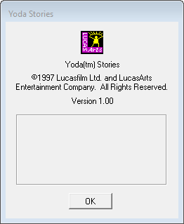

Диалог 111 открывается из меню Options -> Combat Difficulty...

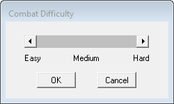

Диалог 134 имеет неизвестное предназначение и недоступен в игре. Три кнопки: DNA, UPA, CLOSE и блок текста.
Не виден в большинстве редакторов ресурсов.

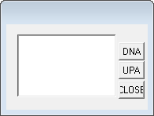

Диалог 147 недоступен в игре. Предназначался для быстрого перехода в требуемую зону.

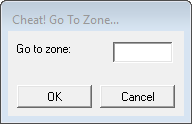

Диалог 191 открывается комбинацией клавиш `Ctrl+F8`.
Он показывает номер текущей зоны, координаты и значение E.

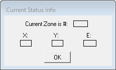

Диалог 193 недоступен в игре. Предназначался для добавления предмета в инвентарь.

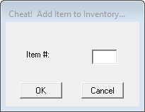

Диалог 204 недоступен в игре. Предназначался для назначения квестовых предметов определённому NPC.

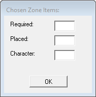

Диалог 206 недоступен в игре. Назначение неизвестно. На нём расположен один компонент CTEXT.

Диалог 207 недоступен в игре. Назначение не совсем очевидное. Генерировались повторяющиеся миры. Видимо, возможность генерировать мир по уникальному номеру.

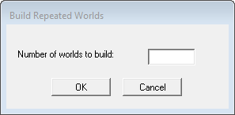

Диалог 215 открывается из меню Options -> Game Speed...

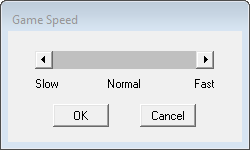

Диалог 218 открывается из меню Options -> World Control...

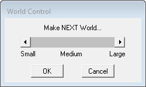

Следующие три диалога уникальны для Yoda Stories.

Диалог 223 недоступен в игре. Предназначался для создания и настройки тестового мира, а так же тестирования различных концовок.
   
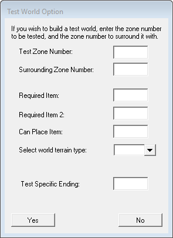

Диалог 224 недоступен в игре. Назначение неизвестно.

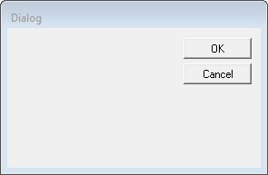

Диалог 225 открывается из меню Options -> Statistics...

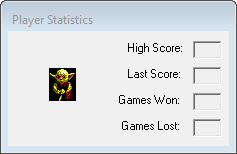

Диалог 30721 недоступен в игре. Вероятно, просто какое-то типовое окно.

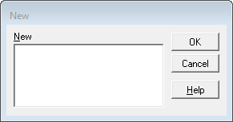
