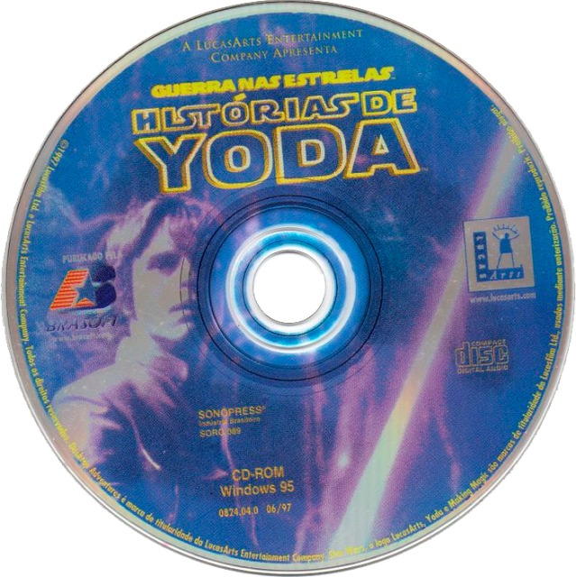

Диск Yoda Stories - лицевая сторона
======================================

США (v1.0, v1.1)
----------------

Классический вариант.

Судя по неполным фотографиям, у ревизии игры диск аналогичный.

Австралия, Великобритания
-------------------------

Фотография диска для Австралии ещё не найдена.

Франция, Италия
----------------

Германия, Нидерланды
--------------------

Фотография диска для Нидерландов отсутствует.

Испания, Бразилия
-----------------

Оформление диска тёмное, нестандартное, совпадает с оформлением на коробке.

Япония, Тайвань
---------------

Диск оформлен синим, но вместо Люка на нём нарисована звезда смерти и атакующий её X-Wing.
Это часть обложки `Star Wars: Screen Entertainment`.

Корея
-----

Yoda Stories в сборниках
========================

The LucasArts Archives Vol. IV: Star Wars Collection II (США)
-------------------------------------------------------------

Star Wars: Dark Forces + Yoda Stories + Star Wars Screen Entertainment (Италия)
-------------------------------------------------------------------------------

Фотографии пока не найдены.

Star Wars: Rebel Assault II + Yoda Stories + Star Wars Screen Entertainment (Италия)
------------------------------------------------------------------------------------

Фотографии пока не найдены.

Star Wars: Shadows of the Empire + Yoda Stories + Star Wars Screen Entertainment (Италия)
-----------------------------------------------------------------------------------------

Star Wars: X-Wing vs TIE Fighter + Yoda Stories + Star Wars Screen Entertainment (Италия)
-----------------------------------------------------------------------------------------

Фотографии пока не найдены.

Star Wars Masterpieces (Япония)
-------------------------------

Yoda Stories для Game Boy Color
===============================

США:

Европа:

