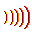
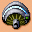
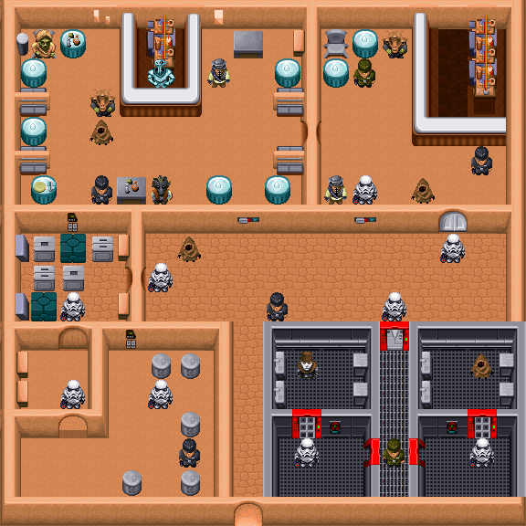
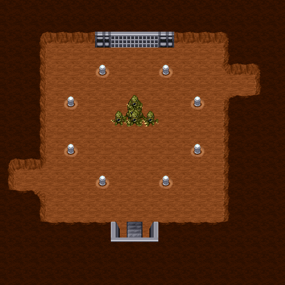
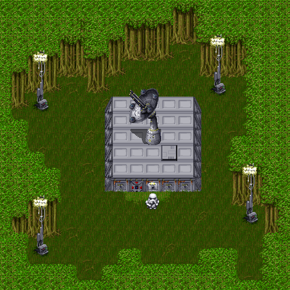
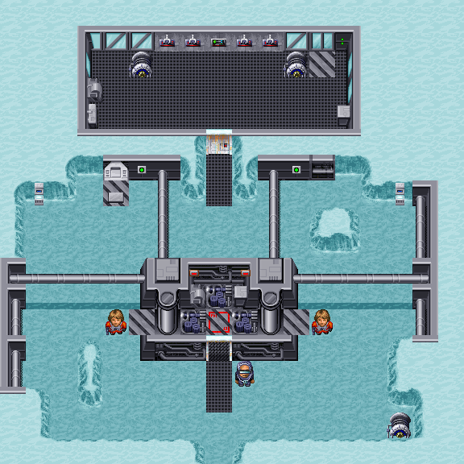

Characters
==========

TODO hex

#### CHAR Format

* 4 bytes: "`CHAR`"
* 4 bytes: section size 0x1946 (6470 bytes)
* 77 Characters, the last index = `-1` (`0xFFFF`), after these two bytes, reading data should be stopped.

#### Characters Format

* 2 bytes: index (0, 1, 2, ...)
* 4 bytes: "`ICHA`"
* 4 bytes: size
* 16 bytes: null-terminated character title
* 2 bytes: CharacterType
* 2 bytes: MovementType
* 2 bytes: probablyGarbage1
* 4 bytes: probablyGarbage2
* CharFrame #1
* CharFrame #2
* CharFrame #3

1 Character occupies 84 bytes.

##### CharFrame Format

* 8 tiles (2 bytes length), 16 bytes total.

#### CHWP Format

TODO hex

* 4 bytes: "`CHWP`"
* 4 bytes: section size 0x1D0 (464 bytes)
* CharacterWeapons, the last index = `-1` (`0xFFFF`), after these two bytes, reading data should be stopped.

##### CharacterWeapon Format

* 2 bytes: index (0, 1, 2, ...)
* 2 bytes: reference
* 2 bytes: health

1 CharacterWeapon occupies 6 bytes.

If the character referenced by index is a `monster`,
this is a reference to their `weapon`: Darth Vader: 69 (Evil Force), StormTrooper: 11 (Imperial Blaster), and so on.
Otherwise, this is the index of the weapon's `sound`.

#### CAUX Format

TODO hex

* 4 bytes: "`CAUX`"
* 4 bytes: section size 0x136 (310 bytes)
* CharacterAuxiliaries, the last index = `-1` (`0xFFFF`), after these two bytes, reading data should be stopped.

##### CharacterAuxiliary Format

* 2 bytes: index (0, 1, 2, ...)
* 2 bytes: damage

1 CharacterAuxiliary occupies 4 bytes.

## Characters

The structure of the `Character` object describes characteristics such as:

* Name
* Character type
* Movement type
* Health level
* Link to the weapon, or to the sound (if it is a weapon)
* Damage level
* 3 frames of animation

Thus, you can create the main character, hostile humanoids, unfriendly or neutral fauna,
robots, equipment and even weapons.

The main purpose of `Character` is to provide animation to an object and identify its type,
and, if necessary, provide it with additional properties and characteristics.

### Health

All characters have different health levels. Where health is not important, or regulated by the game engine,
it is equal to 1 (or 0). In particular, this applies to Luke and weapons.

The health level of ordinary monsters varies from 2 to 10.
Tough monsters and bosses can have up to 30 health,
and Bobba Fett is generally 99. Indestructible objects have a health level of -1 (`0xFFFF`).

Rare monster `Gurk` seems to be immortal.

### Damage

The damage of neutral characters is -1.
The weakest in the food chain are: `Luke` (damage 1), and his two lightsabers (damage 2 and 3 respectively).
Monster damage ranges from 2 to 10.
Strong monsters and bosses can knock out up to 30 health points at a time, `Bobba Fett`, by the way, only 10.

### Weapon

Luke Enemy and enemy Jawa are armed with simple Blasters. Darth Vader owns `Evil Force`.
Stormtroopers, Mercenaries, Battle Droids and Tanks are equipped with the `Imperial Blaster`.

Neutral robots, equipment and other fauna do not have weapons by default.

Weapon damage is taken into account if a shot is fired.
Melee damage depends on the monster's abilities and is generally different from weapon damage.

|  #  |     Tile                  |  Weapon           | Damage | Owners                     | Sound        |
|:---:|:-------------------------:|:-----------------:|:------:|:--------------------------:|:------------:|
| 9 |   | Blaster           | 4      |   | blaster.wav  |
| 10 |  | Blaster Rifle     | 6      |                            | rifle.wav    |
| 11 |  | Imperial Blaster  | 5      |                   | impblst.wav  |
| 12 |  | Thermal Detonator | 8      |                            | banglrg.wav  |
| 13 |  | The Force         | 99     |                            | force.wav    |
| 14 |  | Light Saber (New) | 3      |                            | saberswg.wav |
| 69 |  | Evil Force        | 12     |  | force.wav    |
| 75 |  | Light Saber       | 2      |                            | saberswg.wav |

From the table it becomes clear that Luke Skywalker does not have any weapons by default.
The lightsaber is given to him by the game engine at the beginning of each mission, as soon as Luke arrives in zone `#93`.

Starting weapon(s), depending on completed missions:

| Missions |     Weapon(s)              |
|:--------:|:--------------------------:|
| 0-5      |  |
| 5-10     |  |
| 10-15    |   |
| 16+      |    |

> Few people remember that `Spirit Heart` once resurrects the main character in the event of his death.

### Garbage

Two characteristics that are currently considered unused in most cases have standard values:

* 2 bytes: probablyGarbage1: `0xFFFF`
* 4 bytes: probablyGarbage2: `0`

For `Light Saber` probablyGarbage1 = `149`. `Boba Fett` has `446` and `1` respectively.

### Character Types

The developers did not produce additional sections, placing the characters and weapons in one.
This can be confusing at first, but it's easy enough to distinguish them if you know the type:

| Id  | Character Type |
|:---:|:--------------:|
|  1  |     Hero       |
|  2  |     Enemy      |
|  4  |     Weapon     |

    
The `ENEMY` type is assigned to everything except for the main character and several types of weapons.
Generators, ventilation systems, gears and even neutral robots are all `ENEMY`!

Main character:

|  #  |     Tile                   |  Name           | Movement Type | Health | Melee Damage | Shoot Damage |
|:---:|:--------------------------:|:---------------:|:-------------:|:------:|:------------:|:------------:|
| 1   |  | Luke Skywalker  | None          | 1      | 1            | -            |

Enemies:

|  #  |     Tile                   |  Name           | Movement Type | Health | Melee Damage | Shoot Damage |
|:---:|:--------------------------:|:---------------:|:-------------:|:------:|:------------:|:------------:|
| 1   |  | BLANK           | Unspecific 3  | 30     | -1           | -            |
| 2   |  | Jawa2           | Unspecific 3  | 30     | -1           | -            |
| 3   |  | Mousebot        | Unspecific 5  | 2      | 3            | -            |
| 4   |  | Probot-snow     | Wander        | 10     | 25           | 5            |
| 5   |  | Mine Droid      | Droid         | 2      | 2            | -            |
| 6   |  | Boba Fett       | Unspecific 1  | 99     | 10           | 5            |
| 7   |  | ST-Hard         | Unspecific 1  | 6      | 5            | 5            |
| 8   |  | ST-MildAttack   | Unspecific 2  | 4      | 3            | 5            |
| 15  |  | Wampa           | Unspecific 1  | 8      | 15           | -            |
| 16  |  | SuperTrooper    | Unspecific 1  | 10     | 8            | 5            |
| 17  |  | TuscanHard      | Unspecific 1  | 5      | 3            | -            |
| 18  |  | TuscanMildAttac | Unspecific 2  | 3      | 4            | -            |
| 19  |  | Boushh          | Unspecific 4  | 4      | 5            | 5            |
| 20  |  | Greedo          | Unspecific 1  | 6      | 5            | 5            |
| 21  |  | Ree Yees        | Unspecific 4  | 5      | 6            | 5            |
| 22  |  | Baby Wampa      | Unspecific 3  | 3      | 6            | -            |
| 23  |  | Snowtrooper-H   | Unspecific 1  | 6      | 5            | 5            |
| 24  |  | SnowTrooper-M   | Unspecific 2  | 4      | 3            | 5            |
| 25  |  | ST- Sit         | Sit           | 8      | 6            | 5            |
| 26  |  | Snowtrooper-Sit | Sit           | 6      | 6            | 5            |
| 27  |  | Generator       | Animation     | -1     | -1           | -            |
| 28  |  | ST- Patrol      | Patrol        | 6      | 5            | 5            |
| 29  |  | SandWorm        | Unspecific 3  | 2      | 4            | -            |
| 30  |  | DesertBeetle    | Unspecific 3  | 2      | 2            | -            |
| 31  |  | Torture Droid   | Droid         | 5      | 20           | 5            |
| 32  |  | Sarlacc         | Animation     | 4      | 15           | -            |
| 33  |  | Scorpion        | Unspecific 4  | 5      | 10           | -            |
| 34  |  | IceBug          | Unspecific 3  | 3      | 4            | -            |
| 35  |  | SnowStar        | Unspecific 3  | 2      | 4            | -            |
| 36  |  | TimerPatrol     | Patrol        | -1     | -1           | -            |
| 37  |  | TimerWander     | Unspecific 3  | -1     | -1           | -            |
| 38  |  | BrownJawaEnemy  | Unspecific 3  | 3      | 4            | 4            |
| 39  |  | Snowman         | Unspecific 4  | 25     | 30           | -            |
| 40  |  | Tank-Wander     | Wander        | 30     | 15           | 5            |
| 41  |  | Tank-Patrol     | Patrol        | 30     | 15           | 5            |
| 42  |  | Gurk            | Sit           | -1     | 15           | -            |
| 43  |  | RedMadJawa      | Animation     | -1     | -1           | -            |
| 44  |  | JawaBrnSit      | Sit           | 0      | 0            | 5            |
| 45  |  | LittleRancor    | Unspecific 2  | 15     | 10           | -            |
| 46  |  | RancorLarm      | Animation     | 15     | 20           | -            |
| 47  |  | RancorRarm      | Animation     | 15     | 20           | -            |
| 48  |  | RancorHead      | Animation     | 20     | 20           | -            |
| 49  |  | RancorBody      | Animation     | 20     | 20           | -            |
| 50  |  | Probot-desert   | Wander        | 15     | 25           | 5            |
| 51  |  | Ewok            | Unspecific 3  | 30     | -1           | -            |
| 52  |  | Imp-ScaredyGuy  | Scaredy       | -1     | 6            | 5            |
| 53  |  | Bugs            | Animation     | -1     | -1           | -            |
| 54  |  | InvisiSitOneHit | Sit           | 1      | -1           | -            |
| 55  |  | Scardy-Killable | Scaredy       | 5      | 6            | 5            |
| 56  |  | TurtleEnemy     | Unspecific 3  | 5      | 2            | -            |
| 57  |  | BatThing        | Unspecific 3  | 4      | 2            | -            |
| 58  |  | Jigokiller      | Unspecific 1  | 6      | 10           | -            |
| 59  |  | ShivaDroid      | Wander        | 35     | -1           | -            |
| 60  |  | IG88            | Unspecific 1  | 10     | 8            | 5            |
| 61  |  | R2Unit          | Droid         | 35     | -1           | -            |
| 62  |  | ForestTrooperM  | Unspecific 2  | 4      | 3            | 5            |
| 63  |  | ForestTrooperH  | Unspecific 1  | 6      | 5            | 5            |
| 64  |  | ForestTroopSit  | Sit           | 8      | 6            | 5            |
| 65  |  | Gears           | Animation     | -1     | -1           | -            |
| 66  |  | InvisEnemy-Sit  | Sit           | 6      | 4            | 5            |
| 67  |  | SnowWorm        | Unspecific 4  | 8      | 6            | -            |
| 68  |  | DarthVader      | Sit           | 5      | 8            | 12           |
| 70  |  | LukeEnemy       | Unspecific 1  | 5      | 5            | 4            |
| 71  |  | ImpOff-Green-H  | Unspecific 1  | 4      | 3            | 5            |
| 72  |  | ImpOff-Grey-M   | Unspecific 2  | 4      | 3            | 5            |
| 73  |  | BatPatrol       | Patrol        | -1     | -1           | -            |
| 74  |  | Dainoughout     | Unspecific 4  | 12     | 15           | -            |
| 76  |  | CeilingFan      | Animation     | -1     | -1           | -            |

> There are several invisible enemies in the game.

### The rarest characters

|  #  |     Tile                   |  Name           | Health | Damage | Zones              |
|:---:|:--------------------------:|:---------------:|:------:|:------:|:------------------:|
| 20  |  | Greedo          | 6      | 5      | 72                 |
| 36  |  | TimerPatrol     | -1     | -1     | 211                |
| 39  |  | Snowman         | 25     | 30     | 223                |
| 42  |  | Gurk            | -1     | 15     | 548                |
| 45  |  | LittleRancor    | 15     | 10     | 379                |
| 46  |  | RancorLarm      | 15     | 20     | 379                |
| 47  |  | RancorRarm      | 15     | 20     | 379                |
| 48  |  | RancorHead      | 20     | 20     | 379                |
| 49  |  | RancorBody      | 20     | 20     | 379                |
| 53  |  | Bugs            | -1     | -1     | 409                |
| 52  |  | Imp-ScaredyGuy  | -1     | 6      | 412                |
| 60  |  | IG88            | 10     | 8      | 519                |
| 64  |  | ForestTroopSit  | 8      | 6      | 372                |
| 70  |  | LukeEnemy       | 5      | 5      | 580                |
| 73  |  | BatPatrol       | -1     | -1     | 624                |
| 74  |  | Dainoughout     | 12     | 15     | 271                |
| 31  |  | Torture Droid   | 5      | 20     | 316, 319           |
| 40  |  | Tank-Wander     | 30     | 15     | 161, 645           |
| 54  |  | InvisiSitOneHit | 1      | -1     | 6, 410             |
| 55  |  | Scardy-Killable | 5      | 6      | 289, 412           |
| 68  |  | DarthVader      | 5      | 8      | 266, 498           |
| 41  |  | Tank-Patrol     | 30     | 15     | 110, 166, 357      |
| 65  |  | Gears           | -1     | -1     | 412, 580, 613      |
| 1   |  | BLANK           | 30     | -1     | 14, 54, 72, 286    |
| 28  |  | ST- Patrol      | 6      | 5      | 285, 316, 345, 365 |
| 51  |  | Ewok            | 30     | -1     | 470, 476, 561, 573 |
| 76  |  | CeilingFan      | -1     | -1     | 126, 411, 412, 626 |
| 37  |  | TimerWander     | -1     | -1     | 344, 345, 489, 496, 580 |

The invisible characters `TimerPatrol` and `TimerWander` are used as timers.
For example, in zone #211 `TimerPatrol` has a strictly defined trajectory,
and with each appearance at a certain point in the location, the counter increases by one.

#### Zones of the rarest characters

**Zone 72**: armed mercenary `Greedo`.

**Zone 211**: invisible `TimerPatrol` as timer.
If you do not come to the aid of the rebel within a certain time, he will die.

**Zone 223**: mini boss `Snowman`. 
It will be possible to fight with him only if more than 6 missions are successfully completed.
However, in this case, the probability of this meeting is small: 1 to 10.
If you manage to defeat the central snowman, then his brothers will appear in the four corners of the map.
After the final victory, Luke's health level will rise to 300,
and 7 Thermal Detonators will immediately appear in his inventory!

**Zone 548**: almost invulnerable `Gurk`. Visually, this monster strongly resembles `Little Rancor`,
and he calls himself `Grrk`, but in any case, ordinary weapons do not cause him any harm.
You must have `Gas Grenade` with you, without defeating him you will not receive a quest item.

**Zone 379**: mini boss `Rancor`, `Little Rancor`. There are a total of 7 monsters to defeat in the pit,
but `Rancor` is in four parts. However, both in appearance and in damage this monster is far from its TV original.

**Zone 409**: `Bugs` (Alessian Terror Moth).
They do not pose any danger, but they can scare city dwellers.
Like any other insects, they fly into the light.

**Zone 412**: cowardly imperial officer `Imp-ScaredyGuy`. 

**Zone 519**: robot-mercenary `IG-88B`. It does not cause any particular difficulties.

**Zone 372**: aggressive `ForestTroopSit`. It does not cause any particular difficulties.

**Zone 580**: 12 unfriendly `Luke` clones.

**Zone 624**: `BatPatrol`, aka `Jungle Ray`. Caught with `Grappling Hook`.

**Zone 271**: mini boss `Dianoga`, aka `Dainoughout`. You need to get her heart.

### Movement Types

All characters have one important characteristic - movement type.
There are 13 such types in total.

It is important to note the `NONE` type for weapons, as well as the `ANIMATION` type for static items and static monsters.

|  #  | Movement Type | Characters                  |
|:---:|:-------------:|:---------------------------:|
| 0   | None          | **Luke Skywalker**, all **weapons** |
| 1   | Unspecific 1  |             |
| 2   | Unspecific 2  |       |
| 3   | Unspecific 3  |           |
| 4   | Sit           |        |
| 5   | Unused        | Indy only                   |
| 6   | Unspecific 4  |       |
| 7   | Unspecific 5  |   |
| 8   | Droid         |    |
| 9   | Wander        |     |
| 10  | Patrol        |     |
| 11  | Scaredy       |   |
| 12  | Animation     |           |

#### None

Luke Skywalker, all weapons. These objects, in principle, do not need a movement algorithm.

#### Animation

Character is in one place, but the algorithm allows, for example,
in the case of Sarlac's tentacles, pull them in the direction of the protagonist.

#### Droid

The droid has a certain probability of moving randomly, or,
chooses for itself the preferred direction of movement.
If the main character is in the field of view of the droid, and these are 2 cells,
then the droid with a certain degree of probability can begin to move towards him.

#### Patrol

The patrol moves along the trajectory set using `Waypoints` (see [Monsters](dta-zone.md)).

#### Scaredy

If the protagonist approaches within 6 squares or less, that frightened imperial officer starts to run away.
In a normal situation, it moves randomly.

#### Sit

A determined enemy always goes to the protagonist.

#### Wander

A mechanical enemy is wandering around the map.

#### Unspecific

Несколько достаточно сложных алгоритмов, работу которых не удастся описать простыми словами.

### Frames

To provide all 8 tiles of one frame, you need to place them in this order:

`up-down-up-left-down-up-right-down`

> Reminds me of a secret code from a 16 bit game.

Here you need to understand that diagonal movements in the game are allowed,
but there is no separate graphics for them - either an upward movement or a downward movement is drawn.

3 frames of animation are allotted for movement in any direction.
That is, if the movement is continuous, then when moving to each neighboring cell, one frame will be replaced by the next.

However, if you move without holding down the movement key, the first frame will always be displayed.

Here is an example of how the animation works:

Game state
----------

We have everything ready to create the game world.
Locations will be drawn using tiles.
We will release characters on the levels - the main character, hostile inhabitants, neutral NPCs and see who wins.

Localization
------------

There is no need to translate anything in these sections.

Hacking possibilities
---------------------

Almost any character in the game can be made into an invincible Hulk, or a stunted mob dying at one touch.
It is enough to adjust the level of health, weapon type and damage.

When adding a new character, you can give him a unique name, specify his type and mode of movement, as well as
adjust animation frames, including diagonal ones.

Also saturate the game with new weapons.
`BFG9000` with simultaneous damage to all mobs is not supported by the game engine,
but any other types of small arms and heavy weapons - no problem.
