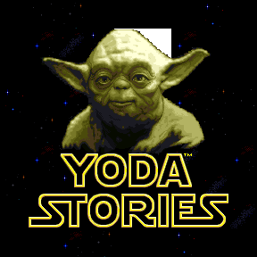

Startup screen
==============

Technically `Startup Screen` is the most common Bitmap. Dimensions:

* `288x288` pixels, `256` colors
* `82944` bytes
* `0x14400` in hex

Each pixel corresponds to 1 byte - the index of color in [palette](color-palette.md).

Visually, the `STUP` screen is identical to `Zone #0`, and is displayed only once when loading the game.
On modern computers with SSD drives, it's only visible for a moment.

The need for it arose due to the low performance of computers of those years.

The duration of the game loading dictated a simple decision - to load the DTA file gradually,
and first of all, display the startup screen, and only then deal with tiles, zones and puzzles.
This logic has been also implemented in the year-old game `Indiana Jones and his Desktop Adventures`.

Once the entire DTA file is in memory, the contents of `Zone #0` are displayed over the startup screen,
X-Wing flyby script starts, voiced by the melody `#40` (XWINGBY.WAV).
A little earlier, the melody `#61` (opening.wav) is launched by the game engine.

Interesting fact
----------------

Please, notice the transparent area to the right of the top of Yoda's head.
Its existence can be explained by several guesses, but the most likely
one is that the bottom layer of tiles drawn without transparency, and the top two with a transparency.
The "transparent" palette color has index `#0` and is the same as `BLACK`.

That is why neither the programmers, nor the players noticed such a clear defect.

[Yoda Stories Translation Tool](https://github.com/LeonisX/yoda-stories-translation-tool) allows you to draw a transparent bottom layer of tiles,
and thanks to this, this "transparency" was found.

Zones `#76`, `#77` also have a similar invisible defect.

Hacking possibilities
---------------------

The image can be replaced with any other, the main thing is to comply with the condition that
the palette completely coincides with the palette of the game.
But the most correct option is to change `Zone #0` and then export it to a `BMP` file.
Although, if the startup image is different from `Zone #0`,
then there is an opportunity to implement the simplest animation, for example:

* After loading, Yoda opens his eyes;
* After loading, the words "STORIES" appear;
* After loading, some stars fade out, while others light up;
* And so on, there are a lot of options.
