Tiles
=====

TODO hex

#### TILE Format

* 4 bytes: "`TILE`"
* 4 bytes: section size
* Tiles

##### Tile format

* 4 bytes: tile attributes
* `1024` bytes: pixels

## Tiles

_The total number of tiles in the game is limited to a signed number that fits in 2 bytes: `32768`._

Technically every tile is the most common Bitmap. Dimensions:

* `32x32` pixels, `256` colors

Each pixel corresponds to 1 byte - the index of color in [palette](color-palette.md).

The Desktop Adventures game engine in the vast majority of cases operates with tiles.

Tiles are the building blocks of any location. All game worlds and their inhabitants consist of tiles.

_Tiles are great for saving resources. About 2100 tiles are enough to make each location look unique.
If the zones were full-fledged bitmaps, they would take up about 166 MB.
Computers of those times didn’t even come close to having so much RAM._

Each location divided into 32x32 pixel cells, and tiles cannot go beyond the borders of these cells.
These are not sprites, but static images.
So, you cannot even dream about the smoothness of Luke Skywalker's movement.
It moves exactly 32 pixels in the selected direction.
The same goes for the movement of enemies and even shots with laser weapons.

> **Note:** The loading screen and speech bubbles do not use tiles. In the first case, this is a full-fledged bitmap,
> and in the second one - `RoundRect`, which displays the `EDIT` component and three `Buttons`.

> **Note:** On the locator screen, the grid cells are 28x28 pixels.
> Otherwise, the 10x10 map cannot be displayed.
> Here the tiles partially overlap each other, their right and bottom edges are transparent.

Each tile has a set of properties, usually 2-3 attributes.
Depending on the type of tile, the same attributes characterize different properties.

All attributes fit in 32 bits, 1 bit per attribute.

### General Attributes

Fundamental attributes. Usually 1-2 of these attributes are used, as well as an optional qualifying attribute.

So far, we are of the opinion that the grouping of attributes was important primarily for developers.
Not all of them affect gameplay.
For example, "transparent" tiles on the bottom layer of the zone for some reason loses their transparency.

| Bit      | Name        | Description                                             |
|:--------:|-------------|---------------------------------------------------------|
| 0        | Transparent | If set, color with index `#0` is treated as transparent |
| 1        | Floor       | Tile is usually placed on the lowest layer of a zone    |
| 2        | Object      | Tile is normally placed on the middle layer of a zone   |
| 3        | Draggable   | If set, the tile can be dragged and pushed              |
| 4        | Roof        | Object is usually placed on the top layer of a zone     |
| **Type** |             |                                                         |
| 5        | Map         | Tiles used in mini-map screen                           |
| 6        | Weapon      | Weapon tiles                                            |
| 7        | Item        | Various items                                           |
| 8        | Character   | The tile is part of the character's appearance          |

### Qualifying attributes
     
Always used in conjunction with general attributes.

#### Floor

| Bit | Name      | Description                                 |
|:---:|-----------|---------------------------------------------|
| 16  | Doorway   | These tiles are doorways, monsters can't go |

#### Map

If the `Map` type bit is set, these flags specify the sub-type.
Some tiles required to render the map scene are not marked with special bit flags,
so a hard coded list of tile ids per game is required.

| Bit | Name                  | Description                                                                  |
|:---:|-----------------------|------------------------------------------------------------------------------|
| 17  | Spaceport             | Marks the spaceport on the map                                               |
| 18  | PuzzleUnsolved        | Marks a discovered, but unsolved puzzle on the map                           |
| 19  | PuzzleSolved          | Marks a solved puzzle on the map                                             |
| 20  | GatewayUnsolved       | Marks a gateway on the map that has not been activated                       |
| 21  | GatewaySolved         | Marks a gateway on the map                                                   |
| 22  | BlockadeNorthUnsolved | Marks a sector on the map that blocks access to northern zones               |
| 23  | BlockadeSouthUnsolved | Marks a sector on the map that blocks access to southern zones               |
| 24  | BlockadeWestUnsolved  | Marks a sector on the map that blocks access to western zones                |
| 25  | BlockadeEastUnsolved  | Marks a sector on the map that blocks access to eastern zones                |
| 26  | BlockadeNorthSolved   | Marks a solved sector on the map that used to block access to northern zones |
| 27  | BlockadeSouthSolved   | Marks a solved sector on the map that used to block access to southern zones |
| 28  | BlockadeWestSolved    | Marks a solved sector on the map that used to block access to western zones  |
| 29  | BlockadeEastSolved    | Marks a solved sector on the map that used to block access to eastern zones  |
| 30  | FinalChapterUnsolved  | The final puzzle of the world. Solving this wins the game                    |
| 31  | LocatorIndicator      | Overlay to mark the current position                                         |

#### Item

Most of these tiles are quest items.

| Bit | Name     | Description                                                                    |
|:---:|----------|--------------------------------------------------------------------------------|
| 16  | KeyCard  | KeyCards, ID Cards, Passes, Cards, Keys and similar items                     |
| 17  | Tool     | Tools to use                                                                   |
| 18  | Part     | Various parts and repair parts                                                 |
| 19  | Valuable | Valuable things and characters                                                 |
| 20  | Locator  | Locator as it is                                                               |
| 22  | Edible   | Medkits and other health items. The health bonus is hard coded in game engine  |

#### Weapon

| Bit | Name        | Description                      |
|:---:|-------------|----------------------------------|
| 16  | Blaster     | Blaster Pistol                   |
| 17  | Heavy       | Blaster Rifle, Thermal Detonator |
| 18  | Lightsaber  | Lightsaber (Blue or Green)       |
| 19  | TheForce    | The Force, Evil Force            |

#### Character

| Bit | Name  |
|:---:|-------|
| 16  | Hero  |
| 17  | Enemy |
| 18  | NPC   |

### Known Attribute Combinations

| Attributes                        | Count |
|-----------------------------------|:-----:|
| Character Enemy (transparent)     |  152  |
| Character Hero (transparent)      |  38   |
| Character NPC (transparent)       |  56   |
| Floor                             |  299  |
| Floor Doorway                     |  142  |
| Item Edible (transparent)         |  8    |
| Item Keycard (transparent)        |  25   |
| Item Locator (transparent)        |  1    |
| Item Part (transparent)           |  19   |
| Item Tool (transparent)           |  23   |
| Item Valuable Transparent         |  91   |
| Map Blockade East Solved          |  1    |
| Map Blockade East Unsolved        |  1    |
| Map Blockade North Solved         |  1    |
| Map Blockade North Unsolved       |  1    |
| Map Blockade South Solved         |  1    |
| Map Blockade South Unsolved       |  1    |
| Map Blockade West Solved          |  1    |
| Map Blockade West Unsolved        |  1    |
| Map Final Chapter Unsolved        |  1    |
| Map Puzzle Solved                 |  1    |
| Map Puzzle Unsolved               |  1    |
| Map Spaceport                     |  1    |
| Map Gateway Solved                |  1    |
| Map Gateway Unsolved              |  1    |
| Map Locator Indicator             |  1    |
| Object                            |  472  |
| Object Draggable (transparent)    |  18   |
| Object (transparent)              |  416  |
| Roof                              |  5    |
| Roof (transparent)                |  333  |
| Weapon Blaster (transparent)      |  1    |
| Weapon Heavy (transparent)        |  2    |
| Weapon Lightsaber (transparent)   |  2    |
| Weapon The Force (transparent)    |  5    |

#### Character Enemy (transparent)

#### Character Hero (transparent)

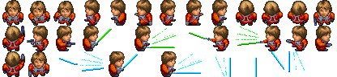

#### Character NPC (transparent)

#### Floor

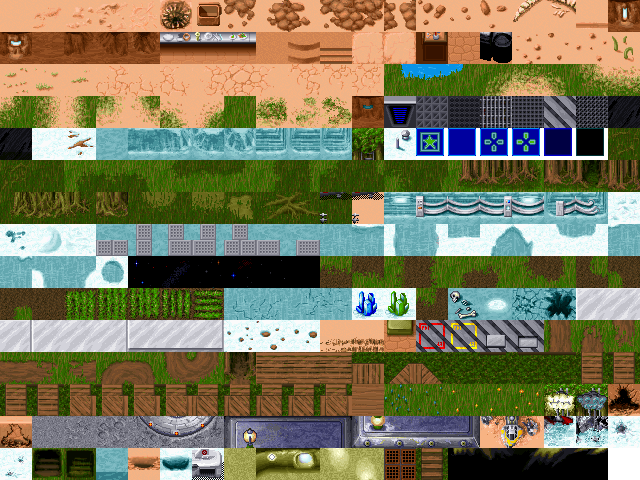

#### Floor Doorway

#### Item Edible (transparent)

#### Item Keycard (transparent)

#### Item Locator (transparent)

#### Item Part (transparent)

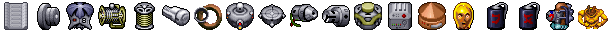

#### Item Tool (transparent)

#### Item Valuable (transparent)

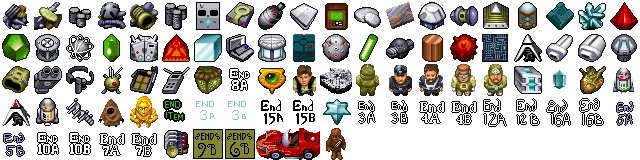

#### Map

4x2 Blockades, Final Chapter Unsolved, Puzzle/Solved, Spaceport, Gateway/Solved, Locator Indicator

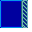

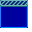

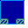

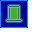

Please note that some tiles related to the map
for some reason have `Floor` attribute,
and only the game engine knows when to render them.

* Final Chapter Solved
* Teleport
* Teleport Activated
* Visited Sector
* Unknown Sector
* Impassable location

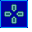

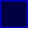

#### Object

#### Object (transparent)

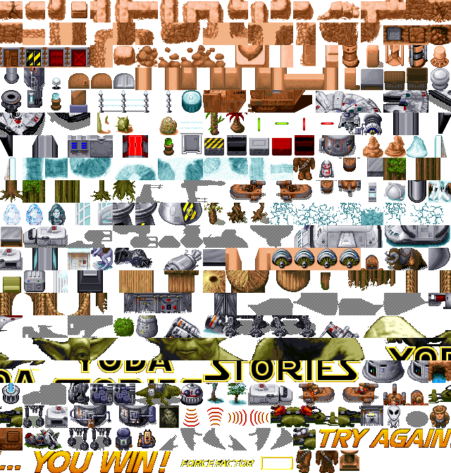

#### Object Draggable (transparent)

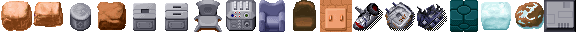

#### Roof

#### Roof (transparent)

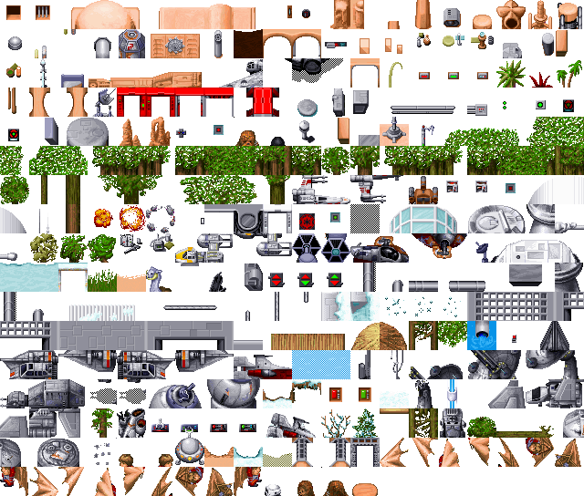

#### Weapon Blaster (transparent)

#### Weapon Heavy (transparent)

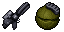

#### Weapon Lightsaber (transparent)

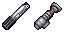

#### Weapon The Force (transparent)

### The most significant tiles

These tiles are worth remembering better. Developers liked them more than others.

### The most popular tiles in locations

| TileId | Image                      | Number of uses/Name                                 |
|:------:|:--------------------------:|:---------------------------------------------------:|
| 648    |  | 36481                                               |
| 0      |  | 35115                                               |
| 403    |  | 23408                                               |
| 858    | 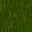 | 6720                                                |
| 355    |  | 5827 / Invis.Blocker                                  |
| 678    |  | 4734                                                |
| 192    |  | 4388                                                |
| 306    |  | 3754                                                |
| 598    |  | 3460                                                |
| 875    | 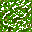 | 2611                                                |
	
		
### Unused tiles

These tiles are not used in YODASK.DTA. However, some of them are used directly by the game engine.

| TileId | Image                     | Comment                                                  |
|:------:|---------------------------|----------------------------------------------------------|
| 81    |  |  This door has a sand entry counterpart |
| 83    |  |                                                          |
| 84    |  |                                                          |
| 221   | 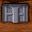 |  This door has a double with a red indicator |
| 251   |  |                                                          |
| 338   |  | The bottom of the Millennium Falcon. Must check in game  |
| 343   |  | Probably part of the Millennium Falcon. Must check in game |
| 414   |  |  This door has a mirrored version |
| 546   |  |  The mirror version is used    |
| 579   | 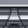 |                                                          |
| 628   |  |  A slightly different version of this door is used |
| 701   |  |  Used version of this door with lock |
| 703   |  | Weird. This door must be used, there are no others       |
| 706   |  |                                                          |
| 718   |  |  The mirror version is used    |
| 757   |  | Top layer graphic element                                |
| 803   |  | Nose of Landspeeder X-34 without transparency            |
| 830   |  | Used directly by the game engine                         |
| 832   |  | Used directly by the game engine                         |
| 833   |  | Used directly by the game engine                         |
| 834   |  | Used directly by the game engine                         |
| 835   |  | Used directly by the game engine                         |
| 836   |  | Used directly by the game engine                         |
| 1094  |  |                                                          |
| 1186  |  | TIE Fighter shadow. It is strange that it is not used    |
| 1187  |  | TIE Fighter shadow. It is strange that it is not used    |
| 1392  |  |                                                          |
| 1503  |  |                                                          |
| 1504  |  |                                                          |
| 1506  |  |                                                          |
| 1508  | 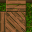 |                                                          |
| 2086  |  |                                                          |
| 2088  |  |                                                          |

Game state
----------

We already have the building blocks of the game. Tiles have characteristics such as transparency,
permeability, mobility and belonging to a certain group.

With the help of tiles, you can draw a game space of any complexity, since 3 layers of graphics are used.
They also represent the appearance of items and make up the animation frames of the characters.

Localization
------------

It makes sense to translate such phrases as `YODA STORIES`, `TRY AGAIN...`, `YOU WIN!`, `FORCE FACTOR`.
They are made up of individual tiles.
If the allotted space is not enough, then additional tiles can be added to the game.

Hacking possibilities
---------------------

When redrawing existing tiles, it must be clearly understood that the same tile can be used
in several tens or even hundreds of zones. That is, all zones will change at once.

In some cases, it will make more sense to add new tiles to the DTA file and use them only there,
where it's really needed.

Attributes should be chosen wisely as they can affect gameplay.
For example, any inventory item with attributes 7 and 20 (locator) opens a map.
In fact, this is a large area for research, you should carefully study the source code of the [WebFun](https://github.com/cyco/WebFun) project,
and experiment with the [Yoda Stories Translation Tool](https://github.com/LeonisX/yoda-stories-translation-tool).

[source](https://www.webfun.io/docs/gameplay/tiles.html)