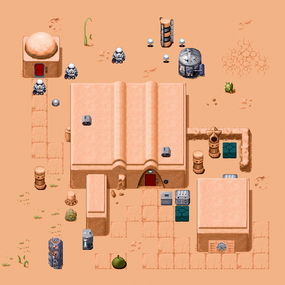
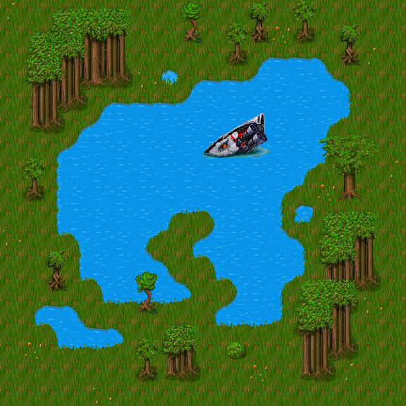
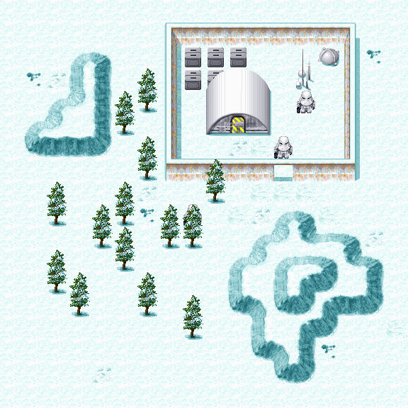
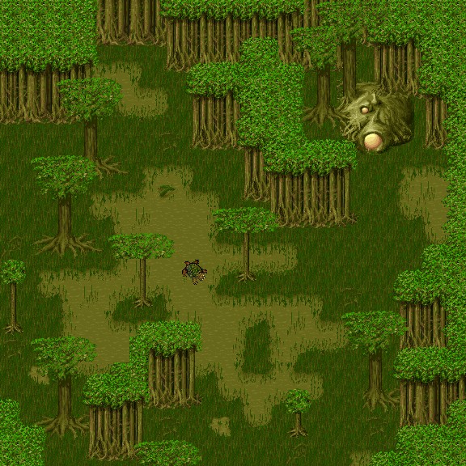

Planet Type
===========

In Yoda Stories, every zone belongs to one of the following planets:

| Planet | Biome  |   Name   | Count | Description                                    |
|:------:|--------|----------|:-----:|------------------------------------------------|
| 1      | Desert | Tatooine |  219  | Desert planet, also referred to as `Nevada`    |
| 2      | Snow   | Hoth     |  227  | Snowy ice planet, also referred to as `Alaska` |
| 3      | Forest | Endor    |  202  | A forest planet, also referred to as `Oregon`  |
| 5      | Swamp  | Dagobah  |  10   | Swamp planet, used in the starting world       |

During world generation the goal puzzle dictates which planet is chosen.
Apart from `swamp` zones, only the zones with type `empty` or the chosen type are loaded when a game is in progress.

However, in Yoda Stories there are no zones without reference to the planet.
Perhaps they are in `Indiana Jones and his Desktop Adventures`, as well as zones belonging to biome number `4`.

> It is quite natural that forest zones are inferior in popularity to desert and snowy ones.
Visually, they are the least spectacular.

> Forest locations were developed later than others.

Desert zone #7
--------------

Forest zone #400
----------------

Snowy zone #133
---------------

Swampy zone #95
---------------

