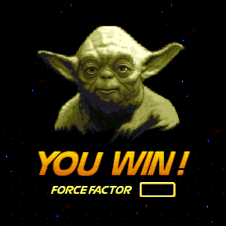
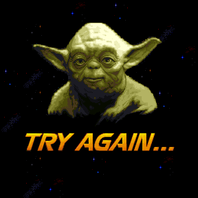
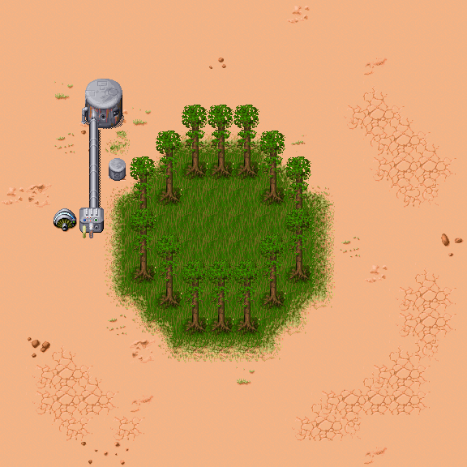
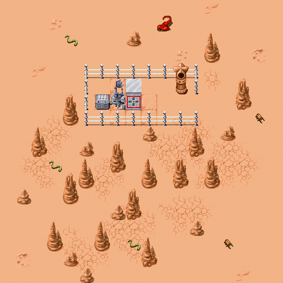
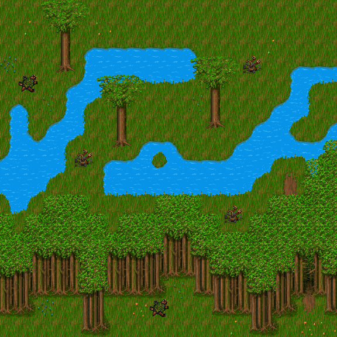
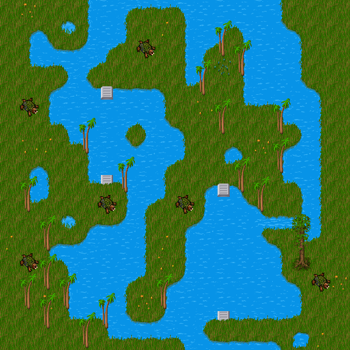
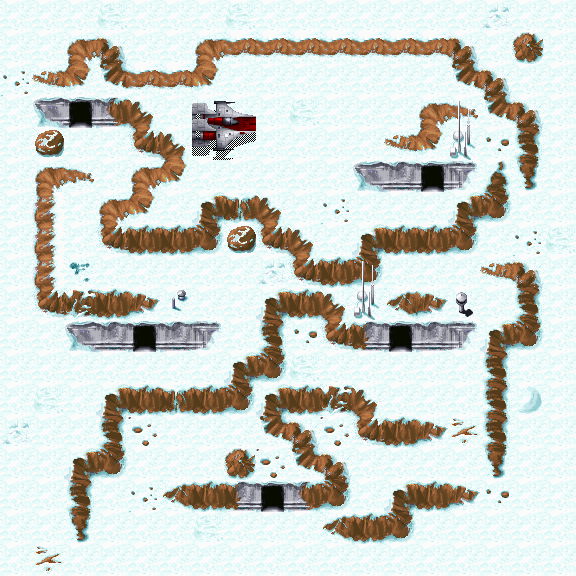
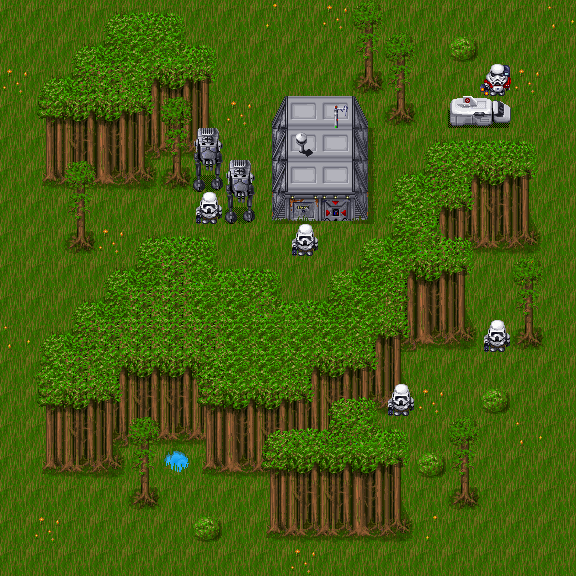

Zone Type
=========

Each zone has a type that is used in the world generation process. See the following table for a list of zone types:

| Type | Name                | Count | Description                                                                                                                                                                |
|:----:|---------------------|:-----:|----------------------------------------------------------------------------------------------------------------------------------------------------------------------------|
| 0    | None                |   -   |                                                                                                                                                                           |
| 1    | Empty               |  112  | An empty zone.                                                                                                                                                             |
| 2    | Blockade North      |   6   | Blocks access to zones north of this one until solved.                                                                                                                     |
| 3    | Blockade South      |   6   | Blocks access to zones south of this one until solved.                                                                                                                     |
| 4    | Blockade East       |   6   | Blocks access to zones east of this one until solved.                                                                                                                      |
| 5    | Blockade West       |   6   | Blocks access to zones west of this one until solved.                                                                                                                      |
| 6    | Gateway Departure   |  14   | When resolved, this allows the player to reach a zone on the island that cannot otherwise be reached by moving between zones in the main world.                            |
| 7    | Gateway Destination |  12   | Counterpart of `Gateway Departure`. Transport will arrive here after leaving the departure area. Zones are connected via hotspots such as 'GatewayStart' and 'GatewayEnd'. |
| 8    | Room                |  265  | Rooms cannot be placed directly in the main world. Access to them is possible only through the hotspots 'DoorIn'/'DoorOut' or using the instructions 'ChangeZone'.         |
| 9    | Load                |   1   | This zone is displayed when creating a new story.                                                                                                                          |
| 10   | Goal                |  15   | `Goal` zones are used for the final puzzles in each story.                                                                                                                 |
| 11   | Town / Spaceport    |   3   | The starting zone on the main world. Every generated world has exactly one town/spaceport.                                                                                 |
| 12   | Unknown             |   -   |                                                                                                                                                                           |
| 13   | Win                 |   1   | Shown when the game is won. This zone also displays the score.                                                                                                             |
| 14   | Lose                |   1   | This zone is shown after the hero has died.                                                                                                                                |
| 15   | Trade               |  69   | A zoone where the player must exchange items with an NPC to solve a puzzle.                                                                                                |
| 16   | Use                 |  56   | In order to solve this zone a tool must be used somewhere on the zone.                                                                                                     |
| 17   | Find                |  79   | `Find` zones provide an item without requiring anything else to solve them.                                                                                                |
| 18   | Find Unique Weapon  |   6   | One of them will be located near the city. it provides the player with a unique weapon (*The Force* in Yoda Stories).                                                      |

The number of zones like `Load`/`Win`/`Lose`, `Goal`, `Town` and `Find Unique Weapon` does not raise questions, there are as many as expected.

But the number of `Gateway Departure`/`Destination` frankly confuses.
However, everything is very simple, two "extra" zones are on Yoda's planet.

On each of the varieties of quest planets, two zones block progress in each of the sides of the world.

Load
----

**Zone**: 0

Win
---

**Zone**: 76

Lose
----

**Zone**: 77

Town
----

The hotspots `Ship From Planet` are located in these zones.

**Zones**: 2, 151, 476.

Find Unique Weapon
------------------

These are places of "`The Power`". Almost all hotspots `Drop Unique Weapon` are located in these zones.

**Zones**: 129, 272, 330, 369, 547, 640.

Goal
----

All 15 quests.

**Zones**: 265, 277, 296, 336, 374, 392, 408, 414, 446, 469, 495, 536, 556, 572, 630.

TODO quest title

Room
----

These zones are of different sizes, but for compactness, we chose several small ones.

Trade
-----

We will show only one zone for each planet.

Use
---

We will show only one zone for each planet.

Find
----

We will show only one zone for each planet.

Empty
-----

We will show only one zone for each planet.

Blockade North
--------------

**Zones**: 65, 66, 360, 390, 328, 435.

Blockade South
--------------

**Zones**: 73, 117, 251, 405, 436, 561.

Blockade East
-------------

**Zones**: 74, 116, 187, 192, 433, 554.

Blockade West
-------------

**Zones**: 99, 115, 196, 389, 434, 563.

Gateway Departure
-----------------

**Zones**: 93, 642.

The hotspots `Ship To Planet` are located in these zones.

Gateway Departure / Destination
-------------------------------

**Zones**: 105/106, 107/108, 142/143, 382/385, 384/402, 391/404,
463/464, 465/466, 542/543, 544/546, 595/596, 598/599.

These zones are respectively located hotspots `Vehicle To` and `Vehicle Back`.

