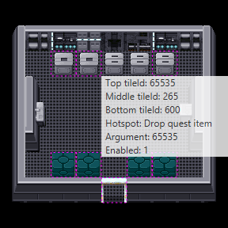
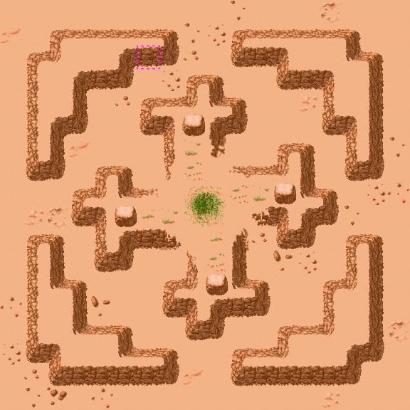
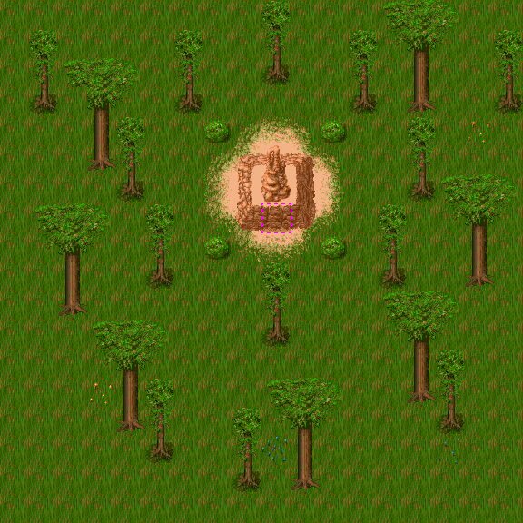
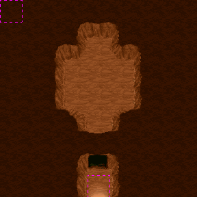
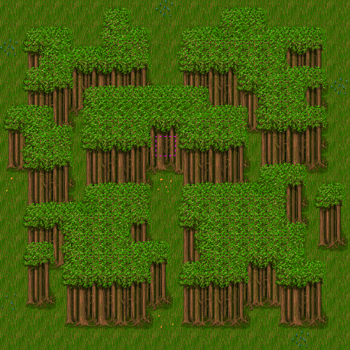
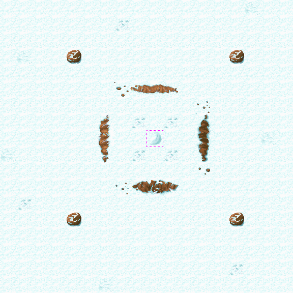
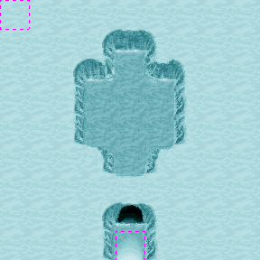
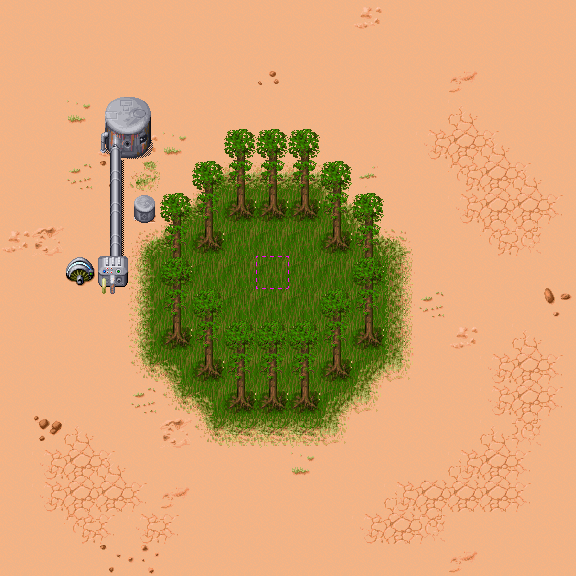
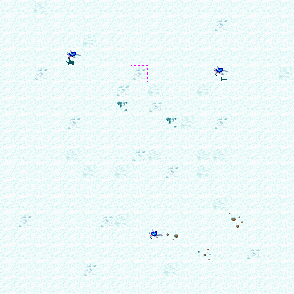

Hotspots
========

Each hotspot has a position on the map, a type, and a single argument. Unless disabled, hotspots are triggered by placing an item, 
walking to the location or removing the tile at the object layer underneath the hotspot.
If disabled, hotspots can not be triggered. See instruction opcodes called `ENABLE_HOTSPOT` and `DISABLE_HOTSPOT`.

The following table describes the hotspot types and their purpose.
We also calculated the number of zones in which each type of hotspot is found:

| Type | Name               | Count | Description                                                                                                                                                                         |
|:----:|--------------------|:-----:|-------------------------------------------------------------------------------------------------------------------------------------------------------------------------------------|
| 0    | Drop Quest Item    |  162  | Drops the Quest Item                                                                                                                                                                |
| 1    | Spawn Location     |  61   | A place for a random NPC from the list available on the zone                                                                                                                        |
| 2    | Drop Unique Weapon |   6   | Drops the Unique Weapon (*The Force* in Yoda Stories).                                                                                                                              |
| 3    | Vehicle To         |  12   | Used in Gateway Departure zones, to change the zone to the gateway target (identified by `arg`). On the target zone, the hero will be placed at a corresponding `Vehicle Back` hotspot. |
| 4    | Vehicle Back       |  12   | Used in Gateway Destination zones.                                                                                                                                                  |
| 5    | Drop Locator       |  11   | Drops the locator                                                                                                                                                                   |
| 6    | Drop Item          |  140  | Drops the item specified in `arg` when the object layer is free                                                                                                                     |
| 7    | NPC                |  31   | A place where the puzzle NPC from `arg` can be placed.                                                                                                                              |
| 8    | Drop Weapon        |  26   | Drops the weapon specified in `arg`                                                                                                                                                 |
| 9    | Door In            |  196  | Connects the zone to the one in `arg`.                                                                                                                                              |
| 10   | Door Out           |  260  | A door leading back to the zone where the player came from                                                                                                                          |
| 11   | Unused             |   -   |                                                                                                                                                                                     |
| 12   | Lock               |  104  | This is a placeholder for a item in a `use` zone. Placing the correct item here removes the underlying tile from the object layer.                                                  |
| 13   | Teleporter         |  18   | A place where the locator view is triggered for teleportation                                                                                                                       |
| 14   | Ship To Planet     |   2   | Used on Dagobah to mark the place to switch worlds. The target zone on the main world is specified in `arg`.                                                                        |
| 15   | Ship From Planet   |   3   | Used in spaceport to mark the place of return to Dagobah. The target zone on the main world is specified in `arg`.                                                                  |

`Ship From Planet` hotspots are located on `Town` zones.

`Ship To Planet` hotspots are located on `Gateway Departure` zones on Yoda's planet.

`Vehicle To` and `Vehicle Back` hotspots are located on zones like `Gateway Departure` / `Destination` on quest planets.

`Drop Unique Weapon` hotspots, logically, should correspond to `Find Unique Weapon` zone types,
but the match is not complete. The fact is that two locations lead to rooms where Luke can gain The Power.

  

  

