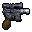
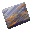
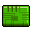
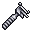

Zone Auxiliary #1
=================

`IZAX` - auxiliary object describing several important characteristics of the zone:

* `Monsters`: List of monsters
* `Required Items`: a list of items that can be used to solve the zone.
* `Goal Items`: a list of additional items that are needed to solve the zone. Only used if the zone type is `GOAL`.

`Required Items` and `Goal Items` are used during world generation.
In particular, the quest item will be selected from their list.
Sufficiently large lists contribute to the diversity of the gameplay.

Monsters
--------

In total, `87` different types of monsters are involved in the game.
In fact, these are not only wild animals, bizarre life forms, but also hostile humanoids, robots, droids,
as well as devices, such as ventilation systems and generators, which require animation in the game.

Monsters are closely related to `Character` objects, in particular,
their appearance, animation, movement type, damage, health level and other characteristics
described in `Character`. But compared to the [Character](dta-char.md) object, monsters also have unique characteristics.

* On the map, each monster has `[x, y]` coordinates.
* Upon death, monsters can drop simple or quest items.
* The monster can have its own trajectory of movement.

### Most popular monsters

* Sand Worm
* SuperTrooper
* SnowTrooper
* StormTrooper
* Desert Beetle
* Mine Droid
* Jigokiller
* Snow Star
* Tuscan Rider
* ForestTrooper
* Baby Wampa
* Wampa

### Rarest monsters

* IG-88
* Dianoga
* TimerPatrol
* Snowman
* Rancor
* Luke Enemy
* Gurk
* Greedo
* Bugs (Alessian Terror Moth)

### Tiles collision

The first attempts to take pictures of all zones with monsters were unsuccessful for the reason that in that place,
where the monster should be, one of its tiles, or a tile of a similar creature, could be drawn. For example:

| Zone Tile                  | Monster                    |
|:--------------------------:|:--------------------------:|
|  |  |
|  |  |

To prevent tiles from overlapping, we simply did not draw the corresponding zone tile.

### Inaccessible items

If you look closely, in Zone `#341` one of the stormtroopers is carrying a `Torture Droid`,
but it can't be knocked out. You can knock out `Q-Rations` from the second stormtrooper.
Easter egg or mistake? The tile numbers are `504` and `507` respectively.

 

The case is not isolated, here is a list of all inaccessible items:

| Zone | Enemy           | Inaccessible loot |
|:----:|:---------------:|:-----------------:|
|  49  | ST-Hard         | Blaster Rifle     |
|  73  | Mine Droid      | Pile of Junk      |
| 118  | TuscanMildAttac | Scrubroot         |
| 118  | TuscanMildAttac | Blaster           |
| 120  | SandWorm        | Scrubroot         |
| 211  | Baby Wampa      | Ice Mushroom      |
| 211  | Baby Wampa      | Ice Mushroom      |
| 211  | Wampa           | Ice Mushroom      |
| 211  | Baby Wampa      | Ice Mushroom      |
| 211  | Wampa           | Ice Mushroom      |
| 231  | Snowtrooper-H   | Blaster           |
| 294  | SnowTrooper-M   | Blaster           |
| 297  | SuperTrooper    | Q-Rations         |
| 297  | SuperTrooper    | Q-Rations         |
| 297  | ST-Hard         | Thermal Detonator |
| 341  | ST-Hard         | Torture Droid     |
| 350  | TuscanMildAttac | Scrubroot         |
| 376  | Boushh          | Blaster           |
| 381  | Wampa           | Ice Mushroom      |
| 381  | Wampa           | Ice Mushroom      |
| 381  | Baby Wampa      | Ice Mushroom      |
| 381  | Baby Wampa      | Ice Mushroom      |
| 455  | SuperTrooper    | Thermal Detonator |
| 465  | SnowTrooper-M   | Blaster           |
| 490  | ST-MildAttack   | Thermal Detonator |
| 514  | ForestTrooperM  | Q-Rations         |
| 536  | Snowtrooper-H   | Thermal Detonator |
| 550  | BatThing        | Mushroom          |
| 588  | SuperTrooper    | Blaster Rifle     |
| 632  | Mine Droid      | Pile of Junk      |
| 634  | Mine Droid      | Pile of Junk      |
| 635  | Mine Droid      | Pile of Junk      |

### Waypoints

Judging by the code of the `WebFun` project, `Waypoints` are used only for `MovementType` = `PATROL`.
These are 4 coordinates describing a square or rectangular trajectory,
where the monster is moving. For example: `[3;3], [5;3], [5;5], [3;5]`.

However, there are also such solutions: `[0;0], [0;0], [0;0], [0;0]`. The monster just turns in place.

The vast majority of Waypoints are undefined: `[-1;-1], [-1;-1], [-1;-1], [-1;-1]`.

### Monster Loot		
		
| TileId | Image                      | Name                    | Uses | Zones                                      |
|:------:|:--------------------------:|-------------------------|:----:|--------------------------------------------|
| 512    |  | Blaster                 | 52   | 20, 21, 41, 43, 66, 67, 72, 110, 133, 150, 157, 162, 187, 196, 209, 217, 219, 227, 256, 294, 295, 296, 306, 318, 319, 360, 363, 364, 372, 375, 392, 396, 417, 419, 441, 445, 462, 483, 497, 497, 517, 524, 526, 528, 553, 564, 588, 597, 631, 635, 646 |
| 513    |  | Blaster Rifle           | 44   | 6, 27, 28, 36, 64, 66, 67, 70, 72, 102, 132, 149, 157, 170, 187, 196, 200, 212, 216, 217, 219, 220, 231, 274, 289, 299, 318, 365, 372, 390, 411, 417, 419, 455, 501, 518, 519, 553, 563, 568, 595, 614, 631, 632 |
| 514    |  | Thermal Detonator       | 34   | 4, 36, 64, 72, 110, 130, 149, 150, 161, 212, 213, 214, 216, 221, 274, 290, 296, 298, 306, 350, 376, 418, 432, 462, 465, 491, 497, 517, 519, 528, 536, 588, 632, 646 |
| 507    |  | Q-Rations               | 26   | 7, 70, 133, 161, 166, 187, 221, 274, 339, 341, 360, 374, 392, 396, 411, 418, 432, 445, 496, 497, 514, 528, 536, 538, 567, 567 |
| 506    |  | Imperial First Aid Kit  | 22   | 36, 72, 150, 196, 290, 299, 300, 343, 360, 364, 390, 392, 418, 455, 465, 526, 564, 595, 632, 636, 643, 646 |
| 418    |  | Pile of Junk            | 18   | 18, 22, 111, 165, 169, 232, 252, 268, 270, 343, 357, 459, 460, 607, 634, 636, 645, 652 |
| 174    |  | Pile of Junk            | 15   | 12, 73, 165, 197, 232, 333, 334, 343, 520, 607, 633, 634, 635, 645, 652 |
| 1233   |  | Key Card                | 13   | 277, 277, 296, 296, 345, 345, 345, 345, 412, 419, 419, 419, 419 |
| 175    |  | Pile of Junk            | 11   | 10, 73, 174, 222, 332, 343, 459, 542, 632, 633, 636 |
| 425    |  | Pile of Junk            | 9    | 18, 50, 73, 222, 252, 334, 391, 632, 635   |
| 1234   |  | Key Card                | 6    | 284, 309, 310, 311, 410, 451               |
| 1236   |  | Stormtrooper ID         | 6    | 446                                        |
| 1198   |  | Scrubroot               | 5    | 21, 35, 43, 375, 496                       |
| 442    |  | Pile of Credits         | 4    | 4, 350, 496                                |
| 1238   |  | Key                     | 3    | 229                                        |
| 484    |  | Nav Card                | 3    | 313                                        |
| 1795   |  | Key Card                | 2    | 563                                        |
| 1232   |  | Key Card                | 2    | 8, 256                                     |
| 1237   |  | ID Card                 | 2    | 276, 276                                   |
| 405    |  | 5,000 Credits           | 2    | 265                                        |
| 482    |  | Chakroot                | 2    | 3, 374                                     |
| 448    |  | Lantern of Sacred Light | 1    | 643                                        |
| 1217   |  | Dianoga Heart           | 1    | 271                                        |
| 515    |  | IM Mine                 | 1    | 632                                        |
| 1284   |  | Fuse                    | 1    | 287                                        |
| 1235   |  | Key Card                | 1    | 451                                        |
| 470    |  | Droid Caller            | 1    | 496                                        |
| 1240   |  | Imperial Key            | 1    | 465                                        |
| 480    |  | Bacta Fluid             | 1    | 49                                         |
| 1196   |  | Ice Mushroom            | 1    | 337                                        |
		
		
Goal Items
----------

| TileId | Image                      | Name                | Uses | Zones  |
|:------:|:--------------------------:|---------------------|:----:|:------:|
|  429   |  | 10,000 Credits      |  1   | 536    |
| 1353   |  | C-3PO               |  1   | 392    |
| 2114   |  | Chewbacca           |  1   | 572    |
|  471   |  | Crate of Spice      |  1   | 287    |
| 1215   |  | DataCube            |  1   | 392    |
|  486   |  | Drive Guide         |  1   | 287    |
|  470   |  | Droid Caller        |  1   | 495    |
|  465   |  | Droid Part          |  1   | 469    |
| 1351   |  | Energy Relay        |  1   | 265    |
|  478   |  | Glow Rod            |  1   | 630    |
| 1292   |  | Grappling Hook      |  1   | 336    |
|  492   |  | Hydrospanner        |  1   | 630    |
|  515   |  | IM Mine             |  1   | 469    |
|  433   |  | Ice Drill           |  1   | 296    |
| 1350   |  | Jawa                |  1   | 265    |
| 1243   |  | Key Card            |  1   | 374    |
|  450   |  | Lommite Crystal     |  2   | 536, 556 |
|  479   |  | Power Coupling      |  1   | 408    |
| 1245   |  | Rebel ID Card       |  1   | 414    |
|  473   |  | Red Key Card        |  1   | 287    |
|  452   |  | Sample of Ryll      |  1   | 536    |
|  460   |  | Sensor Pack         |  1   | 336    |
|  527   |  | Sequencer Charge    |  1   | 446    |
|  523   |  | Stasis Mine         |  1   | 495    |
|  437   |  | Thermal Cape        |  1   | 296    |

Required Items
--------------

| TileId | Image                      | Name                | Uses | Zones                                                                              |
|:------:|:--------------------------:|---------------------|:----:|------------------------------------------------------------------------------------|
|  457   |  | Beamdrill           |  82  | 3, 7, 13, 14, 23, 28, 31, 39, 42, 44, 48, 50, 65, 66, 67, 73, ...                  |
|  440   |  | Power Prybar        |  81  | 3, 7, 13, 14, 28, 31, 42, 44, 48, 50, 65, 66, 67, 80, 82, 84, ...                  |
|  439   |  | Power Terminal      |  65  | 16, 19, 33, 39, 71, 75, 78, 80, 82, 84, 85, 86, 90, 91, 99, 105, ...               |
|  456   |  | Fusion Welder       |  63  | 3, 7, 13, 14, 28, 31, 42, 44, 48, 50, 66, 67, 73, 78, 85, 91, ...                  |
|  432   |  | Sonic Cleaver       |  62  | 3, 13, 28, 31, 42, 44, 48, 65, 66, 67, 90, 99, 116, 117, 135, 178, ...             |
|  435   |  | Alluvial Damper     |  60  | 16, 19, 23, 33, 39, 71, 74, 75, 78, 80, 82, 84, 85, 86, 90, 91, ...                |
|  518   |  | Fusion Cutter       |  59  | 3, 13, 28, 31, 42, 44, 48, 65, 66, 67, 90, 99, 116, 117, 135, 157, ...             |
|  441   |  | Navicomputer        |  59  | 16, 33, 39, 71, 75, 78, 80, 82, 84, 86, 88, 90, 115, 138, 142, 148, ...            |
|  445   |  | Drive Compensator   |  58  | 16, 33, 39, 71, 74, 75, 78, 80, 82, 84, 86, 88, 90, 91, 99, 105, ...               |
|  436   |  | Vial of Tibanna Gas |  57  | 16, 19, 23, 33, 39, 71, 74, 75, 78, 80, 82, 84, 85, 86, 88, 90, ...                |
|  447   |  | Anti-Grav Generator |  56  | 16, 23, 33, 39, 71, 78, 80, 82, 84, 86, 88, 90, 91, 105, 115, 138, ...             |
|  479   |  | Power Coupling      |  56  | 16, 23, 33, 71, 73, 74, 75, 83, 85, 99, 107, 138, 142, 150, 157, 176, ...          |
|  446   |  | Comm Unit           |  55  | 16, 33, 39, 71, 75, 78, 80, 82, 84, 86, 90, 91, 99, 115, 138, 142, ...             |
|  477   |  | Electrolockpick     |  55  | 3, 7, 14, 16, 31, 42, 48, 50, 66, 67, 142, 150, 178, 190, 198, 216, ...            |
|  434   |  | Droid Detector      |  54  | 16, 19, 23, 33, 39, 71, 78, 80, 82, 84, 85, 86, 88, 90, 91, 115, ...               |
|  443   |  | Bar of Durasteel    |  54  | 16, 33, 39, 71, 74, 78, 80, 82, 84, 86, 88, 90, 115, 138, 148, 150, ...            |
|  464   |  | Transponder         |  54  | 16, 19, 33, 39, 71, 73, 75, 80, 83, 85, 91, 99, 105, 107, 115, 138, ...            |
|  438   |  | Restraining Bolt    |  53  | 16, 19, 33, 39, 71, 78, 80, 82, 84, 85, 86, 90, 91, 115, 138, 148, ...             |
|  450   |  | Lommite Crystal     |  53  | 16, 23, 33, 39, 71, 75, 78, 80, 82, 84, 86, 88, 91, 115, 138, 150, ...             |
|  466   |  | Power Converter     |  53  | 16, 33, 39, 71, 83, 99, 105, 115, 138, 150, 157, 176, 181, 185, 203, 231, ...      |
|  463   |  | Holocube            |  51  | 16, 19, 23, 33, 71, 74, 75, 80, 83, 85, 88, 91, 115, 138, 150, 157, ...            |
|  472   |  | Blue Key Card       |  51  | 3, 7, 14, 31, 50, 67, 142, 178, 185, 190, 196, 198, 218, 219, 234, 236, ...        |
|  453   |  | Sensor Array        |  50  | 16, 33, 39, 71, 78, 80, 86, 90, 91, 99, 115, 138, 142, 157, 176, 181, ...          |
|  454   |  | Repulsor            |  50  | 16, 19, 23, 33, 71, 73, 78, 80, 86, 90, 91, 99, 105, 107, 115, 138, ...            |
|  444   |  | Shield Generator    |  49  | 16, 19, 23, 33, 39, 71, 78, 80, 82, 84, 86, 90, 91, 115, 138, 142, ...             |
|  474   |  | Green Key Card      |  49  | 3, 7, 14, 31, 50, 67, 142, 178, 185, 190, 196, 198, 216, 218, 219, 234, ...        |
|  491   |  | Macrofuser          |  49  | 13, 31, 39, 42, 48, 66, 67, 73, 83, 99, 135, 150, 178, 190, 198, 238, ...          |
|  460   |  | Sensor Pack         |  48  | 16, 33, 39, 71, 75, 78, 80, 83, 85, 88, 91, 99, 115, 138, 157, 176, ...            |
|  461   |  | Holocron            |  48  | 16, 19, 33, 71, 78, 80, 83, 85, 91, 99, 115, 138, 150, 157, 176, 185, ...          |
|  473   |  | Red Key Card        |  48  | 3, 14, 31, 67, 157, 178, 185, 190, 196, 198, 216, 218, 219, 234, 236, 247, ...     |
|  455   |  | Hyperspace Compass  |  47  | 16, 23, 33, 39, 71, 75, 78, 80, 85, 86, 88, 91, 115, 138, 142, 150, ...            |
|  437   |  | Thermal Cape        |  44  | 16, 19, 39, 71, 78, 80, 82, 84, 85, 86, 88, 91, 115, 138, 148, 157, ...            |
|  471   |  | Crate of Spice      |  44  | 16, 19, 23, 33, 39, 71, 75, 82, 83, 85, 88, 115, 138, 150, 157, 176, ...           |
|  498   |  | Telesponder         |  44  | 16, 19, 23, 33, 39, 71, 74, 83, 88, 90, 115, 138, 142, 150, 157, 187, ...          |
|  449   |  | Data Card           |  43  | 16, 33, 39, 71, 78, 80, 82, 84, 86, 90, 91, 115, 138, 148, 150, 176, ...           |
|  452   |  | Sample of Ryll      |  43  | 16, 23, 33, 71, 74, 75, 78, 80, 86, 88, 90, 91, 115, 138, 150, 187, ...            |
|  458   |  | Vocabulator         |  43  | 16, 19, 33, 71, 74, 75, 78, 85, 88, 91, 115, 138, 150, 176, 185, 203, ...          |
|  489   |  | Condenser Unit      |  43  | 16, 19, 23, 33, 39, 71, 74, 75, 78, 83, 99, 115, 138, 176, 238, 247, ...           |
|  469   |  | Computer Probe      |  42  | 16, 33, 39, 71, 74, 83, 85, 99, 115, 138, 150, 157, 176, 185, 203, 231, ...        |
|  462   |  | Decoder             |  41  | 16, 23, 31, 39, 71, 80, 83, 91, 115, 138, 150, 157, 176, 185, 203, 231, ...        |
|  481   |  | Sample of Carbonite |  40  | 16, 23, 33, 39, 71, 74, 75, 88, 115, 138, 150, 157, 176, 187, 231, 238, ...        |
|  497   |  | Fusion Furnace      |  40  | 16, 19, 23, 33, 71, 74, 75, 78, 83, 90, 99, 115, 138, 148, 150, 157, ...           |
|  476   |  | Locomotor           |  39  | 16, 71, 73, 74, 75, 83, 85, 105, 107, 138, 142, 148, 157, 176, 185, 231, ...       |
|  485   |  | Homing Beacon       |  39  | 16, 19, 23, 33, 39, 71, 74, 82, 85, 115, 138, 148, 150, 157, 176, 187, ...         |
|  492   |  | Hydrospanner        |  39  | 42, 66, 67, 73, 82, 83, 99, 135, 150, 157, 178, 190, 198, 247, 252, 257, ...       |
|  508   |  | Purple Key Card     |  39  | 14, 196, 218, 219, 234, 236, 247, 257, 258, 292, 300, 308, 320, 346, 358, 363, ... |
|  509   |  | Yellow Key Card     |  39  | 14, 196, 218, 219, 234, 236, 247, 257, 258, 292, 300, 308, 320, 346, 358, 363, ... |
|  516   |  | Orange Key Card     |  38  | 14, 196, 218, 219, 234, 236, 247, 257, 258, 292, 300, 308, 320, 346, 358, 363, ... |
|  501   |  | Transfer Register   |  38  | 16, 23, 33, 71, 74, 75, 83, 88, 90, 115, 138, 150, 157, 176, 187, 238, ...         |
|  486   |  | Drive Guide         |  37  | 16, 23, 33, 71, 85, 115, 138, 150, 157, 231, 238, 247, 251, 259, 303, 307, ...     |
|  467   |  | Motivator           |  36  | 23, 71, 73, 75, 83, 99, 105, 107, 138, 150, 176, 185, 203, 231, 238, 247, ...      |
|  488   |  | Rangefinder         |  36  | 16, 19, 23, 33, 71, 82, 88, 99, 115, 138, 157, 231, 238, 247, 251, 259, ...        |
|  487   |  | Electroscope        |  35  | 16, 19, 23, 33, 39, 71, 75, 82, 99, 115, 138, 157, 176, 238, 247, 251, ...         |
|  494   |  | Generator           |  34  | 23, 33, 39, 71, 74, 88, 99, 107, 138, 148, 157, 176, 231, 238, 247, 251, ...       |
|  500   |  | Holocomm            |  34  | 16, 23, 33, 39, 71, 74, 83, 90, 115, 138, 150, 187, 238, 247, 251, 314, ...        |
|  475   |  | Training Remote     |  33  | 19, 33, 39, 71, 74, 75, 83, 88, 115, 138, 148, 157, 157, 176, 185, 231, ...        |
|  478   |  | Glow Rod            |  33  | 16, 23, 39, 75, 82, 83, 85, 88, 99, 138, 148, 160, 176, 231, 238, 247, ...         |
|  490   |  | Pair of Binoculars  |  33  | 16, 19, 33, 71, 75, 82, 83, 115, 138, 157, 176, 231, 238, 247, 251, 259, ...       |
|  495   |  | Macroscope          |  33  | 16, 19, 23, 33, 71, 74, 78, 83, 88, 90, 115, 138, 148, 150, 157, 176, ...          |
|  470   |  | Droid Caller        |  31  | 16, 33, 71, 82, 83, 85, 99, 138, 157, 185, 203, 238, 247, 250, 251, 259, ...       |
|  484   |  | Nav Card            |  31  | 16, 19, 23, 33, 71, 75, 115, 138, 150, 157, 176, 187, 231, 238, 247, 251, ...      |
|  465   |  | Droid Part          |  30  | 73, 75, 83, 91, 107, 157, 185, 203, 238, 247, 250, 259, 304, 307, 322, 359, ...    |
|  496   |  | Utility Belt        |  30  | 19, 23, 33, 39, 71, 83, 90, 138, 148, 150, 157, 176, 231, 238, 247, 322, ...       |
|  503   |  | Comlink             |  30  | 16, 23, 33, 39, 71, 74, 78, 90, 99, 115, 138, 150, 157, 231, 238, 247, ...         |
|  499   |  | Breath Mask         |  28  | 16, 19, 23, 33, 71, 78, 83, 88, 90, 115, 138, 150, 157, 176, 231, 247, ...         |
|  515   |  | IM Mine             |  27  | 3, 13, 26, 28, 31, 44, 65, 99, 116, 190, 192, 196, 231, 236, 238, 247, ...         |
|  523   |  | Stasis Mine         |  26  | 3, 13, 31, 44, 65, 90, 99, 116, 185, 190, 192, 196, 231, 236, 238, 247, ...        |
|  483   |  | Blumfruit           |  25  | 19, 83, 138, 238, 247, 304, 314, 336, 353, 354, 359, 362, 368, 387, 423, 431, ...  |
|  493   |  | Imperial Belt       |  24  | 23, 33, 39, 71, 78, 88, 90, 115, 150, 176, 231, 238, 247, 259, 328, 353, ...       |
|  428   |  | Collapsible Bridge  |  23  | 238, 328, 328, 328, 328, 328, 328, 328, 328, 328, 328, 328, 328, 328, 328, 328, ... |
|  433   |  | Ice Drill           |  20  | 135, 148, 157, 178, 190, 192, 196, 216, 234, 241, 247, 250, 252, 258, 301, 405, ... |
|  468   |  | Energy Cell         |  16  | 231, 238, 354, 359, 362, 425, 426, 434, 435, 461, 486, 503, 572, 582, 589, 621     |
|  430   |  | Gas Grenade         |  15  | 26, 148, 150, 238, 250, 322, 348, 354, 359, 362, 387, 431, 465, 561, 565           |
|  431   |  | Smoke Grenade       |  13  | 26, 90, 150, 238, 250, 348, 354, 359, 362, 431, 465, 561, 565                      |
| 1292   |  | Grappling Hook      |   9  | 90, 157, 231, 247, 362, 368, 392, 442, 624                                         |
|  429   |  | 10,000 Credits      |   3  | 275, 336, 630                                                                      |
|  526   |  | Sequencer Charge    |   1  | 446                                                                                |
|  809   |  | Han Solo            |   1  | 287                                                                                |
| 1357   |  | Droid Body          |   1  | 265                                                                                |
| 1246   |  | Ladder              |   1  | 392                                                                                |
|  502   |  | C-3PO's Head        |   1  | 265                                                                                |

Unnamed field
-------------

`IZAX` has one more field, `_unnamed2`, which takes one of two values: `0` or `1`.
Unfortunately, the purpose of this field is currently unknown,
and it is also unknown whether it is used in the game (when generating the world) or not.
One thing can be seen. 103 locations with flag `1` are often quite eventful,
often directly related to quests or secrets.

Distribution of `_unnamed2` by zone types:

| Type | Name                | "0" count | "1" count |
|:----:|---------------------|:---------:|:---------:|
| 0    | None                |     -     |     -     |
| 1    | Empty               |    112    |     -     |
| 2    | Blockade North      |     6     |     -     |
| 3    | Blockade South      |     6     |     -     |
| 4    | Blockade East       |     6     |     -     |
| 5    | Blockade West       |     6     |     -     |
| 6    | Gateway Departure   |    14     |     -     |
| 7    | Gateway Destination |    11     |     1     |
| 8    | Room                |    186    |    79     |
| 9    | Load                |     1     |     -     |
| 10   | Goal                |     4     |    11     |
| 11   | Town / Spaceport    |     2     |     1     |
| 12   | Unknown             |     -     |     -     |
| 13   | Win                 |     1     |     -     |
| 14   | Lose                |     1     |     -     |
| 15   | Trade               |    66     |     3     |
| 16   | Use                 |    54     |     2     |
| 17   | Find                |    76     |     3     |
| 18   | Find Unique Weapon  |     3     |     3     |
