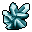
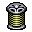
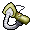
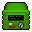
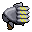
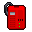
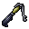
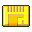
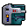
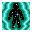

Zone Auxiliary #2
=================

`IZX2` is a small helper object whose purpose is to store a list of `Provided Items`.

These are Items that can be gained when the zone is solved. Each occupies 2 bytes (tileId).
When generating a map, the `Provided Item` is randomly selected from the proposed list.
This increases the variability of the game.

We have calculated in which types of zones `Provided Items` can be found most often:

| Zone Type          | Zones count |
|:------------------:|:-----------:|
| Room               |     90      |
| Find               |     65      |
| Trade              |     28      |
| Use                |     24      |
| Goal               |     14      |
| Find Unique Weapon |      4      |

Provided Items
--------------

| TileId | Image                      | Name                | Uses | Zones                                                             |
|:------:|:--------------------------:|---------------------|:----:|-------------------------------------------------------------------|
|  431   |  | Smoke Grenade | 144 | 4, 13, 15, 17, 19, 19, 20, 23, 25, 29, 32, 34, 35, 37, 39, 40, ... |
|  460   |  | Sensor Pack | 143 | 4, 6, 12, 13, 15, 17, 19, 20, 23, 25, 27, 29, 32, 35, 37, 40, ... |
|  430   |  | Gas Grenade | 141 | 4, 13, 15, 17, 19, 19, 20, 23, 25, 29, 32, 34, 35, 37, 39, 40, ... |
|  436   |  | Vial of Tibanna Gas | 136 | 4, 6, 12, 13, 15, 19, 20, 23, 27, 29, 32, 37, 39, 40, 42, 45, ... |
|  479   |  | Power Coupling | 136 | 6, 13, 15, 17, 20, 29, 34, 35, 37, 39, 42, 45, 48, 52, 67, 82, ... |
|  443   |  | Bar of Durasteel | 133 | 4, 6, 12, 13, 15, 17, 19, 20, 23, 27, 35, 37, 40, 42, 45, 48, ... |
|  450   |  | Lommite Crystal | 133 | 4, 6, 13, 15, 19, 20, 25, 35, 37, 40, 42, 45, 48, 52, 55, 57, ... |
|  453   |  | Sensor Array | 133 | 4, 6, 12, 13, 15, 17, 19, 20, 23, 25, 29, 34, 42, 45, 48, 52, ... |
|  456   |  | Fusion Welder | 133 | 6, 12, 15, 17, 19, 20, 23, 25, 27, 35, 37, 39, 40, 42, 52, 55, ... |
|  457   |  | Beamdrill | 133 | 4, 6, 12, 15, 17, 19, 20, 25, 27, 34, 35, 37, 40, 42, 52, 55, ... |
|  461   |  | Holocron | 132 | 4, 6, 15, 17, 20, 29, 37, 39, 40, 42, 45, 48, 52, 55, 67, 75, ... |
|  466   |  | Power Converter | 131 | 4, 6, 12, 15, 17, 19, 20, 23, 25, 29, 32, 34, 37, 42, 42, 45, ... |
|  452   |  | Sample of Ryll | 130 | 4, 6, 13, 15, 20, 27, 37, 39, 40, 42, 45, 48, 52, 55, 67, 72, ... |
|  454   |  | Repulsor | 130 | 6, 12, 15, 17, 20, 25, 27, 29, 32, 35, 39, 42, 45, 48, 52, 55, ... |
|  481   |  | Sample of Carbonite  | 130 | 4, 6, 12, 15, 17, 19, 20, 23, 29, 34, 37, 40, 42, 45, 48, 52, ... |
|  485   |  | Homing Beacon | 130 | 4, 6, 12, 13, 15, 17, 19, 20, 29, 35, 40, 42, 45, 52, 55, 57, ... |
|  492   |  | Hydrospanner | 130 | 6, 12, 17, 19, 20, 23, 27, 29, 32, 34, 35, 37, 39, 40, 48, 52, ... |
|  499   |  | Breath Mask | 130 | 6, 12, 15, 17, 20, 27, 29, 32, 37, 39, 40, 42, 45, 48, 52, 55, ... |
|  438   |  | Restraining Bolt | 129 | 6, 12, 13, 15, 17, 19, 20, 25, 27, 29, 32, 35, 37, 39, 40, 42, ... |
|  446   |  | Comm Unit | 129 | 6, 12, 13, 15, 17, 20, 23, 25, 29, 35, 37, 39, 42, 45, 48, 52, ... |
|  515   |  | IM Mine | 128 | 4, 15, 17, 20, 23, 25, 27, 34, 35, 37, 39, 40, 42, 45, 52, 55, ... |
|  432   |  | Sonic Cleaver | 128 | 13, 15, 17, 19, 19, 20, 23, 25, 29, 34, 37, 39, 40, 42, 52, 55, ... |
|  523   |  | Stasis Mine | 127 | 4, 15, 17, 20, 23, 25, 34, 35, 37, 39, 40, 42, 45, 52, 55, 67, ... |
|  462   |  | Decoder | 127 | 4, 6, 12, 15, 17, 20, 29, 35, 37, 42, 48, 52, 55, 67, 75, 80, ... |
|  464   |  | Transponder | 127 | 6, 15, 17, 20, 25, 29, 32, 37, 42, 45, 48, 52, 55, 67, 78, 80, ... |
|  469   |  | Computer Probe | 127 | 6, 15, 20, 23, 29, 32, 35, 37, 42, 45, 48, 48, 52, 67, 75, 78, ... |
|  470   |  | Droid Caller | 127 | 6, 15, 19, 20, 29, 32, 35, 37, 39, 40, 42, 48, 52, 57, 67, 75, ... |
|  447   |  | Anti-Grav Generator | 126 | 6, 12, 13, 15, 17, 20, 23, 25, 29, 34, 42, 45, 52, 55, 57, 67, ... |
|  476   |  | Locomotor | 126 | 4, 6, 12, 15, 17, 20, 23, 29, 34, 35, 37, 39, 42, 48, 52, 55, ... |
|  478   |  | Glow Rod | 126 | 6, 15, 19, 20, 25, 29, 32, 37, 45, 52, 67, 86, 90, 91, 109, 111, ... |
|  484   |  | Nav Card | 126 | 6, 15, 20, 23, 27, 29, 35, 37, 39, 40, 42, 45, 48, 52, 67, 72, ... |
|  439   |  | Power Terminal | 125 | 6, 12, 13, 15, 17, 19, 25, 27, 29, 40, 42, 45, 48, 52, 55, 67, ... |
|  449   |  | Data Card | 125 | 6, 12, 15, 17, 20, 23, 25, 27, 29, 37, 39, 40, 42, 48, 52, 67, ... |
|  491   |  | Macrofuser | 125 | 6, 12, 15, 17, 19, 20, 23, 27, 29, 32, 34, 35, 37, 40, 52, 55, ... |
|  495   |  | Macroscope | 125 | 6, 12, 17, 19, 20, 29, 32, 34, 35, 39, 40, 42, 45, 48, 52, 55, ... |
|  498   |  | Telesponder | 125 | 6, 15, 17, 20, 25, 29, 32, 34, 35, 37, 40, 42, 48, 52, 55, 57, ... |
|  435   |  | Alluvial Damper | 124 | 6, 12, 13, 15, 17, 19, 20, 23, 25, 27, 29, 32, 37, 42, 48, 52, ... |
|  440   |  | Power Prybar | 124 | 4, 12, 15, 17, 19, 20, 25, 27, 29, 34, 35, 37, 39, 40, 52, 55, ... |
|  487   |  | Electroscope | 124 | 6, 15, 17, 20, 27, 29, 32, 34, 35, 48, 52, 55, 67, 83, 85, 91, ... |
|  488   |  | Rangefinder | 124 | 6, 13, 15, 17, 20, 34, 35, 39, 48, 52, 55, 57, 67, 83, 83, 85, ... |
|  444   |  | Shield Generator | 123 | 6, 13, 15, 17, 20, 25, 27, 29, 37, 39, 42, 48, 55, 67, 75, 88, ... |
|  437   |  | Thermal Cape | 121 | 6, 15, 17, 19, 20, 25, 37, 45, 48, 52, 55, 67, 75, 78, 109, 111, ... |
|  467   |  | Motivator | 121 | 6, 15, 17, 19, 20, 29, 32, 34, 37, 39, 42, 48, 52, 67, 78, 82, ... |
|  490   |  | Pair of Binoculars | 121 | 6, 13, 17, 20, 23, 29, 34, 35, 39, 48, 52, 55, 57, 67, 78, 83, ... |
|  497   |  | Fusion Furnace | 121 | 4, 6, 12, 13, 17, 20, 27, 29, 32, 34, 39, 45, 52, 55, 57, 67, ... |
|  503   |  | Comlink | 121 | 6, 12, 17, 19, 20, 29, 35, 37, 40, 42, 45, 48, 52, 55, 67, 83, ... |
|  500   |  | Holocomm | 120 | 6, 17, 20, 27, 29, 34, 37, 42, 48, 52, 67, 78, 83, 88, 90, 91, ... |
|  501   |  | Transfer Register | 120 | 6, 15, 17, 19, 20, 29, 37, 39, 40, 42, 48, 52, 67, 78, 83, 90, ... |
|  518   |  | Fusion Cutter | 119 | 15, 17, 20, 23, 25, 27, 34, 35, 39, 40, 42, 45, 52, 55, 78, 85, ... |
|  458   |  | Vocabulator | 119 | 6, 15, 17, 19, 20, 23, 29, 32, 37, 39, 40, 42, 45, 48, 52, 67, ... |
|  471   |  | Crate of Spice | 119 | 4, 6, 12, 15, 17, 27, 29, 34, 37, 42, 45, 55, 67, 72, 78, 109, ... |
|  477   |  | Electrolockpick | 119 | 12, 15, 19, 20, 23, 27, 29, 34, 35, 37, 39, 52, 57, 75, 78, 80, ... |
|  493   |  | Imperial Belt | 117 | 6, 15, 17, 20, 25, 27, 29, 35, 37, 52, 55, 57, 67, 82, 83, 90, ... |
|  486   |  | Drive Guide | 116 | 6, 12, 15, 17, 27, 29, 32, 34, 37, 39, 40, 42, 52, 55, 67, 75, ... |
|  489   |  | Condenser Unit | 116 | 6, 12, 13, 15, 17, 20, 27, 29, 32, 34, 35, 45, 48, 52, 55, 57, ... |
|  463   |  | Holocube | 115 | 6, 15, 20, 29, 35, 37, 39, 42, 48, 52, 67, 80, 82, 84, 86, 90, ... |
|  496   |  | Utility Belt | 115 | 6, 17, 20, 25, 29, 35, 40, 45, 52, 55, 57, 67, 78, 83, 90, 91, ... |
|  441   |  | Navicomputer | 113 | 6, 12, 15, 17, 19, 25, 27, 29, 37, 42, 48, 67, 72, 78, 85, 86, ... |
|  445   |  | Drive Compensator | 112 | 6, 13, 15, 17, 20, 25, 29, 37, 42, 48, 52, 67, 111, 114, 118, 119, ... |
|  455   |  | Hyperspace Compass | 112 | 6, 12, 15, 17, 25, 29, 34, 42, 48, 52, 67, 80, 82, 84, 90, 111, ... |
|  465   |  | Droid Part | 112 | 4, 6, 12, 13, 15, 20, 23, 25, 29, 35, 37, 39, 45, 55, 57, 78, ... |
|  474   |  | Green Key Card | 112 | 6, 12, 15, 20, 23, 23, 27, 29, 34, 37, 39, 42, 52, 57, 75, 80, ... |
|  475   |  | Training Remote | 109 | 6, 15, 20, 23, 29, 40, 48, 52, 67, 78, 82, 91, 111, 119, 120, 124, ... |
|  472   |  | Blue Key Card | 106 | 6, 12, 15, 20, 23, 27, 29, 34, 35, 37, 39, 42, 52, 57, 75, 80, ... |
|  473   |  | Red Key Card | 104 | 12, 15, 19, 20, 23, 27, 29, 34, 37, 39, 42, 52, 57, 75, 80, 84, ... |
|  494   |  | Generator | 104 | 6, 17, 20, 23, 32, 34, 45, 52, 55, 57, 67, 78, 83, 90, 91, 111, ... |
| 1292   |  | Grappling Hook | 100 | 15, 37, 42, 45, 48, 52, 55, 67, 78, 85, 88, 90, 114, 124, 136, 138, ... |
|  434   |  | Droid Detector | 97 | 6, 15, 17, 19, 23, 25, 27, 29, 39, 42, 55, 78, 111, 119, 120, 122, ... |
|  468   |  | Energy Cell | 64 | 210, 235, 237, 246, 257, 258, 292, 294, 308, 317, 320, 323, 351, 353, 358, 359, ... |
|  483   |  | Blumfruit | 63 | 82, 109, 126, 136, 146, 149, 150, 157, 185, 189, 197, 203, 213, 216, 218, 221, ... |
|  433   |  | Ice Drill | 48 | 13, 138, 145, 146, 149, 157, 160, 167, 169, 170, 173, 176, 178, 189, 197, 199, ... |
|  429   |  | 10,000 Credits | 47 | 4, 17, 20, 25, 37, 40, 42, 45, 48, 52, 55, 109, 111, 122, 126, 130, ... |
|  526   |  | Sequencer Charge | 46 | 72, 150, 218, 221, 290, 292, 294, 323, 329, 354, 359, 362, 364, 365, 373, 388, ... |
|  428   |  | Collapsible Bridge | 45 | 292, 329, 358, 359, 364, 373, 423, 424, 426, 432, 438, 440, 442, 443, 455, 461, ... |
|  527   |  | Sequencer Charge | 43 | 72, 150, 221, 290, 292, 294, 323, 329, 354, 359, 362, 364, 365, 373, 388, 428, ... |
|  508   |  | Purple Key Card | 40 | 150, 185, 231, 247, 253, 290, 294, 327, 329, 353, 354, 359, 362, 368, 387, 423, ... |
|  509   |  | Yellow Key Card | 40 | 150, 185, 231, 247, 253, 290, 294, 327, 329, 353, 354, 359, 362, 368, 387, 423, ... |
|  516   |  | Orange Key Card | 39 | 150, 185, 216, 231, 247, 259, 290, 294, 329, 353, 354, 359, 362, 368, 387, 423, ... |
| 1351   |  | Energy Relay | 30 | 4, 15, 17, 19, 25, 25, 27, 29, 34, 37, 39, 40, 42, 45, 48, 52, ... |
| 1243   |  | Key Card | 29 | 6, 15, 19, 23, 25, 27, 32, 34, 37, 39, 45, 55, 75, 80, 82, 83, ... |
| 1357   |  | Droid Body | 26 | 4, 13, 15, 17, 19, 25, 27, 29, 34, 37, 39, 42, 45, 48, 52, 55, ... |
|  502   |  | C-3PO's Head | 13 | 13, 25, 57, 67, 83, 84, 109, 118, 353, 354, 358, 362, 455 |
| 1350   |  | Jawa | 12 | 4, 15, 17, 19, 29, 34, 37, 75, 82, 353, 354, 362 |
|  421   |  | Locator | 11 | 127, 128, 228, 331, 335, 381, 413, 516, 625, 638, 639 |
| 1246   |  | Ladder | 11 | 388, 424, 440, 442, 462, 511, 522, 550, 551, 552, 582 |
|  511   |  | THE FORCE | 6 | 129, 273, 330, 370, 547, 640 |
|  514   |  | Thermal Detonator | 2 | 387, 458 |
|  809   |  | Han Solo | 2 | 72, 275 |
| 1353   |  | C-3PO | 2 | 265, 401 |
|  459   |  | Adegan Crystal | 2 | 235, 630 |
|  504   |  | ??? #504 | 2 | 288, 348 |
|  517   |  | ??? #517 | 1 | 216 |
|  524   |  | Mine Pin | 1 | 555 |
|  529   |  | End8A | 1 | 495 |
| 1828   |  | END10A | 1 | 408 |
| 1829   |  | END10B | 1 | 408 |
|  810   |  | END1A | 1 | 287 |
|  816   |  | END1B | 1 | 287 |
| 1596   |  | END3A | 1 | 374 |
| 1597   |  | END3B | 1 | 374 |
| 2114   |  | Chewbacca | 1 | 641 |
| 1354   |  | END2B | 1 | 265 |
| 1617   |  | END4A | 1 | 392 |
| 1618   |  | END4B | 1 | 392 |
|  610   |  | Sith Amulet | 1 | 495 |
| 1378   |  | END13A | 1 | 296 |
| 1379   |  | END13B | 1 | 296 |
| 1650   |  | END12A | 1 | 446 |
| 1651   |  | END12B | 1 | 446 |
| 1652   |  | END16A | 1 | 414 |
| 1653   |  | END16B | 1 | 414 |
| 1419   |  | END15A | 1 | 336 |
| 1420   |  | END15B | 1 | 336 |
| 1935   |  | End7A | 1 | 536 |
| 1936   |  | End7B | 1 | 536 |
| 1983   |  | END9B | 1 | 630 |
| 1215   |  | DataCube | 1 | 401 |
| 1984   |  | END6B | 1 | 572 |
|  448   |  | Lantern of Sacred Light | 1 | 572 |
| 1985   |  | END11A | 1 | 556 |
| 1986   |  | END11B | 1 | 556 |
| 1245   |  | Rebel ID Card | 1 | 518 |
| 1788   |  | Ending5A | 1 | 469 |
| 1789   |  | Ending5B | 1 | 469 |
|  510   |  | Lightsaber | 1 | 623 |

Most of the rarely used items are generally hidden from the player's eyes.
