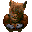
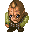
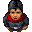
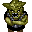
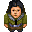
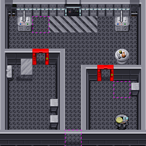

Zone Auxiliary #3
=================

`IZX3` is the next auxiliary object, the purpose of which is to store a list of NPCs.

Non-playable characters perform an important function - they can communicate,
especially talkative humanoids know up to 5 phrases, but the most important thing is that they ask for something,
and having received the desired, they give the quest item as gratitude.

The NPC communication logic is described in the [PUZ2](dta-puz2.md) section, which we will study last.
And within the framework of `Zone Auxiliary #3`, we can add that when generating a map, an NPC is selected randomly from the proposed list.
This increases the variability of Yoda Stories.

		
NPCs
----

NPCs are represented in the game by a single tile and are not animated.

| TileId | Image                      | Name                | Uses | Zones |
|:------:|----------------------------|---------------------|------|-------|
| 1056 |  | Nikto | 54 | 19, 23, 39, 75, 78, 80, 82, 83, 84, 85, 86, 88, 90, 91, 138, 148, ... |
| 1063 |  | Abyssin | 54 | 19, 23, 39, 75, 78, 80, 82, 83, 84, 85, 86, 88, 90, 91, 138, 148, ... |
| 1061 |  | Defel | 53 | 19, 23, 39, 75, 78, 80, 82, 83, 84, 85, 86, 88, 90, 91, 138, 148, ... |
| 1062 |  | Groucho | 53 | 19, 23, 39, 75, 78, 80, 82, 83, 84, 85, 86, 88, 90, 91, 138, 148, ... |
| 1064 |  | Nien Nunb | 53 | 19, 23, 39, 75, 78, 80, 82, 83, 84, 85, 86, 88, 90, 91, 138, 148, ... |
| 1067 |  | Chico | 53 | 19, 23, 39, 75, 78, 80, 82, 83, 84, 85, 86, 88, 90, 91, 138, 148, ... |
| 1069 |  | Harpo | 53 | 19, 23, 39, 75, 78, 80, 82, 83, 84, 85, 86, 88, 90, 91, 138, 148, ... |
| 1072 |  | Bith | 53 | 19, 23, 39, 75, 78, 80, 82, 83, 84, 85, 86, 88, 90, 91, 138, 148, ... |
| 1052 |  | Gnudo Heap | 52 | 19, 23, 39, 75, 78, 80, 82, 83, 84, 85, 86, 88, 90, 91, 138, 148, ... |
| 1057 |  | Frodo | 52 | 19, 23, 39, 75, 78, 80, 82, 83, 84, 85, 86, 88, 90, 91, 138, 148, ... |
| 1058 |  | Duros | 52 | 19, 23, 39, 75, 78, 80, 82, 83, 84, 85, 86, 88, 90, 91, 138, 148, ... |
| 1066 |  | Brainee2 | 52 | 19, 23, 39, 75, 78, 80, 82, 83, 83, 84, 85, 86, 88, 90, 91, 138, ... |
| 1053 |  | Advorzse | 51 | 19, 23, 39, 75, 78, 80, 82, 83, 84, 85, 86, 88, 90, 91, 138, 148, ... |
| 1055 |  | Bilbo | 51 | 19, 23, 39, 75, 78, 80, 82, 83, 84, 85, 86, 88, 90, 91, 138, 148, ... |
| 1071 |  | Labria | 51 | 19, 23, 39, 75, 78, 80, 82, 83, 84, 85, 86, 88, 90, 91, 138, 148, ... |
| 1054 |  | Advorzse2 | 43 | 19, 23, 39, 75, 78, 80, 82, 83, 84, 85, 86, 88, 90, 91, 138, 148, ... |
|  785 |  | Captain Blob | 32 | 19, 23, 39, 75, 78, 80, 82, 83, 84, 85, 86, 88, 90, 91, 138, 148, ... |
| 1602 |  | Asinus Testa | 29 | 150, 157, 231, 247, 300, 303, 307, 348, 353, 354, 359, 362, 368, 387, 423, 426, ... |
| 1600 |  | Uncle Jimmy | 27 | 150, 157, 231, 300, 303, 307, 348, 353, 354, 359, 362, 368, 387, 423, 426, 431, ... |
| 1818 |  | Tahmboix | 27 | 19, 23, 39, 75, 185, 300, 303, 307, 314, 322, 359, 362, 423, 431, 442, 458, ... |
| 1821 |  | Porker | 27 | 19, 23, 39, 75, 185, 300, 303, 307, 314, 322, 359, 362, 423, 431, 442, 458, ... |
| 1823 |  | Jimmy Corrigan | 27 | 19, 23, 39, 75, 185, 300, 303, 307, 314, 322, 359, 362, 423, 431, 442, 458, ... |
| 1603 |  | Private Lime | 26 | 150, 157, 231, 300, 303, 348, 353, 354, 359, 362, 368, 387, 423, 426, 431, 442, ... |
| 1827 |  | Nai'ah | 26 | 19, 23, 39, 75, 185, 300, 303, 307, 314, 322, 359, 362, 423, 431, 442, 458, ... |
| 1826 |  | Xizor Sal Ud | 25 | 19, 23, 39, 75, 185, 300, 303, 307, 314, 322, 359, 362, 423, 431, 442, 458, ... |
| 1820 |  | Dr. Filth | 23 | 185, 300, 303, 307, 314, 322, 359, 362, 423, 431, 442, 458, 461, 486, 503, 505, ... |
| 1824 |  | Hiball | 23 | 185, 300, 303, 307, 314, 322, 359, 362, 423, 431, 442, 458, 461, 486, 503, 505, ... |
| 1825 |  | Bill Carson | 22 | 185, 300, 303, 307, 314, 322, 359, 362, 423, 431, 442, 458, 461, 486, 503, 505, ... |
| 1831 |  | Rumple | 22 | 23, 185, 300, 303, 307, 314, 359, 362, 423, 431, 442, 458, 461, 486, 503, 505, ... |
| 1832 |  | Shaker | 22 | 23, 185, 300, 303, 307, 314, 359, 362, 423, 431, 442, 458, 461, 486, 503, 505, ... |
| 1833 |  | Chubbs | 22 | 23, 185, 300, 303, 307, 314, 359, 362, 423, 431, 442, 458, 461, 486, 503, 505, ... |
| 1830 |  | Betsy Page | 21 | 23, 185, 300, 303, 307, 314, 359, 362, 423, 442, 458, 461, 486, 503, 505, 512, ... |
| 1794 |  | Yea Martini | 20 | 23, 185, 300, 303, 307, 314, 322, 423, 426, 431, 442, 458, 461, 486, 503, 505, ... |
| 1065 |  | Brainee(left) | 19 | 83, 84, 86, 88, 148, 150, 303, 348, 359, 368, 423, 426, 431, 458, 486, 518, ... |
| 1822 |  | Nanuk | 18 | 185, 300, 303, 307, 314, 322, 359, 431, 442, 458, 461, 512, 518, 521, 522, 565, ... |
| 1819 |  | Limburger(Left) | 14 | 303, 307, 359, 423, 431, 442, 458, 486, 503, 512, 518, 522, 565, 582 |
| 1604 |  | Back | 8 | 150, 348, 426, 458, 518, 522, 565, 582 |
|  780 |  | Yoda | 5 | 93, 94, 95, 96, 535 |
| 1981 |  | Imp Off One | 1 | 185 |
| 1982 |  | Imp Off Too | 1 | 185 |

### Zone 185

In fact, there is not much to say about this zone, 
except that in the room you can randomly chat with imperial officers helping the rebels. 
In total, you can randomly meet 30 different NPCs at the location.
There are no special scripts here, the NPC is randomly generated on one of 
the [hotspots](dta-zone-3-hotspots.md) of the `Spawn Location` type.

