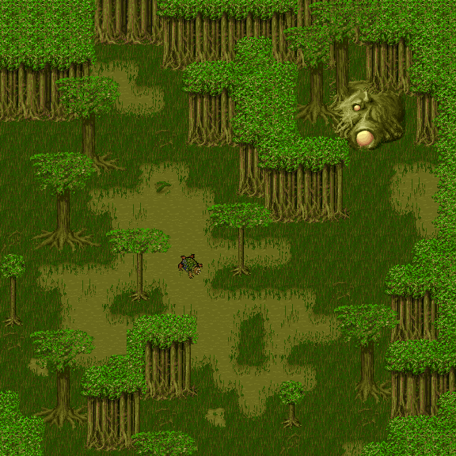
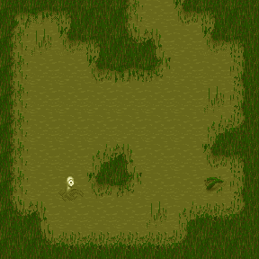
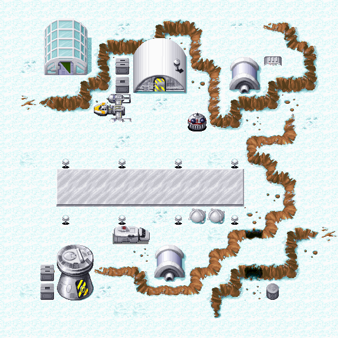
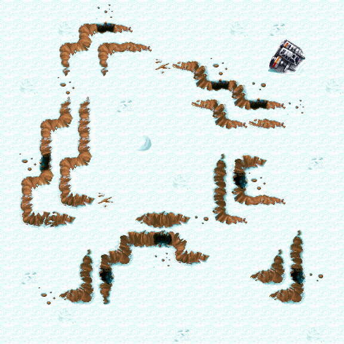
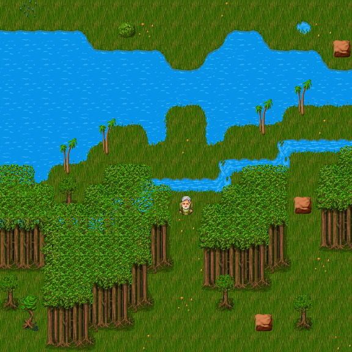
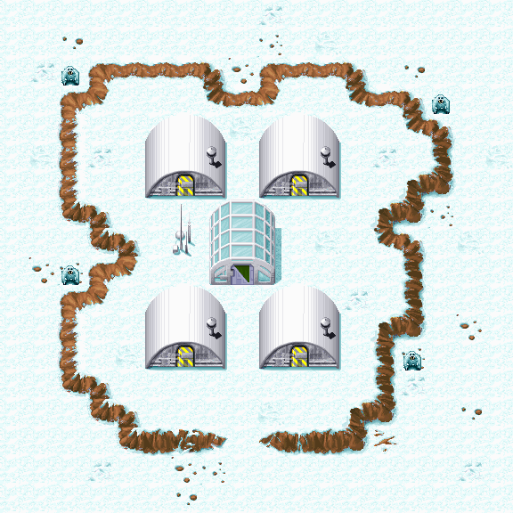

Zone Auxiliary #4
=================

`IZX4` is the fourth auxiliary object of the zone, the purpose of which is still a mystery.

Its only significant field `_unnamed2` is the boolean flag.

A total of 8 zones have a value of `0`. These are: `94`, `95`, `96`, `135`, `176`, `267`, `271` and `345`.
For the rest, it is equal to `1`.

These flags can be used when generating a world, for example these 8 zones are excluded from the world generation algorithm.
Also, these flags can be some kind of markers for developers.

Most of them are associated with the swamp planet Dagobah, however, for some reason, zone `#93` is not listed.

Another suggestion - the number `0` marks the zones involved in the final of special quests, for example,
getting `Adegan Crystal` or `Dianoga Heart`.

Any other suggestions are welcome.

In the [demo version](demo.md) of the game, zones `93`, `151`, `160`, `203`, `210`, `246`, `263`, `264`, 
`317`, `326`, `327`, `328`, `336` and `535` also have the `0` flag,
but zone `176`, on the contrary, has the value `1`.

"Zero" zones
------------

**Zone**: 94

**Zone**: 95

**Zone**: 96

**Zone**: 135

**Zone**: 176

**Zone**: 267

**Zone**: 271

**Zone**: 345

"Zero" zones from the demo version of the game
----------------------------------------------

**Zone**: 93

**Zone**: 151

**Zone**: 160

**Zone**: 176 (1 -> 0)

**Zone**: 203

**Zone**: 210

**Zone**: 246

**Zone**: 263

**Zone**: 264

**Zone**: 317

**Zone**: 326

**Zone**: 327

**Zone**: 328

**Zone**: 336

**Zone**: 535

