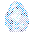
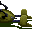
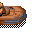

Actions
=======

Все рассмотренные ранее способы формирования игрового пространства
определены до начала игры и выполняются по заранее установленному алгоритму.

Монстры перемещаются по своим траекториям, места появления NPC строго определены,
хотспоты, оживляющие гейплей, по-сути своей тоже выполняют только свои функции и ничего более.

Этой игре не хватало интерактивности и динамизма.
Понимая сей факт, программисты реализовали Actions.

Для этого был написан простой скриптовый язык.
Для каждой зоны можно добавить один или несколько блоков Action.
Эти блоки состоят из операторов.

Условные операторы проверяют факт наступления необходимы условий.
Например, X-Wing приземлился, и при этом зона ещё не была проинициализирована.
Если эти два условия верны, то выполняются все инструкции текущего Action.
Например, сгенерировать случайное число и отключить пару хотспотов.

Активизируется другой Action, который ожидал случайное число 2 и выполнит свои инструкции.
И так далее.

То есть, игрок и Actions меняют состояние игры, и в зависимости от этих изменений
запускаются другие Actions. Игра оживает.

Более того, с помощью action можно реализовывать сложную анимацию с
перемещением тайлов. Например, полёт X-Wing в начале игры.


Action
------

Каждый action состоит из нуля или больше условий и инструкций.

У каждого условия или инструкции может быть до 5 аргументов и блок текста.

Как только в игре что-то меняется, игровой движок начинает проверять условия всех action по порядку.
Если ВСЕ условия определённого action верны, то по порядку выполняются все его инструкции.

В распоряжении программиста 3 переменные, которые можно называть и 16-ти битными регистрами,
кому как больше нравится.

* `counter` – обычная переменная, локальная по отношению к зоне.
* `sector-counter` – переменная, доступная как на самой зоне, так и во всех связанных с ней помещениях.
* `random` – переменная, принимающая случайные значения.

Несколько инструкций проверяют и устанавливают значения этих регистров.

Если этих переменных недостаточно, то можно скрытно менять тайлы.
Это достаточно часто используется в сложных сценариях.


Автор проекта WebFun писал, что скрипты Actions напоминают язык Lisp.
Возможно это и так, но на наш взгляд всё дело в формате, например этот формат действительно напоминает Lisp:

```
(defaction
   (and (bump 5 6 1067)
        (counter-is 1)
        (progn
           (speak-npc 5 6 "No ¢, no pass!"))))
```

А вот этот же код, записанный в более человекопонятном формате:

```
if
    bump: 5 6 1067
    counter-is: 1
then
    speak-npc: 5 6 "No ¢, no pass!"
```

Люди, программировавшие зоны в Yoda Stories писали код как раз в таком, человекопонятном виде.
Правда, вместо kebab-case использовался CamelCase, точнее даже PascalCase.

Названия инструкций, которые использовались в 90-е почти полностью утеряны,
и только чудом мы смогли восстановить несколько из них.

По какой-то причине, скомпилированные скрипты в памяти ПК записывались поверх
рукописных скриптов. Потом область памяти записывалась на диск.
Волшебство начиналось с инструкциями, которые не использовали все 5 аргументов - 
неиспользуемые адреса в памяти не перезаписывались!

Каждый аргумент в памяти занимает 2 байта, поэтому, если не используется 3 из них,
то из-под скопилированного кода будет выглядывать 6 байт рукописного.

Пример того, как мог выглядеть рассмотренный выше код:

```
BumpTile 5 6 Chico
CounterIs 1

ShowTextAt: 5 6 "No ¢, no pass!"
```

Названия тайлов записывались не числами, а текстом, названия файлов мелодий скорее всего тоже.
 
Sector counter назывался Global, вместо Monster писали Enemy, и так далее.
Из солидарности с Cyco, который первым описал все инструкции игры,
мы будем использовать его нотацию, а первоначальные названия приведём для самых любознательных.
 
 https://www.webfun.io/docs/scripting/index.html
 https://www.webfun.io/docs/scripting/conditions.html
 https://www.webfun.io/docs/scripting/instructions.html


ZoneNotInitialised  FirstE   oneJ    Jaw            No T        Thro     setu       Noti     Setu
ZoneEntered         Move       Zone     Remo       Read     SetE        Dude
Bump                BumpTi       
StandingOn          Walk
CounterIs           Coun
RandomIs            Rand
RandomIsGreaterThan Rand       RandNu
RandomIsLessThan    Rand
EnterByPlane        EnterF      FlyIn
TileAtIs            TileAt
MonsterIsDead       EnemyD  Dead
HasNoActiveMonsters Dead
HasItem             HasIte
RequiredItemIs      Requ       ChkJ
EndingIs            Endi
HasGoalItem         Read    
HealthIsLessThan    Hero
HealthIsGreaterThan Hero
FindItemIs          Plac
HeroIsAt            HeroAt
SectorCounterIs     Global
SectorCounterIsLessThan Global
SectorCounterIsGreaterThan  Global
GamesWonIs          GOIt
DropsQuestItemAt    Glob???
HasAnyRequiredItem
CounterIsNot        Coun
RandomIsNot         RandNu   wRandNum      
IsVariable          ReadTF          FlipTF
GamesWonIsGreaterThan       GamesW


PlaceTile           ac         Replac
RemoveTile          Remove
MoveTile            MoveTi
DrawTile            DrawTi
SpeakHero           ShowTe
SpeakNpc            ShowTe
SetTileNeedsDisplay Redraw
SetRectNeedsDisplay aw             ShowFr???
Wait                WaitFo
Redraw              ShowFr
PlaySound           PlaySo
StopSound
RollDice            ThrowR
SetCounter          SetCou
AddToCounter        AddToC
SetVariable         TF
HideHero            Switch
ShowHero
MoveHeroTo          SetHer
MoveHeroBy          WalkHe
DisableAction       FlipTF ??     Action
EnableHotspot       HotSpo
DisableHotspot      HotSpo
EnableMonster       EnemyO
DisableMonster      EnemyO
EnableAllMonsters   Notice  notice
DisableAllMonsters  Setup???
DropItem            DropIt
AddItem             AddIte
RemoveItem          Remove
MarkAsSolved
WinGame
LoseGame
ChangeZone          ch
SetSectorCounter    SetGlo
AddToSectorCounter  AddToG
SetRandom           SetRan    SetRandNum
AddHealth

| Opcode | Condition                  | Usage | Args | Description                                                                                                                         |
|:------:|:--------------------------:|:-----:|:----:|-------------------------------------------------------------------------------------------------------------------------------------|
|   0    | ZoneNotInitialised         |  1635 |  0   | Evaluates to true exactly once (used for initialization)                                                                            |
|   1    | ZoneEntered                |   203 |  0   | Evaluates to true if hero just entered the zone                                                                                     |
|   2    | Bump                       |  3157 |  3   | x,y,itemId                                                                                                                          |
|   3    | PlacedItemIs               |   789 |  5   | x, y, z, target, item                                                                                                               |
|   4    | StandingOn                 |   228 |  3   | Check if hero is at `args[0]`x`args[1]` and the floor tile is `args[2]`                                                             |
|   5    | CounterIs                  |  1397 |  1   | Current zone's `counter` value is equal to `args[0]`                                                                                |
|   6    | RandomIs                   |  2136 |  1   | Current zone's `random` value is equal to `args[0]`                                                                                 |
|   7    | RandomIsGreaterThan        |   109 |  1   | Current zone's `random` value is greater than `args[0]`                                                                             |
|   8    | RandomIsLessThan           |    87 |  1   | Current zone's `random` value is less than `args[0]`                                                                                |
|   9    | EnterByPlane               |   285 |  0   |                                                                                                                                     |
|   10   | TileAtIs                   |  1312 |  4   | tileId,x,y,z. Check if tile at `args[1]`x`args[2]`x`args[3]` is equal to `args[0]`                                                  |
|   11   | MonsterIsDead              |   375 |  1   | True if monster `args[0]` is dead. `args[0]`: monsterId                                                                             |
|   12   | HasNoActiveMonsters        |    13 |  0   | undefined                                                                                                                           |
|   13   | HasItem                    |   169 |  1   | True if inventory contains `args[0]`. If `args[0]` is `0xFFFF` check if inventory contains the item provided by the current zone's puzzle |
|   14   | RequiredItemIs             |   309 |  1   | itemId                                                                                                                              |
|   15   | EndingIs                   |    41 |  1   | True if `args[0]` is equal to current goal item id                                                                                  |
|   16   | ZoneIsSolved               |     5 |  0   | True if the current zone is solved                                                                                                  |
|   17   | NoItemPlaced               |     0 |  0   | Returns true if the user did not place an item.                                                                                     |
|   18   | HasGoalItem                |    32 |  0   | Returns true if the user placed an item                                                                                             |
|   19   | HealthIsLessThan           |    30 |  1   | Hero's health is less than `args[0]`.                                                                                               |
|   20   | HealthIsGreaterThan        |    44 |  1   | Hero's health is greater than `args[0]`.                                                                                            |
|   21   | Unused                     |     0 |  5   |                                                                                                                                     |
|   22   | FindItemIs                 |     5 |  1   | True the item provided by current zone is `args[0]`                                                                                 |
|   23   | PlacedItemIsNot            |   128 |  5   | x, y, z, target, item                                                                                                               |
|   24   | HeroIsAt                   |   663 |  2   | True if hero's x/y position is `args_0`x`args_1`.                                                                                   |
|   25   | SectorCounterIs            |   549 |  1   | Current zone's `shared_counter` value is equal to `args[0]`                                                                         |
|   26   | SectorCounterIsLessThan    |    92 |  1   | Current zone's `shared_counter` value is less than `args[0]`                                                                        |
|   27   | SectorCounterIsGreaterThan |    97 |  1   | Current zone's `shared_counter` value is greater than `args[0]`                                                                     |
|   28   | GamesWonIs                 |    67 |  1   | Total games won is equal to `args[0]`                                                                                               |
|   29   | DropsQuestItemAt           |    39 |  2   | zoneX, zoneY                                                                                                                        |
|   30   | HasAnyRequiredItem         |     4 |  0   | Determines if inventory contains any of the required items needed for current zone                                                  |
|   31   | CounterIsNot               |   124 |  1   | Current zone's `counter` value is not equal to `args[0]`                                                                            |
|   32   | RandomIsNot                |   171 |  1   | Current zone's `random` value is not equal to `args[0]`                                                                             |
|   33   | SectorCounterIsNot         |   122 |  1   | Current zone's `shared_counter` value is not equal to `args[0]`                                                                     |
|   34   | IsVariable                 |  1737 |  4   | Check if variable identified by `args[0]`⊕`args[1]`⊕`args[2]` is set to `args[3]`. Internally this is implemented as opcode 0x0a, check if tile at `args[0]`x`args[1]`x`args[2]` is equal to `args[3]`. zone.getTileID(args[1], args[2], args[3]) === args[0]; tileId, x, y, z |
|   35   | GamesWonIsGreaterThan      |    21 |  1   | True, if total games won is greater than `args[0]`                                                                                  |


| Opcode | Instruction                | Usage | Args | Description                                                                                                                         |
|:------:|:--------------------------:|:-----:|:----:|-------------------------------------------------------------------------------------------------------------------------------------|
|   0    | PlaceTile                  |  5517 |  4   | Place tile `arg_3` at `arg_0`x`arg_1`x`arg_2`. To remove a tile the id -1 is used.                                                  |
|   1    | RemoveTile                 |  3009 |  3   | Remove tile at `arg_0`x`arg_1`x`arg_2`                                                                                              |
|   2    | MoveTile                   |  3009 |  5   | Move Tile at `arg_0`x`arg_1`x`arg_2` to `arg_3`x`arg_4`x`arg_2`. *Note that this can not be used to move tiles between layers!*     |
|   3    | DrawTile                   |   638 |  3   | Draw tile `arg_2` at `arg_0`x`arg_1`                                                                                                |
|   4    | SpeakHero                  |  1086 |  0   | Show speech bubble next to hero. _Uses `text` attribute_.                                                                           |
|   5    | SpeakNpc                   |  1234 |  2   | Show speech bubble at `arg_0`x`arg_1`. _Uses `text` attribute_.  characters `¢` and `¥` are used as placeholders for provided and required items of the current zone, respectively. |
|   6    | SetTileNeedsDisplay        |  2821 |  2   | Redraw tile at `arg_0`x`arg_1`                                                                                                      |
|   7    | SetRectNeedsDisplay        |  2668 |  4   | Redraw the part of the current scene, specified by a rectangle positioned at `arg_0`x`arg_1` with width `arg_2` and height `arg_3`. |
|   8    | Wait                       |  5483 |  0   | Pause script execution for one tick.                                                                                                |
|   9    | Redraw                     |  4524 |  0   | Redraw the whole scene immediately                                                                                                  |
|   10   | PlaySound                  |  2702 |  1   | Play sound specified by `arg_0`                                                                                                     |
|   11   | StopSound                  |    35 |  0   | Stop playing sounds.                                                                                                                |
|   12   | RollDice                   |   475 |  1   | Set current zone's `random` to a random value between 1 and `arg_0`.                                                                |
|   13   | SetCounter                 |  1451 |  1   | Set current zone's `counter` value to a `arg_0`                                                                                     |
|   14   | AddToCounter               |   137 |  1   | Add `arg_0` to current zone's `counter` value                                                                                       |
|   15   | SetVariable                |  1364 |  4   | Set variable identified by `arg_0`⊕`arg_1`⊕`arg_2` to `arg_3`. Internally this is implemented as opcode 0x00, setting tile at `arg_0`x`arg_1`x`arg_2` to `arg_3`. |
|   16   | HideHero                   |   494 |  0   | Hide hero                                                                                                                           |
|   17   | ShowHero                   |   321 |  0   | Show hero                                                                                                                           |
|   18   | MoveHeroTo                 |   939 |  2   | Set hero's position to `arg_0`x`arg_1` ignoring impassable tiles. Execute hotspot actions, redraw the current scene and move camera if the hero is not hidden. |
|   19   | MoveHeroBy                 |   151 |  4   | relx, rely, absx, absy                                                                                                              |
|   20   | DisableAction              |  1075 |  0   | Disable current action                                                                                                              |
|   21   | EnableHotspot              |   446 |  1   | Enable hotspot `arg_0`                                                                                                              |
|   22   | DisableHotspot             |   552 |  1   | Disable hotspot `arg_0`                                                                                                             |
|   23   | EnableMonster              |   448 |  1   | Enable monster `arg_0`                                                                                                              |
|   24   | DisableMonster             |   283 |  1   | Disable monster `arg_0`                                                                                                             |
|   25   | EnableAllMonsters          |    11 |  0   | Enable all monsters                                                                                                                 |
|   26   | DisableAllMonsters         |    32 |  0   | Disable all monsters                                                                                                                |
|   27   | DropItem                   |   765 |  3   | Drops item `arg_0` for pickup at `arg_1`x`arg_2`. If the item is -1, it drops the current sector's find item instead                |
|   28   | AddItem                    |    22 |  1   | Add item with id `arg_0` to inventory                                                                                               |
|   29   | RemoveItem                 |   354 |  1   | Remove one instance of item `arg_0` from the inventory                                                                              |
|   30   | MarkAsSolved               |   162 |  0   |                                                                                                                                     |
|   31   | WinGame                    |    16 |  0   |                                                                                                                                     |
|   32   | LoseGame                   |     0 |  0   |                                                                                                                                     |
|   33   | ChangeZone                 |   415 |  3   | Change current zone to `arg_0`. Hero will be placed at `arg_1`x`arg_2` in the new zone.                                             |
|   34   | SetSectorCounter           |   339 |  1   | Set current zone's `sector-counter` value to a `arg_0`                                                                              |
|   35   | AddToSectorCounter         |    59 |  1   | Add `arg_0` to current zone's `sector-counter` value                                                                                |
|   36   | SetRandom                  |  1551 |  1   | Set current zone's `random` value to a `arg_0`                                                                                      |
|   37   | AddHealth                  |    71 |  1   | Increase hero's health by `arg_0`. New health is capped at hero's max health (0x300).                                               |


| TileId | Image                      | Name                | Uses | Zones |
|:------:|:--------------------------:|---------------------|:----:|-------|
| 0xFFFF | - | Quest Item | 306 | 3, 6, 7, 13, 13, 13, 13, 13, 15, 16, 20, 20, 20, 25, 26, 27, ... |
| 1074 |  |  | 112 | 3, 13, 28, 31, 44, 65, 73, 124, 190, 192, 194, 196, 236, 278, 301, 316, 341, 342, 345, 351, 379, 392, 409, 412, 436, 450, 465, 469, 471, 472, 489, 493, 499, 513, 548, 556, 571, 603, 606, 609, 632 |
| 1073 |  |  | 110 | 3, 13, 28, 31, 44, 65, 73, 124, 190, 192, 194, 196, 236, 278, 301, 316, 341, 342, 345, 351, 379, 392, 409, 412, 436, 450, 465, 469, 471, 472, 489, 493, 499, 513, 548, 556, 571, 603, 606, 609, 632 |
| 1075 |  |  | 109 | 3, 13, 28, 31, 44, 65, 73, 124, 190, 192, 194, 196, 236, 278, 301, 316, 341, 342, 345, 351, 379, 409, 412, 436, 450, 465, 469, 471, 472, 489, 493, 499, 513, 548, 556, 571, 603, 606, 609, 632 |
| 634 |  |  | 102 | 42, 48, 52, 69, 126, 156, 157, 173, 190, 216, 218, 221, 230, 248, 284, 285, 292, 297, 332, 334, 341, 364, 407, 418, 428, 447, 451, 474, 492, 493, 496, 498, 540, 541, 579, 617, 620, 634, 636 |
| 1430 |  |  | 60 | 1, 129, 152, 266, 267, 273, 282, 330, 344, 369, 370, 376, 380, 454, 477, 495, 500, 512, 547, 621, 640 |
| 1429 |  |  | 58 | 1, 129, 152, 266, 267, 273, 282, 330, 344, 369, 370, 376, 380, 454, 477, 495, 500, 512, 547, 621, 640 |
| 1431 |  |  | 58 | 1, 129, 152, 266, 267, 273, 282, 330, 344, 369, 370, 376, 380, 454, 477, 495, 500, 512, 547, 621, 640 |
| 1766 |  |  | 48 | 150, 203, 270, 317, 320, 322, 373, 411, 473, 491, 519, 525, 541, 564, 607, 614 |
| 6 |  |  | 38 | 25, 33, 40, 55, 59, 63, 85, 90, 101, 120, 211, 287, 415, 446, 472, 498, 600, 626 |
| 1095 |  |  | 36 | 129, 210, 211, 267, 273, 330, 370, 454, 547, 640 |
| 1096 |  |  | 36 | 129, 210, 211, 267, 273, 330, 370, 454, 547, 640 |
| 1097 |  |  | 36 | 129, 210, 211, 267, 273, 330, 370, 454, 547, 640 |
| 1934 |  |  | 31 | 20, 41, 132, 151, 265, 441, 443, 462, 555, 588, 595, 596, 630, 632, 646 |
| 259 |  |  | 26 | 23, 292, 324, 325, 353, 362, 368, 377, 399, 420, 421, 431, 440, 461, 507, 508, 566 |
| 1051 |  |  | 22 | 97, 219, 240, 312, 344, 360, 414, 536, 556 |
| 528 |  | Yubnut | 21 | 420, 421, 469, 470, 571 |
| 955 |  |  | 19 | 2, 93, 151, 315, 470, 472, 476 |
| 12 |  |  | 17 | 87, 89, 110, 140, 495, 531, 547 |
| 1163 |  |  | 17 | 204 |
| 1295 |  |  | 16 | 230, 417, 418, 473, 475, 492, 540, 541 |
| 609 |  | Ore Drill | 14 | 124, 494, 513 |
| 1960 |  |  | 14 | 542, 543, 629, 643 |
| 2068 |  |  | 13 | 599, 600, 644 |
| 2078 |  |  | 13 | 599, 600, 644 |
| 2079 |  |  | 13 | 599, 600, 644 |
| 1116 |  |  | 13 | 151, 200, 296, 318, 472, 489 |
| 1092 |  |  | 12 | 150, 153, 154, 155, 200, 406 |
| 1660 |  |  | 12 | 465, 466 |
| 2067 |  |  | 11 | 599, 600, 644 |
| 1662 |  |  | 11 | 465, 466 |
| 1991 |  |  | 11 | 559, 579 |
| 779 |  | Obi Wan Kenobi | 10 | 210, 211 |
| 1661 |  |  | 10 | 465, 466 |
| 1961 |  |  | 10 | 542, 543, 629, 643 |
| 791 |  | Obi Wan | 8 | 129, 267, 273, 330, 370, 454, 547, 640 |
| 964 |  |  | 8 | 105, 323, 324 |
| 1099 |  |  | 8 | 235, 239, 253 |
| 1100 |  |  | 8 | 235, 239, 253 |
| 1767 |  |  | 8 | 396, 397 |
| 1989 |  |  | 8 | 595, 596 |
| 1990 |  |  | 8 | 595, 596 |
| 1952 |  |  | 7 | 450 |
| 1267 |  |  | 6 | 238, 241 |
| 1432 |  | Spirit Heart | 6 | 93, 94, 95, 96, 535 |
| 1757 |  |  | 6 | 425, 430, 479, 503, 532 |
| 637 |  |  | 5 | 364, 401 |
| 1231 |  | Key Card | 5 | 234, 491 |
| 1241 |  | Key Card | 5 | 142, 248, 342, 597 |
| 1348 |  |  | 5 | 323, 324 |
| 1962 |  |  | 5 | 542, 543, 629, 643 |
| 1964 |  |  | 5 | 542, 543, 629, 643 |
| 525 |  | Igniter | 4 | 119 |
| 1926 |  |  | 4 | 105, 106 |
| 1927 |  |  | 4 | 105, 106 |
| 1963 |  |  | 4 | 542, 543, 629, 643 |
| 1993 |  | Yoda's Back | 4 | 539 |
| 2077 |  |  | 3 | 599, 600 |
| 2080 |  |  | 3 | 599, 600 |
| 1268 |  | Beacon (L) | 3 | 210, 211 |
| 1285 |  |  | 3 | 151 |
| 1286 |  |  | 3 | 151 |
| 1627 |  |  | 3 | 396, 573 |
| 1796 |  | Ancient Key | 3 | 557, 558, 559 |
| 1969 |  |  | 3 | 559, 604, 605 |
| 1970 |  |  | 3 | 151, 559, 605 |
| 1998 |  |  | 3 | 130, 609 |
| 2073 |  |  | 2 | 599 |
| 2074 |  |  | 2 | 599 |
| 2082 |  |  | 2 | 476, 629 |
| 2083 |  |  | 2 | 476, 629 |
| 2115 |  |  | 2 | 578 |
| 2116 |  |  | 2 | 578 |
| 2117 |  |  | 2 | 578 |
| 2118 |  |  | 2 | 578 |
| 961 |  |  | 2 | 2, 472 |
| 1184 |  |  | 2 | 471 |
| 1185 |  |  | 2 | 471 |
| 1287 |  | Security Pass | 2 | 417, 537 |
| 1924 |  |  | 2 | 105, 106 |
| 1925 |  |  | 2 | 105, 106 |
| 1937 |  |  | 2 | 467, 563 |
| 1938 |  |  | 2 | 467, 563 |
| 1939 |  |  | 2 | 467, 563 |
| 1968 |  |  | 2 | 559, 605 |
| 2058 |  |  | 1 | 495 |
| 2061 |  |  | 1 | 599 |
| 2062 |  |  | 1 | 599 |
| 2063 |  |  | 1 | 599 |
| 2064 |  |  | 1 | 599 |
| 2065 |  |  | 1 | 600 |
| 2066 |  |  | 1 | 600 |
| 2069 |  |  | 1 | 600 |
| 2070 |  |  | 1 | 600 |
| 2071 |  |  | 1 | 600 |
| 2072 |  |  | 1 | 600 |
| 960 |  |  | 1 | 93 |
| 1239 |  | Sonic Hammer | 1 | 297 |
| 1308 |  |  | 1 | 315 |
| 1360 |  |  | 1 | 151 |
| 1583 |  |  | 1 | 376 |
| 1584 |  |  | 1 | 376 |
| 1585 |  |  | 1 | 376 |
| 1586 |  |  | 1 | 376 |
| 1587 |  |  | 1 | 376 |
| 1588 |  |  | 1 | 376 |
| 1589 |  |  | 1 | 376 |
| 1590 |  |  | 1 | 376 |
| 1790 |  |  | 1 | 409 |
| 1867 |  |  | 1 | 450 |
| 1928 |  |  | 1 | 106 |
| 1929 |  |  | 1 | 105 |
| 1965 |  |  | 1 | 543 |
| 1971 |  |  | 1 | 605 |


Game state
----------


Localization
------------


Hacking possibilities
---------------------

fgdfgdfgfdg


In fact, this is a large area for research, you should carefully study the source code of the [WebFun](https://github.com/cyco/WebFun) project,
and experiment with the [Yoda Stories Translation Tool](https://github.com/LeonisX/yoda-stories-translation-tool).


[source 1](https://www.webfun.io/docs/scripting/index.html),
[source 2](https://www.webfun.io/docs/scripting/conditions.html),
[source 3](https://www.webfun.io/docs/scripting/instructions.html).
