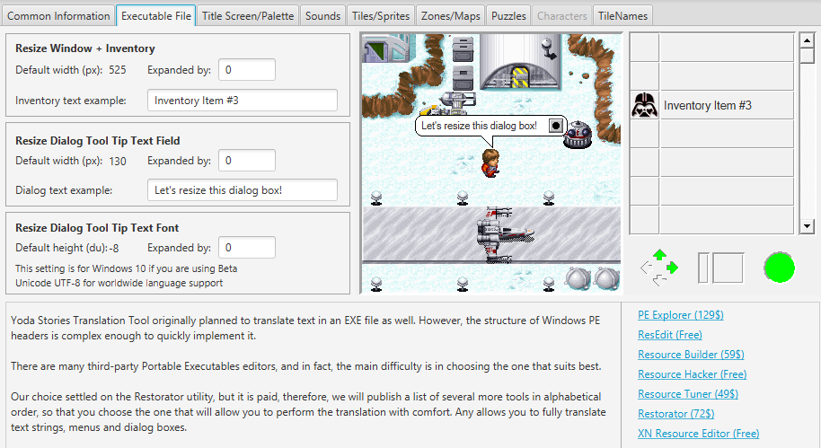

Yoda Stories EXE Translation Guide
==================================

[TOC](translation-guide.md)

A fully translated YS executable file has its own localized/modified ones: 

* Menu
* Dialogs
* Strings
* Optionally windows size
* Optionally dialog tool tip size

Yoda Stories Translation Tool (YSTT) originally planned to translate text in an EXE file as well. 
However, the structure of Windows PE headers is complex enough to quickly implement it.

There are many third-party Portable Executables editors, and in fact, the main difficulty is in choosing the one that suits best.

Our choice settled on the Restorator utility, but it is paid, therefore, we will publish a list of several more tools in alphabetical order, 
so that you choose the one that will allow you to perform the translation with comfort. Any allows you to fully translate text strings, menus and dialog boxes.

* PE Explorer (129$)
* ResEdit (Free)
* Resource Builder (59$)
* Resource Hacker (Free)
* Resource Tuner (49$)
* Restorator (72$)
* XN Resource Editor (Free)

YSTT reports the same information, but can optionally open the website of the selected utility.




## Text translation

For the purposes of this tutorial, we are not able to describe how each PE resource editor works.
We will limit ourselves to just a few tips.

Characteristics of a good editor:

* Change menus, dialogs and string resources
* Ability to change lines in batch, not one by one
* Visual dialog editor
* Create backup copies of the executable file

When translating strings, you should take into account some features. In particular, some string resources are used in the game itself,
usually phrases R2-D2. Others can be seen when some warnings and errors appear.

The R2-D2 dialogs are formatted automatically, however, some phrases are formatted with forced line breaks: "\r\n".
It is desirable to leave them.

You should take care of the wrapping of the warning lines yourself: "\n".
Practice has shown that lines can be made longer than in the original game, the dialog box is automatically stretched.


## Main window and dialogs width

The main goal of these changes is to expand the window controls to accommodate longer text strings.

* Read article [Hacking Yoda Stories article (Eng)](http://tv-games.ru/forum/blog.php?b=2683)
* Read article [Hacking Yoda Stories article (Rus)](http://tv-games.ru/forum/blog.php?b=2682)

All found offsets are valid for `Yoda Stories (10.08.1998) (Eng) (v1.2) (Patch v6)`.

`Yoda Stories Translation Tool` is able to make these changes out of the box - there is no need to edit the file by hand.

Original example:


After the changes: 


## Main Window

When translating the Yoda Stories game into Russian, it turned out that the Tile Names do not fit in the inventory and goes to the ScrollBar.
It is necessary to expand:

* MainWindow
* Inventory Grid View

Move to the right: 

* ScrollBar

### Window size

The window is 525 pixels wide. This is 0x20D (0D020000 in LittleEndian)

For an unambiguous search for a value, it is need to find the following sequence of bytes:

Offset: 0x52DF

```
       vvvv
8D3C45 0D020000 6A08FF     (width)  	
```

It also needs to be replaced at this address:  

Offset: 0x5393

```
       vvvv
C74708 0D020000 C7470C
```

### Inventory Grid View

The Inventory Grid View is 489 pixels wide. This is 0x1E9 (E9010000 in LittleEndian) 

For an unambiguous search for a value, it is need to find the following sequence of bytes:

Offset: 0x1CA5D

```
             vvvv
C7828C320000 E9010000 C78294	(right coordinate)		
```

### Scroll Bar

To move to the right, it is need to change the left and right coordinates of the Scroll Bar.
Their current values: 

* Left: 496. This is 0x1F0 (F0010000 in LittleEndian)
* Right: 512. This is 0x200 (00020000 in LittleEndian)

For an unambiguous search for a value, it is need to find the following sequence of bytes:

Offset: 0x1CA67

```
             vvvv 
C78294320000 F0010000 B8FC00		(left)		offset: 0x1CA67
```

Offset: 0x1CA87

```
			 vvvv
C7829C320000 00020000 C782A4		(right)		offset: 0x1CA87
```


## Dialog Tool Tip

To make reading easier and to reduce the need for scrolling text, it is need to change the dialog box.
To do this, it is need to expand:

* White Round Rectangle
* Text Area (EDIT)

Move to the right:

* Dialog Control Buttons

Research has shown that it is enough to change the size of the Text Area, and all other controls will correctly respond to these changes.

Since the width of the Text Area is not constant and is calculated runtime, it is need to replace part of the code:

It was: 

```
lea     edx, [ebx+ebx*4]
add     eax, edx
```

Became: 

```
mov    eax, 0xA2
```

For an unambiguous search for a value, it is need to find the following sequence of bytes:

Offset: 0x8B17

```
8D149B03C2
```

replace with: 

```
b8a2000000          
```

## Dialogs font in the game
   
This Windows 10 bug was discovered completely by accident.


It happens if you enable "Beta: Use Unicode UTF-8 for worldwide language support" in the system region settings.

Attention! Do not under any circumstances enable this setting. In my case, I had to fix it in the registry,
because even after the reboot it was not possible to remove this damn checkbox!

If you ALREADY have it, then try to remove it here: 

Control Panel -> Region -> Administrative -> Change system locale...


If not, then you will have to change the values in the registry, and this is dangerous, so I won't even tell you where to look.

YSTT offers the ability to change the font size of the dialog box if you already have this checkbox checked.
Or if you like big letters. It is enough to increase the font height by 3 or 4 for the text to be perfectly readable.

If you change in the HEX editor, you will need to change in two places, finding the following data: 

```
5668900100005656566A F8 FF15

0100006A006A006A006A F8 FF15
```

One value is to specify the font height for EDIT control, the second is used to calculate the dimensions of the dialog box.

The F8 value is actually -8, don't be alarmed, you can also specify the font height. 


## Text scrolling timers

`Not implemented.`

The timer delay value is 64 milliseconds.

It was found 4 timers, but experiments to reduce delays lead to the fact that after a click, the text scrolls by 1-2 lines,
and it is need to focus on the mouse to scroll either 1 or 2 lines at the same time. 

```
  vv
6A646A018B481C
```
