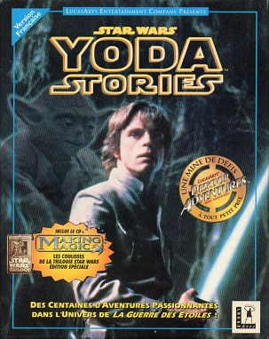
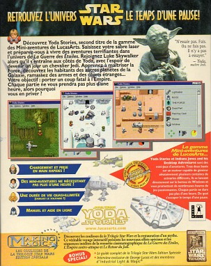
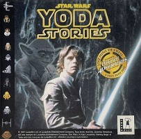
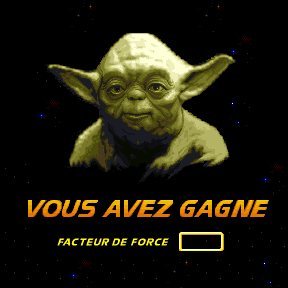
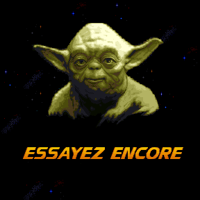

Star Wars - Yoda Stories (Fra) & Making Magic
=============================================

* Region: `France`, probably Belgium, French Canada and Switzerland
* Language: `French`
* Publisher: [`Ubi Soft Entertainment`](http://web.archive.org/web/19971010184138/http://www.ubisoft.fr/)
* Planned release date: `April 1997`
* Age rating: `none`
* UPC: `3 362932 248507`

The release date is printed on the flyer that comes with the game.

Curiously, the screenshots on the box are not translated.
This suggests that some other games may have been localized as well,
but the box used screenshots from the US version.

The text on the box, except for the screenshots, is entirely French. There is no age rating on the packaging.

**Disk:**

* Recording date: `05/07/1997 10:21:28`
* Volume Space Size (LBA): `252658`
* Volume Identifier: `YODAFRENCH`

**Disc content:**

* `Star Wars: Yoda Stories (France)`
* `Star Wars: Making Magic (France) (FD1.03) (22.09.1996)`
* Themed cursors, icons, wallpapers and sound effects for Windows.

We can notice that the disc was recorded at the beginning of May, the publisher did not fit into the scheduled time.

`Star Wars - Making Magic` on this disc is different from the US version, which was released on September 3rd.
The interface is fully translated into French. Two dozen new files appeared on the disk,
probably with additional materials. From the font files it becomes obvious
that somewhere in the universe there are still such encyclopedias in Korean and Japanese.

The results of the comparison with the Spanish version show that the following files are localized:

* `data\drivers\bootdisk.exe` [48346 bytes]
* `data\launch\launch.trs` [89807 bytes]
* `data\system\hope.trs` [64190 bytes]
* `support\bootdisk.exe` [48346 bytes]

Probably, it makes sense to try to translate the encyclopedia into Russian, and if it is not possible to do this with the English version, 
then take one of the European versions as a basis.

The French version vs Spanish version
-------------------------------------

Among all Europeans, the French were the first to have the opportunity to listen to Yoda's stories.
That's why there is no demo version of the rail shooter `Rebel Assault II` on the disc,
and fixed fewer zones than subsequent games.

_When comparing European versions, we will rely primarily on
[Spanish Edition](spain.md),
because it appeared on the net earlier than others, it is better studied,
and is very similar to all other versions, that is, we do not have to list the same differences every time._

Compared to the Spanish game,
French version of the game is missing very important fixes for zones `472` and `572`.

So, on the one hand, this is the very first European version of Yoda Stories,
but on the other hand, it has only bug fixes for zones `72, 236, 407`.
More information about these fixes can be found on the page dedicated to [version 1.2](usa-12.md).

_It's ironic that this game was the last one I got._

Here, as in the German version, the loading screen and Zone 0 have not been corrupted.

Language differences aside, these versions are near identical.

**Tiles**:

To accommodate all text, the number of tiles has been increased from `2123` to `2135`.
So many tiles were required in order to write text between the lines without limiting oneself to the dimensions of the tiles.

* Changed tiles: 2090-2108
* 11 new tiles: 2123-2134

These tiles are used in zones 76-77.

**Zones 76-77**:

 

**Zones 472, 572**: Major fixes missing.
It would be logical to assume that these bugs were discovered only in May 1997.

The differences in the structure of TGEN are large, 
but it seemed that not as much as with the German version.
