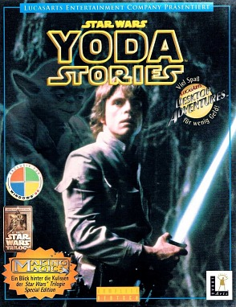
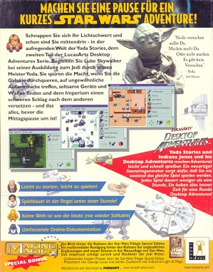
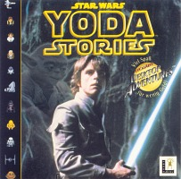
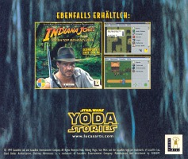
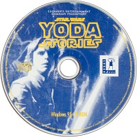
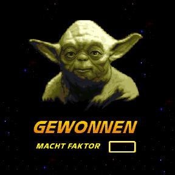
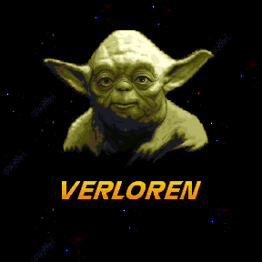

Star Wars - Yoda Stories (Ger) & Making Magic
=================================================

* Region: `Germany`, also possibly Austria, the Netherlands and Switzerland.
* Language: `German`
* Publisher: [`Funsoft GmbH`](http://web.archive.org/web/19980119214124fw_/http://www.funsoft-online.com/) (`Softgold Computerspiele GmbH`)
* Release date: `June-July 1997`
* USK Rating: `6`
* UPC: `4 005209 023795`

The game is fully translated into German, including packaging,
accompanying documents and even screenshots on the box.

There is no age rating on the packaging.

Disk:

* Recording date: `24.06.1997 18:20:18`
* Volume Space Size (LBA): `328929`
* Volume Identifier: `YODA_GERMAN`

Disc content:

* `Star Wars: Yoda Stories (Germany)`
* `Star Wars: Making Magic (Germany) (FB1.04) (14.09.1996)`
* `Star Wars: Rebel Assault II Demo (Germany) (FS1.15) (14.10.1996)`
* Themed cursors, icons, wallpapers and sound effects for Windows.

The text in `Star Wars - Making Magic` has been translated into German.
Otherwise, the encyclopedia does not differ from the Spanish one, with the exception of the language
and links to the home site. The demo version of `Rebel Assault II` is also unique.

Unnecessary `MAGIC/STATE.RST` file got stuck on the disk.

The contents of the `MAGIC` directory are exactly the same as the contents of the `Star Wars - Making Magic (Germany) & Rebel Assault 2 Demo` disc.

At [online auction](https://www.ebay.com/itm/313549180173?hash=item4900fccd0d:g:kxUAAOSw8~Zfoa1F&amdata=enc%3AAQAHAAAAsF%2FMcbk2q7HHknYk41bX%2Bb7ItlICBHiUBasPzzLylTyWqaijnCTTVO8Ijm2hFpV1VKDUg22cOWqa%2Fpi%2F7BKIYwHX9tpTGcN2xcno0flNLQwnKilpFKVa2i3%2BpRJN4Lj1V%2F4n5Hc2epkcGaAS2LiAebneTWwedWFon80e9hB02hWPSrBBDDvXRBH1Du2dGxXP1ZHHZzMzEzHvhfgIiza8GlNTiYheKeOeChb2Vb%2FRDyM5%7Ctkp%3ABk9SR8iGzsb2YA)
`Star Wars: Yoda Stories` lot was found, in which `Star Wars: Making Magic` is sold as a separate disc.
This fact must be verified.

The German version vs Spanish version 
-------------------------------------

Despite the fact that the German version is close to the [Spanish version](spain.md),
it has one important difference - the loading screen and Zone 0 have not been corrupted. 
This could probably indicate that a different team was working on the Spanish translation, 
or that the German version was assembled earlier.

Language differences aside, these versions are otherwise identical.

**Tiles**:

This version has 1 more tiles than the English version.

* Changed: 2091-2095, 2097-2107
* New: 2123

These tiles used in zones 76-77.

**Zones 76-77**:

 

**Zone 472**: differences among unused instruction arguments.

The differences in the structure of TGEN are very large.
It is interesting to observe how words in different languages change gender.
