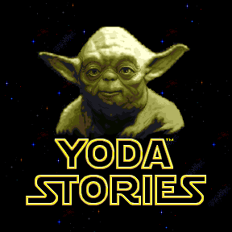
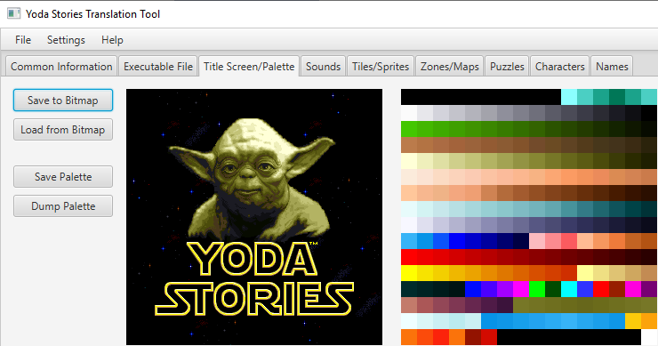
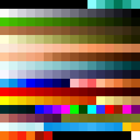
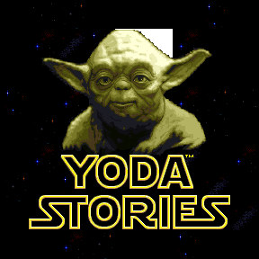
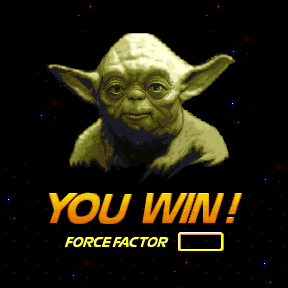
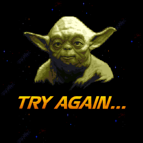
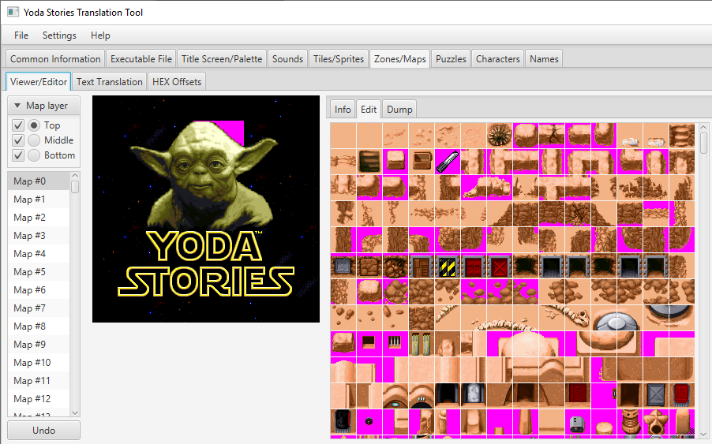
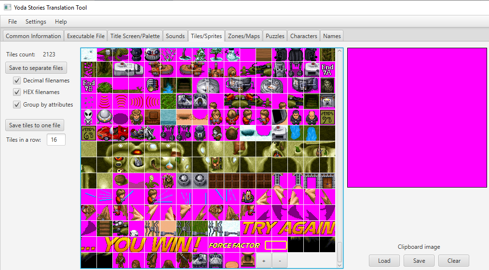

Yoda Stories Graphics Translation Guide
==============================

[TOC](translation-guide.md)

A fully translated game has its own localized ones: 

* Startup screen
* Start, Win and Lose screens

## Startup screen

This screen can be seen when loading the game. In fact, it is identical to what can be seen in Zone #0.
And this will simplify our work a little.

_Let's say right away - not everyone supports the idea of translating the name of the game.
There is enough reasoning on this topic on the Internet, and there are enough weighty arguments
in favor of keeping the original name._

_We will give this advice. If native speakers of your language pronounce the name of the game as "Yoda Stories",
then it is better not to touch this screen. In Russian, translation is usually found, therefore
when translating the game into Russian, we still changed the name._

There are two tasks to solve here:

* Draw missing letters.
* Correctly reduce the number of colors to the Yoda Stories palette.

I will post the source code of my work to make it easier for you: [font-resources.zip](../font-resources.zip)

### Redrawing the font

To match the existing style, we advise you to borrow as much as possible from existing solutions
and compose the missing letters based on the existing ones.

YSTT allows to save both the startup screen and the palette:

Look for the generated files in the output-eng-1.2 directory.

The choice of graphic editors is huge, but the level of free Paint or Paint.Net and Irfan View is quite enough.

They implement copy-paste operations, as well as drawing with a pencil.

As you have already noticed, the font is drawn with only two colors - white and pale yellow.
That is, for any straight lines, and there will be most of them, it is enough to draw two parallel
stripes of these colors and then rotate them to the desired angle.

The rounded sections in the original are quite enough so as not to come up with something from yourself. Use letters as a base: "O", "S", "R".

The width of letters in each language may be different, so try to keep the proportions so that the text looks organic.

All work should be done on a black background. After the font is ready, save the file in BMP format.

Then open this picture in Irfan View. It is necessary to replace the palette with 256 colors. It was generated earlier.

Image -> Palette -> Import Palette.

Then save the file, it is important that its format remains BMP.

The last part is to paste the translated text into startup.bmp. However, in order not to waste time in vain,
we advise you to go from the other side. The fact is that the loading screen is visually identical to Zone #0,
and all Zones are made up of Tiles. Therefore, it is necessary to:

1. Redraw tiles
2. Load startup.bmp into Clipboard image
3. Transfer the letter tiles to the Clipboard image
4. Save the image
5. Rename clipboard.bmp to startup.bmp

The details of working with tiles are described below.

### Palette

All graphics in the game are drawn with a palette of 256 colors. Although, in fact, there are even fewer unique colors.

NEVER use a color with index 0 when painting.

The color with index 0 is a transparent color, that is, no matter what color is in that place,
it will not be displayed in the game. This is the color to fill the transparent areas around the letters.

Irfan View allows you to see the color index of a pixel, if you click on it.

There are also unused colors, it is also better not to use them: 3, 4, 5, 6, 7, 8, 196, 197, 198, 199, 206, 246, 247, 248, 249, 250, 251, 252, 253, 254

And the most important thing. There is not much animation in the game, but some of it is implemented by changing the colors in the palette:

If you use red-orange colors from the range of changing colors, then if you play the game again,
this can spoil the graphics. To prevent this from happening, we also generate "safe" palettes, in which
problem colors are simply removed.

#### Transparent color

We recommend filling the background with Fuchsia color after all transformations, as it is bright and eye-catching.

Accordingly, it is better to use a palette that also has a zero color of Fuchsia: palette-fuchsia.pal or palette-fuchsia-safe.pal.

In YSTT, the transparent color is selected in the upper menu: Settings -> Transparent Color.

You need to pick one color at the start and use that color to save and replace resources. Set it as Fuchsia.

## Start, Win and Lose screens

In fact, these screens are implemented in the same way as all play Zones in the game. Their numbers: 0, 76, 77.

  

Note that Zone #0 is very similar to the startup screen. It is displayed at the beginning of every game,
and on it, you can see the flight of the X-Wing.

All Zones are made up of tiles. In practice, usually 3 tiles are superimposed on one area, they make up the Zone Spot.

Zone Spot has 3 levels, our goal is an intermediate level, it is on this level that the letters are displayed.

Zones are either 8x8 or 16x16 tiles in size.

YSTT allows you to edit the graphics of any Zone in the game.

The sequence of actions is as follows:

1. Select the required layer (options: top, middle, bottom). We need middle.
2. Consecutively drag the tiles to the desired places in the Zone.

Errors are often possible when editing Zones, the state can be returned with the Undo button.

So that your work is not wasted, it must be saved: File -> Save.

### Tiles

The sequence of working with tiles is as follows:

1. Export tiles
2. Redraw them
3. Import back, replacing the existing ones, and, if necessary, adding new ones

#### Exporting tiles

At the beginning of this operation, it is better to replace the transparent color with black: Settings -> Transparent Color. 
This will make your job easier.

Drag and drop the required tiles into the Clipboard image, then save it (clipboard.bmp file in the output-eng-1.2 directory).

We are interested in phrases:

* YODA STORIES
* YOU WIN!
* TRY AGAIN...
* FORCE FACTOR

The last 3 phrases use a different font.

#### Redrawing tiles

We have already described how to redraw the font for Zone #0 above.

The tools don't change, it's still Paint and Irfan View. However, for the work to be of high quality,
we highly recommend using a vector graphics editor: Inkscape or Corel Draw. The idea is this:

1. Make italic font vertical. You need to perform a Horizontal Skew with a value of 19.5
2. Increase the font several times, for example, 5 or 10
3. Find a similar sans-serif system font
4. In Inkscape, write text over graphics
5. Edit the vectors to match the style of the font from the game
6. Fill the letters with a gradient
7. Skew letters: Horizontal Skew with a value of 19.5 in the opposite direction
8. Decrease the letters to the required height
9. Center the text
10. Import SAFE palette
11. Smooth transitions between gradient colors by pencil (F12 in Irfan View, or use Paint)
12. Fill the letters inside with black, outside with transparent
13. Save image in BMP format

Some tips:

Feel free to choose a larger font:

* 11-12 px for force factor
* 31-32 px for the rest of the font

The main rule is to keep within 288 pixels of the game screen. YSTT allows you to add new tiles to the game.

You can use sample letters from any available translations of the game as a source of inspiration.

TODO link to my translation

Please note - for the letters "O" or "C" to look organic, they must be slightly higher than the rest of the letters.
In Russian translation, the usual letters of the phrase YOU WIN are 32 pixels high. The letter "O" protrudes 1 pixel down.
It is drawn on FORCE FACTOR tiles.

#### Importing tiles

* Load modified clipboard.bmp
* Drag and drop tiles
* Add empty tiles if you run out of free ones

Each added tile automatically gets an Object (transparent) attribute.
It should be changed only if you want to make a deep hack of the game (context menu of the tile, right click with the mouse).
But you don't need it for translation.

### Zones

After importing the tiles, open the Zones again. If the letters strictly correspond to the original, then all Zones
will be displayed correctly, and it is enough to save the result of your work.

Otherwise, by dragging the tiles with letters to the middle level of the Zone, make the words look like
and read the way you planned it. 