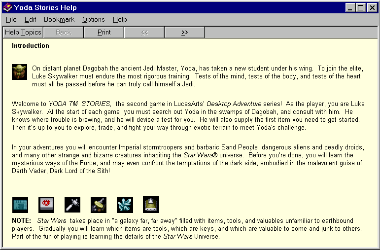
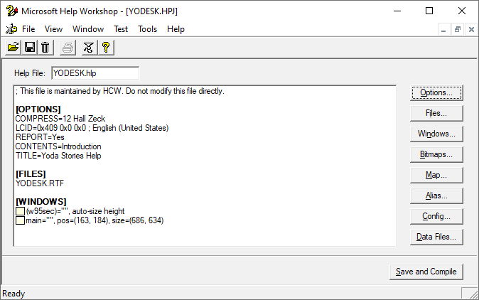
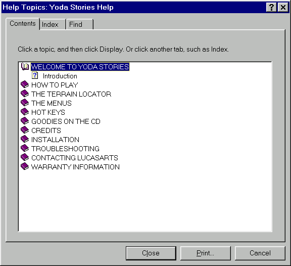

Работа с файлом справки
=======================

В этом документе мы изучим файл справки игры **Yoda Stories**.

1. Рассмотрим структуру, формат и важные особенности YODESK.HLP, YODESK.CNT.
2. Разберём процедуру перевода файла справки на другие языки.
3. Научимся открывать "родной" файл справки в Windows 10.
4. Изучим способы преобразования в другоие форматы справки.


Редактор
--------

Файл справки YODESK.HLP был собран утилитой **RoboHELP** от Blue Sky Software.
Какая версия - не уточняется, но вероятно RoboHELP 95 или в крайнем случае RoboHELP 4, вышедшая в декабре 1996-го года.

Утилита со старта, начиная с 1992 года стоила 495$. Цена не маленькая, но, видимо оно того стоило.

Один из конкурентов, **Adobe Acrobat Pro 2.1** в 1995-м году стоил 595$, а версия для рабочих групп 1595$.
По иронии судьбы, спустя много лет продукт RoboHelp вошёл в семейство Adobe (через поглощение Macromedia),
и, благодаря возможности генерировать документы в различных форматах, успешно дожил до наших дней.

_Забегая вперёд можно сказать, что все локализованные версии собирались по одному алгоритму, вероятно тоже в RoboHelp._

_Ретроспективно можно так же вспомнить, что файл справки для первой игры серии **Desktop Adventures** собирался 
при помощи **Doc-to-Help** от Wextech Systems Inc.
Шаблон + макрос для WinWord стоил порядка $295, и под капотом, наверняка, запускал Microsoft Help Compiler,
предоставляя разработчику лишь помощь в создании документа справки._


Почему HLP?
-----------

**HLP** - архаичный формат **Microsoft WinHelp**, используемый, начиная с 1990-го года в Windows 3.0.
Уже в 1996-м году Microsoft озвучила планы сворачивания формата, но только в 2006-м году его стали понемногу убирать из системы,
в частности, по умолчанию он уже не открывался в Windows Vista, 
а в 2015-м году поддержка этого формата окончательно прекратилась с выпуском Windows 10.

В связи с этим изучение файла справки, и уж тем более, перевод его на другие языки, был несколько осложнён.
Приходилось искать утилиты, некоторые из которых отказывались работать в современных версиях Windows.

_О том, как можно открыть файл справки в современных версиях Windows мы расскажем в конце документа._



У нынешних исследователей видеоигр невольно может возникнуть вопрос - почему именно HLP формат?
Неужели не было ничего более подходящего? Чтобы ответить на него, давайте проведём небольшой экскурс в 90-е.

**PDF**. Формат официально родился только в 1993-м году, причём первая версия Acrobat Reader вообще была платной.
Несмотря на то, что более поздние компакт-диски с играми сплошь и рядом предлагали установить Acrobat Reader версий 3-5,
разработчики, владевшие RoboHELP или подобными инструментами не спешили выкладывать 600$ и больше за редактор.
Зачем что-то менять, если, итак, всё работает?

**CHM**. Microsoft Compiled HTML Help представлял собой уже не такой опасный, с точки зрения взлома, документ в формате HTML.
Стандарт внедрялся с августа 1997-го года и логично, что он не успел попасть в релиз с игрой.
К тому же, распространение формата тормозилось низким качеством Microsoft Html Help Workshop.
При конвертировании прежнего файла справки в новый формат требовалось, хоть и незначительно, но дорабатывать проект руками.

**HTML**. Отличный формат для текста, именно он использовался в CHM файлах, но судя по-всему, первые браузеры,
способные открывать HTML файлы со встроенными картинками, появились не раньше 2003-го года.
А поставлять веб-страницу отдельно, а картинки отдельно, было как-то совсем странно.

**RTF, WRI, DOC**. В комплекте с каждой Windows 95 и новее идёт текстовый редактор WordPad.
Он не обладает всеми возможностями Microsoft Word, но в файле справки используется очень базовое форматирование, которое ему по силам.
Почему тогда не использовать эти текстовые документы, ведь RTF вообще является основой HLP? На этот вопрос у нас есть только догадки.

Дя начала надо помнить, что на дворе примерно 1996-й год, и LucasArts делает первые робкие шаги
в создании игр для Windows 95. До этого год назад уже был опыт с **Indiana Jones and His Desktop Adventures** для Windows 3x.
Обе игры серии Desktop Adventures являются оконными. Чтобы написать нечто подобное,
программистам требовалась документация и Win32 SDK и, почти наверняка, они всецело опирались на эти источники.

А в документации формат файла справки наверняка был описан как единственно доступный способ донести нужную информацию до игроков.


Формат HLP
----------

При переводе файла справки на другие языки можно использовались утилиты **HelpDeco** и **Microsoft Help Workshop**.
Их же можно использовать для исправления ошибок в текущих файлах справки.



Если разобрать файл справки на составляющие, то внутри окажется текстовый документ в формате RTF и 32 картинки в формате BMP.
Специальные символы разметки позволяют снова собрать файл справки из RTF документа.


Декомпиляция файла справки
--------------------------

Утилита **HelpDeco** от Manfred Winterhoff работает из командной строки.

Пример декомпиляции:

    HELPDECO.EXE YODESK.HLP


После её выполнения в текущем каталоге появятся следующие файлы:

- bm0.BMP, bm1.BMP, ..., bm30.BMP, bm31.BMP - иконки
- YODESK.HPJ - файл проекта
- YODESK.RTF - весь текст

Можно запустить HELPDECO.EXE без аргументов, чтобы посмотреть ключи использования. Более подробно они описаны в файле HELPDECO.TXT.


Ключ `/y` не выводит предупреждение при перезаписи файлов. Может быть полезным если экспериментируете с настройками HELPDECO.

Полезным может оказаться и ключик `/c`, генерирующий файл YODESK.CNT. Он не совпадает с тем, который идёт в комплекте с игрой,
так как является списком промаркированных страниц, без группировки.


CNT файл
--------

Текстовый документ YODESK.CNT, который идёт в комплекте с YODESK.HLP, представляет собой удобное оглавление.
Это новшество нового формата справки, принятого в Windows 95.

В Windows 3.x оглавление является частью файла справки и может иметь очень произвольное форматирование. 

Пример файла YODESK.CNT:

```
:Base YODESK.HLP
1 WELCOME TO YODA STORIES
2 Introduction=Introduction
1 HOW TO PLAY
2 Landing on Dagobah=Landing_on_Dagobah
2 Walking Around=Walking_Around
2 Talking to People=Talking_to_People
2 Picking Up and Using Items=Picking_Up_and_Using_Items
2 Readying and Wielding Weapons=Readying_and_Wielding_Weapons
2 The Compass=The_Compass
2 Health=Health
2 The Force=The_Force
2 Force Factor=Force_Factor
1 THE TERRAIN LOCATOR
2 Looking at the Terrain Locator=Looking_at_the_Terrain_Locator
2 Terrain Locator Symbols=Terrain_Locator_Symbols
1 THE MENUS
2 Menu Commands=Menu_Commands
1 HOT KEYS
2 Gameplay=Gameplay
2 Dialogue Balloons=Dialogue_Balloons
1 GOODIES ON THE CD
2 Theme Folder=Theme_Folder
2 Shortcuts=Shortcuts
1 CREDITS
2 The Yoda Stories Team=The_Yoda_Stories_Team
2 Acknowledgements=Acknowledgements
1 INSTALLATION
2 Installing and Uninstalling=Installing_and_Uninstalling
1 TROUBLESHOOTING
2 Questions and Answers=Questions_and_Answers
2 Hardware Problems=Hardware_Problems
1 CONTACTING LUCASARTS
2 How to Contact LucasArts=How_to_Contact_LucasArts
1 WARRANTY INFORMATION
2 Limited Warranty=Limited_Warranty
```

Так оно выглядит на практике:



Перевести этот файл можно в любом текстовом редакторе, но ссылки (после "=") лучше не трогать, это необязательно, иначе придётся менять ссылки и в RTF документе тоже.


RTF формат
----------

RTF документ, являющийся основой файла справки, фактически представляет собой текстовый документ, в который, 
где необходимо, подмешаны управляющие слова, начинающиеся с символа обратного слэша.
Например, если надо сделать текст жирным, то он записывался так: `{\b текст}`.

Формат поддерживал несколько стилей текста, цвет шрифта, картинки. Но не таблицы.

Отдельные страницы справки формируются символами разрыва страниц.

Надстрочные и подстрочные индексы поддерживаются в формате RTF, но в формате справки - нет.
Здесь они служебные, и используются для форматирования.

На каждой странице можно указывать специальные сноски. Это директивы для компилятора файла справки.

Например:

- \# - содержит идентификатор страницы, чтобы на неё можно было создавать ссылки. Единственная обязательная сноска.
- $ - название страницы, таким оно будет в оглавлении, индексе и других местах.
- K - ключевые слова для индекса (и поиска).
- \+ - информация о последовательности просмотра.

Ниже фрагмент начала страницы:

```
+$#KLanding on Dagobah

{bml bm7.BMP}
```

Директива bml позволяет внедрять в текст изображения.

[Спецификация RTF формата](https://latex2rtf.sourceforge.net/rtfspec_6.html).


### Структура файла справки

В конце RTF-файла можно обнаружить следующую структуру:

```
+ BROWSE0001:0001
$ Introduction
# Introduction
K Introduction
+ BROWSE0001:0002
$ Landing on Dagobah
# Landing_on_Dagobah
K Landing on Dagobah
...
+ BROWSE0002:0001
$ Theme Folder
# Theme_Folder
K Theme Folder
...
+ BROWSE0002:0004
$ Limited Warranty
# Limited_Warranty
K Limited Warranty
```

Видим, что страницы справки объединены в две группы.
Первая, большая группа страниц (BROWSE0001) доступна сразу после открытия документа, достаточно просто полистать влево-вправо.
Вторая, группа (BROWSE0002) доступна только из оглавления, либо через поиск.


### Кодировка текста в RTF документе

Большим недостатком формата RTF было отсутствие нормальной поддержки расширенной таблицы ASCII. А поддержка Unicode выйдет ещё позднее.

Формат отлично управлялся лишь с первыми 127 символами ASCII.
Для вставки в текст не типичных символов, например, символов национальных алфавитов, необходимо было экранировать код каждой буквы.
Например: \'c8.

Главный подвох заключался в том, что RTF формат поддерживал почти два десятка кодовых страниц, но разработчик файла
справки мог не удосужиться принудительно указать кодовую страницу, так как кодовая страница, используемая по умолчанию в его системе,
прекрасно отображала все его специальные символы. Но стоило перенести документ на компьютер с другой кодовой страницей,
например Windows-1251, и специальные символы заменялись совершенно другими буквами.

Именно это повсеместно и наблюдается в файлах справки к игре.

"`Version française réalisée par Ubi Soft`" внезапно может превратиться в плохо читаемое "`Version franзaise rйalisйe par Ubi Soft`"

_Под капотом эта фраза записана так:_

    \par Version fran\'e7aise r\'e9alis\'e9e par Ubi Soft\plain\f0\ul\fs16

Если не обращать внимание на управляющие слова, то видим:

- `\\'e7` - это символ `ç`.
- `\\'e9` - это символ `é`.


#### Как лечить RTF документы с неправильной кодировкой

Простой, но действенный способ. Рассмотрим пример, когда документ на испанском языке по ошибке читается как документ на русском языке.

1. Открыть документ в Microsoft Word, сделать незначительную правку и сохранить.
2. Открыть документ в текстовом редакторе вроде `notepad` или редакторе Far Manager, Total Commander.
3. Заменить все вхождения `\fcharset204` на `\fcharset0`.

Что мы сейчас сделали:

1. Microsoft Word при сохранении RTF документа добавляет много разметочного кода, в том числе определяет шрифты (и их кодовые страницы).
2. 204 - это кодовая страница RUSSIAN. 0 - это кодовая страница ANSI, где есть все буквы испанского алфавита.
3. При следующем открытии документа в Microsoft Word редактор отобразит текст в верной кодировке.

Пример исправления гибридного документа (несколько очень разных языков сразу):

1. `Microsoft Word`: выделить текст каждого языка своим шрифтом, например Arial, Times New Roman, Tahoma, ...
2. В `notepad` поменять номера кодировки у каждого шрифта на необходимые. Их можно найти в спецификации формата RTF.
3. По желанию в `notepad` переименовать все шрифты в основной, например, Arial, чтобы весь текст выглядел однородно.

Такой RTF документ уже не будет зависеть от языка системы, установленных языков и прочих факторов. 


Перевод и компиляция файла справки
----------------------------------

Как мы ранее уже рассмотрели, RTF документ, являющийся основой для файла справки, позволяет
в пределах одного документа иметь текст на разных языках. Но куда сложнее добиться того же после компиляции файла справки.

Пример шрифта:

    {\f0\fbidi \froman\fcharset204\fprq2{\*\panose 02020603050405020304}Times New Roman;}

Текст, используемый этот шрифт будет интерпретироваться как русский (204). И таких `Times New Roman` может быть несколько для каждой кодировки.

Рассмотрим алгоритм для поддержки нескольких кодировок в одном документе справки.

_Сразу предупредим, что редактировать документ в WordPad нельзя, так как потеряются служебные сноски.
Скомпилировать файл справки после этого не получится._

_Рекомендуется использовать Microsoft Word. Он оставляет много разметочного мусора, что сильно портит читабельность исходного кода документа,
но даёт возможность с помощью разных шрифтов поддерживать разные языки в пределах одного документа._

Рассмотрим вариант перевода англоязычного файла справки на русский язык с добавлением имён и фамилий разработчиков для Испании, Франции, и т.д.

**RTF файл**:

1. `Microsoft Word`: подготовить RTF документ (с текстом в разных кодировках).
2. Задать шрифт для всего текста как Arial, 8.
3. Задать другой шрифт для текста западноевропейских языков, например Tahoma, 8.
4. Сохранить, открыть документ в текстовом редакторе вроде `notepad`.
5. Поменять у всех шрифтов Arial `\fcharset0` -> `\fcharset204`
6. Поменять у всех шрифтов Tahoma `\fcharset204` -> `\fcharset0`
7. Убедиться, что текст в RTF файле по-прежнему читабельный. 

Сейчас мы принудительно поменяли язык. Шрифт Arial - русский, шрифт Tahoma - западноевропейский.
Эти шрифты очень похожи, но буквы Tahoma несколько крупнее. Можно оставить и так, но далее мы решим этот вопрос тоже.

**Microsoft Help Workshop** (файл HCRTF для 32-bit WinHelp):

1. Открыть проект YODESK.HPJ.
2. Открыть Options, выбрать вкладку Fonts.
2. Character set: установить основную кодировку документа. RUSSIAN.
3. Font in WinHelp dialog boxes: установить Arial Cyr, 8, RUSSIAN. Это будет основная кодировка документа. Arial,8,204
4. Ниже Substitute these fonts in Help topics -> Add.
5. Original font: Arial, Character set: RUSSIAN
6. Replacement font: Arial CYR, Character set: RUSSIAN
7. Должно получиться Arial,,204=Arial CYR,,204
8. Снова Substitute these fonts in Help topics -> Add.
9. Original font: Tahoma, Character set: (all character sets)
10. Replacement font: Arial, Character set: ANSI
11. Должно получиться Tahoma=Arial,,0
12. Во вкладке Sorting установить Language of help file: Russian (Russia)
13. Скомпилировать документ.
14. Убедиться, что новый файл YODESK.HLP корректно выглядит.

Что мы сделали:

1. В RTF документе весь текст на русском языке выделен шрифтом Arial.
2. В RTF документе весь текст на испанском языке выделен шрифтом Tahoma.
3. В Help Project установили основной шрифт как Arial, RUSSIAN.

Если скомпилировать сейчас, то весь испанский текст будет заметно отличаться от основного (Tahoma), поэтому применим немного магии.

1. Конвертируем шрифт Arial, RUSSIAN в Arial CYR, RUSSIAN
2. Конвертируем шрифт Tahoma в Arial, ANSI
3. Arial и Arial CYR визуально не отличимы, так что цель достигнута.

Такой файл справки будет одинаково выглядеть в разных версиях Windows, независимо от языка системы и прочих настроек.

Весь процесс сборки файла справки в картинках:


Как открыть YODESK.HLP в Windows 10
-----------------------------------

В Windows 10 и новее есть файл winhlp32.exe, но это заглушка, открывающая в браузере страницу: Error opening Help in Windows-based programs: "Feature not included" or "Help not supported".

Самый верный путь - это взять winhlp32.exe от Windows XP SP3. Причём тут даже не важна разрядность.
32-х разрядный файл WinHelp отлично будет работать в 64-ти разрядной Windows 10!

Есть несколько вариантов, как это можно сделать. Например, проштудировать страницу ниже, там есть и скрипт замены, 
и ссылки на файлы winhlp32.exe: https://www.tenforums.com/general-support/16982-cant-read-older-hlp-files-windows-10-a.html

Только надо понимать - стоит ли оно того. Как часто вы планируете открывать устаревший файл справки? Один раз?
Стоит ли тогда так ломать голову ради разовой операции?

Куда проще воспользоваться советами с этой страницы: https://videoforums.ru/showthread.php?t=10001

Предлагается 3 способа. Первый и третий не дают всех прелестей второго варианта, то есть возможности открывать справку прямо из игры.

Но предварительно надо раздобыть требуемые файлы. Лучше это сделать самостоятельно, чтобы не нахватать вирусов, то есть взять оригинальный ISO-образ Windows XP SP3. Но можно и скачать их внизу страницы.

В зависимости от языка, лучше подобрать соответствующий образ, например, англоязычный, или русскоязычный, что вам роднее.
Это повлияет на язык интерфейса winhlp32.exe, а так же на язык файла справки winhlp32.hlp.

ISO-образ можно напрямую открыть в архиваторе 7-zip. Или смонтировать в виртуальный привод, кому как проще.

В каталоге i386 образа диска находим четыре файла: WINHLP32.EX_, WINHLP32.HL_, WINHLP32.CH_ и FTSRCH.DL_.
Разархивируем каждый из них с помощью 7-zip. Четыре полученных файла, winhlp32.exe, ftsrch.dll, winhlp32.hlp и winhlp32.cnt кладём в одну папку.

Теперь три варианта действий:

**Первый вариант** - не аутентичный, но самый простой. Подойдёт, в первую очередь, если просто нужно прочитать hlp файл.

Надо запустить полученный ранее winhlp32.exe от Windows XP и просто открыть в нём hlp файл. Или перетащить файл справки на файл winhlp32.exe.
Минус этого способа в том, что пункты "How to play" и "Using Help" в игре Yoda Stories по-прежнему будут открывать страницу-заглушку.

**Второй вариант** - продвинутый.

1. В папке C:\Windows найти файл winhlp32.exe.
2. На всякий случай создать его резервную копию.
3. Файлы winhlp32.exe, ftsrch.dll, winhlp32.hlp и winhlp32.cnt скопировать в папку C:\Windows.
4. Перезагрузить компьютер.
5. Теперь файл справки можно читать двойным кликом по файлу YODESK.HLP, но так же заработают и пункты меню "How to play" и "Using Help".
6. Минус этого способа в том, что после обновления системы winhlp32.exe скорее всего будет перезаписан и всё придётся проделывать снова.

**Третий вариант** можно сделать попроще, чем рекомендовано в статье.

1. Переименовываем winhlp32.exe в winhlp32-legacy.exe
2. Правый клик по файлу справки, Properties -> Open with -> Change (Свойства -> Открыть с помощью -> Изменить)
3. Указать путь до файла winhlp32-legacy.exe
4. Теперь двойной клик по файлу справки откроет его в winhlp32-legacy.exe
5. Минус этого способа в том, что пункты "How to play" и "Using Help" в игре по-прежнему будут открывать страницу-заглушку.

Есть ещё и **четвёртый вариант** - преобразовать файл справки в документ, читабельный в современных ОС. Об этом далее.


Преобразование HLP в CHM
------------------------

Быстрый и простой способ предлагают такие решения, как:

- [HelpNDoc](https://www.helpndoc.com/step-by-step-guides/how-to-convert-a-hlp-winhelp-help-file-to-a-chm-html-help-help-file/)
- [HelpScribble](https://www.helpscribble.com/vista.html)
- [Help+Manual](https://www.helpandmanual.com/index.html)
- [Adobe RoboHelp HTML](https://community.adobe.com/t5/robohelp-discussions/how-to-convert-hlp-files-to-chm-file-in-windows-7/m-p/4838148)

А так же некоторые другие. Здесь перечислены утилиты, которые Гугл показал первыми. Естественно, все они платные,
но если постараться, то для некоторых из них можно скачать триальную версию, и, вероятно для ваших целей её хватит.

_Стандарт файла справки CHM, как и другие решения от Microsoft, не слишком прошёл проверку временем.
Официально его ещё не удалили ниоткуда, но официальная утилита поддерживает лишь спецификацию 1.3, хотя была опубликована версия 1.4.
Это уже говорит обо многом. К тому же, после CHM, Microsoft выпустила ещё несколько вариантов справочных систем._

Из бесплатных решений можно назвать безальтернативный вариант - **HTML Help Workshop**.
Утилита умеет импортировать декомпилированный проект WinHelp, но интерфейс несколько коряво написан,
и, чтобы открыть HPJ файл, надо убрать фильтр расширений.

Нельзя сказать, что HTML Help Workshop достаёт звёзды с небес. Решения с конвертацией в один клик не будет.
Кроме того, в современных версиях Windows начинаются проблемы с некоторыми библиотеками, поэтому,
удалось сконвертировать HLP файл в проект HTML Help только в Windows 95 из виртуальной машине DosBox-X.

_Впрочем, со второй попытки удалось проделать то же самое и в Windows 10 x64,
но непонятно что помогло - установка и удаление MS Visual Studio 2019 или установка HTML Help Workshop с правами администратора._

**Рабочая инструкция, как быстро сконвертировать HLP в CHM**.

1. Microsoft Help Workshop: В HPJ проекте подключить CNT файл. Тогда Contents нового проекта не придётся набирать вручную. 
2. HTML Help Workshop: File -> Open -> фильтр: выбрать All files \*.*, далее открыть HPJ проект.
3. Спустя несколько элементарных шагов проект будет сконвертирован и загружен.
4. Иконка слева. Нажать Change Project Options.
5. Title: Yoda Stories Help
6. Default file: выбрать первую HTML страницу из секции [FILES].
7. Иконка слева. Нажать Save project (иначе Default file может не сохраниться).
8. Иконка сверху. Нажать Compile HTML file.
9. Если при компиляции не было никаких ошибок, то в каталоге проекта будет создан файл YODESK.CHM.

То же самое в картинках:


Полезные ссылки:

- [Решение проблем HTML Help Workshop](http://www.helpfulsolutions.com/).
- [Как из HLP сделать CHM](https://stackoverflow.com/questions/43617504/how-to-convert-hlp-files-into-chm-files).
- [Как ещё из HLP сделать CHM](https://help-info.de/index.html).
- [Онлайн просмотрщик и декомпилятор HLP, CHM](https://ehubsoft.herokuapp.com/chmviewer/).


Скачать
-------

**_Настоятельно рекомендуем проверять все скачанные файлы на вирусы, например в онлайн-сервисе VIRUSTOTAL._**

[https://www.virustotal.com](https://www.virustotal.com)

### Архивы

- [HELPDECO v2.1](files%2Fhelpdc21.zip) - декомпилятор HLP файлов от Manfred Winterhoff.

Microsoft Help Workshop можно было скачать с официального сайта Microsoft, поэтому считаем его свободным ПО.

- [Microsoft Help Workshop v4.03.0002.zip](files%2FMicrosoft_Help_Workshop_v4.03.0002.zip) - оконный компилятор HLP файлов.

HTML Help Workshop так же был доступен на сайте MSDN.

- [HTML Help Workshop 4.74.8702.0 (installer)](files%2Fhtmlhelp.exe)
- [HTML Help Workshop (Compiler only, VISUAL Stusio 2019)](files%2FHTML_Help_Workshop_Compiler.zip) - 2 библиотеки и компилятор, может выручат, если перезаписать файлы после установки.
- [HTML Help Workshop (helpdocs)](files%2Fhelpdocs.zip) - тут всё про формат CHM и программы для работы с ним.

**_Файлы ниже представлены в качестве примера. Как только вы поймёте что нужно искать,
то подключайте пыльные системные блоки, открывайте свои старые, легально купленные дистрибутивы и извлекайте требуемые файлы._**

- [Microsoft Help Compiler v3.10.505](files%2FMicrosoft_Help_Compiler_v3.10.505.zip) - для создания 16-битных WinHelp. Работает из командной строки, не прощает ошибок разметки. 
- [Microsoft Help Compiler v3.10.505 (Extended)](files%2FMicrosoft_Help_Compiler_v3.10.505_Extended.zip) - расширенная версия, различия неизвестны.
- [WinHlp32 Windows XP Pro SP3 VL (Eng)](files%2FWinHlp32_Windows_XP_Pro_SP3_VL_Eng.zip) - winhlp32.exe, английская версия (для просмотра HLP-файлов в современных системах).
- [WinHlp32 Windows XP Pro SP3 VL (Rus)](files%2FWinHlp32_Windows_XP_Pro_SP3_VL_Rus.zip) - winhlp32.exe, русская версия (для просмотра HLP-файлов в современных системах).

Надо отметить, что Microsoft Help Compiler отдельно не продавался, а шёл в комплекте с различными пакетами разработки.
Например, в Borland C++ 3.1 можно найти версию 3.0, а версия 3.10 шла в комплекте с Microsoft Visual Basic Pro 2.0-4.0.
Поэтому, когда вы покупали любой из таких пакетов разработки, то среди компиляторов и других действительно важных программ
вы скорее всего и не замечали присутствия Microsoft Help Compiler.

HTML Help Workshop так же поставлялся с различными средами разработки, например, Microsoft Visual Basic Pro 3.0
или даже с MS Visual Studio 2017.