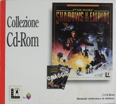

Star Wars - Yoda Stories (Ita) & Making Magic
=============================================

* Регион: `Италия` и вероятно часть Швейцарии
* Язык: `итальянский`
* Издатель: [`CTO, S.p.A.`](http://web.archive.org/web/19980526073707fw_/http://www.cto.it/Yodastor.html)
* Дата выпуска: `июнь 1997`, переиздание `1998 года`
* Возрастной рейтинг: `отсутствует`
* Serial: `FD005`, `LUC629`, `LUC630`
* UPC: `0 23272 31118 6` (отдельное издание)
* EAN: `8 015887 002209` (сборник)

Игра полностью переведена на итальянский язык, включая упаковку, 
сопроводительные документы и даже скриншоты на коробке.

Бумажный мануал отпечатан в апреле 1997 года.

Коробка типичная для Yoda Stories, возрастного рейтинга на упаковке нет.

Самое любопытное то, что предприимчивые менеджеры из C.T.O. продавали Yoda Stories
и как самостоятельный продукт, и как часть [комплектации](http://web.archive.org/web/19991007205410fw_/http://www.cto.it/collezione99/main.html) 
с более популярными играми от LucasArts:

* `Star Wars: Dark Forces + Yoda Stories + Star Wars Screen Entertainment`
* `Star Wars: Rebel Assault II + Yoda Stories + Star Wars Screen Entertainment` (3 CDs)
* `Star Wars: Shadows of the Empire + Yoda Stories + Star Wars Screen Entertainment` (2 CDs)
* `Star Wars: X-Wing vs TIE Fighter + Yoda Stories + Star Wars Screen Entertainment`

Последние два сборника в списке были выпущены первыми, до мая 1998 года. 
Видимо, этим и объясняется их хоть какая-то известность.

Белая книжка-коробка сборника раскрывалась дважды, демонстрируя сначала обложку с документацией, 
а потом сами диски.

Образ диска, выпущенного в 1997 году пока не найден. Известно лишь, что у него аскетичное оформление.
Поэтому давайте рассмотрим игру из сборника.

Диск:

* Дата записи: `11.03.1998 18:31:33`
* Volume Space Size (LBA): `332032`
* Volume Identifier: `Yoda+SWSE`
* Mastering code: `DADC AUSTRIA   A0100241137-0303   13	IFPI L553`

Содержимое диска:

* `Star Wars: Yoda Stories (Italy)`
* `Star Wars: Making Magic (Italy) (FA1.15 от 03.09.1996)`
* `Star Wars: Rebel Assault II Demo (Italy) (DX1.14 от 30.01.1997)`
* `Star Wars: Screen Entertainment (Rev 1)`
* Тематические курсоры, иконки, обои и звуковые эффекты для Windows.
* Два мануала в `PDF` формате. По-идее, они же отпечатаны на бумаге.

`Star Wars: Making Magic` на этом диске аналогичен другим Европейским версиям.
Интерфейс полностью переведён, уникальная ссылка на сайт регистрации и на домашний сайт.
Версия демки игры `Rebel Assault II` так же переведена на Итальянский язык.

`Star Wars: Screen Entertainment` - набор хранителей экрана по кинофильму "Новая надежда", 
созданный `Presage Software Development` и опубликованный `LucasArts Entertainment Company` летом 1994 года для Windows 3.0. 
Помимо чисто визуальных скринсейверов, в комплекте имеются хранители экрана, 
содержащие справочные сведения по персонажам и транспортным средствам "Звёздных войн".
Смотрятся весьма достойно даже по меркам 21-го века.

Хранители экрана сделаны в формате, отличном от формата, принятого в Windows (scr),
так что, отдельно их использовать не получится, нужен полный дистрибутив.

На этом сборнике - англоязычное переиздание `Screen Entertainment`, 
лучше приспособленное под более современные системы (Windows 95).
В частности, обновлена библиотека `Win-G` (предшественник Direct X).

Так же изменены следующие хранители экрана:

* `Cantina`
* `Character Biographies`
* `Hyperspace`
* `Poster Art`
* `Scrolling Text`
* `Storyboards`

Отсутствует библиотека `SWSFX.DLL` и файл `SWSESET.EXE`.

Надо сказать, что уже через несколько лет некоторые данные с этих заставок потеряли свою актуальность.

The Italian version vs Spanish version
--------------------------------------

Here, as in the [German version](germany.md), the loading screen and Zone 0 have not been corrupted.

Currently, Yoda Stories in Italian can be found on the Internet only in the 1998 reissue.
The one that came with `Star Wars - X-Wing vs. TIE Fighter (Italy) (Disco 1) (Gioco)` and `Star Wars - X-Wing vs. TIE Fighter (Italy) (Disco 2) (Multiplayer)`.

The dates of the game files on the disc indicate that the game was ready around the same time
as the other European versions, so we need to find the first edition of the game.

Language differences aside, these versions are otherwise identical.

**Tiles**:

This version also has more tiles than the English version.

* Changed: 2090-2108
* New: 2123-2127

These tiles used in zones 76-77.

**Zones 76-77**:

 

**Zone 265**: replaced one tile on the intermediate layer:

* [8; 16]: [0, 61, 65535] -> [0, 69, 65535]

 

Most likely, the change was made out of curiosity, and the programmer used the level editor.

**Zone 472**: differences in unused script fields.

We will not even discuss differences in the structure of TGEN, they also exist, and significant ones.
