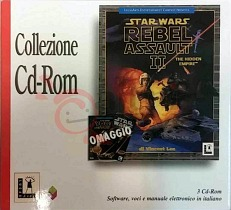

Star Wars - Yoda Stories (Ita) & Making Magic
=============================================

* Region: `Italy` and probably part of Switzerland
* Language: `Italian`
* Publisher: [`CTO, S.p.A.`](http://web.archive.org/web/19980526073707fw_/http://www.cto.it/Yodastor.html)
* Release date: `June 1997`, rerelease `1998`
* Age rating: `none`
* Serial: `FD005`, `LUC629`, `LUC630`
* UPC: `0 23272 31118 6` (separate edition)
* EAN: `8 015887 002209` (collection)

The game is fully translated into Italian, including the packaging, accompanying documents, and even the screenshots on the box.

Paper manual printed in April 1997.

The box is typical of Yoda Stories, there is no age rating on the packaging.

Most curiously, the enterprising managers at C.T.O. sold Yoda Stories
both as a standalone product and as part of a [compilation](http://web.archive.org/web/19991007205410fw_/http://www.cto.it/collezione99/main.html)
with more popular games from LucasArts:

* `Star Wars: Dark Forces + Yoda Stories + Star Wars Screen Entertainment`
* `Star Wars: Rebel Assault II + Yoda Stories + Star Wars Screen Entertainment` (3 CDs)
* `Star Wars: Shadows of the Empire + Yoda Stories + Star Wars Screen Entertainment` (2 CDs)
* `Star Wars: X-Wing vs TIE Fighter + Yoda Stories + Star Wars Screen Entertainment`

The last two compilations on the list were the first to be released, until May 1998.
Apparently, this explains their at least some prevalence.

The collection's white bookcase is opened twice, revealing first the documentation cover,
and then the discs themselves.

The disk image that was released in 1997 has not yet been found. It is only known that it has an ascetic design.
So let's look at the game from the collection.

**Disk:**

* Recording date: `11.03.1998 18:31:33`
* Volume Space Size (LBA): `332032`
* Volume Identifier: `Yoda+SWSE`
* Mastering code: `DADC AUSTRIA A0100241137-0303 13 IFPI L553`

****Disc content:

* `Star Wars: Yoda Stories (Italy)`
* `Star Wars: Making Magic (Italy) (FA1.15) (03.09.1996)`
* `Star Wars: Rebel Assault II Demo (Italy) (DX1.14) (30.01.1997)`
* `Star Wars: Screen Entertainment (Rev 1)`
* Themed cursors, icons, wallpapers and sound effects for Windows.
* Two manuals in `PDF` format. In theory, they are printed on a paper.

`Star Wars: Making Magic` on this disc is similar to other European versions.
The interface is completely translated, there is a unique link to the registration site and to the `C.T.O.` home site.
The demo version of the game `Rebel Assault II` is also translated into Italian.

`Star Wars: Screen Entertainment` - a set of screen savers based on the movie `Star Wars: Episode IV - A New Hope`,
created by `Presage Software Development` and published by `LucasArts Entertainment Company` in the summer of 1994 for Windows 3.0.
In addition to purely visual screensavers, the kit includes screensavers,
containing background information on the characters and vehicles from the space saga.
They look very dignified even by the standards of the 21st century.

Screen savers are in a different format than typical Windows (`scr`), so it's not enough just to copy them to the system folder.
They are launched by the `intermis.exe` utility, which is supplied with the `Star Wars: Screen Entertainment` package.

On this compilation is an English-language rerelease of `Screen Entertainment`, 
better adapted to more modern systems (Windows 95).
In particular, the `Win-G` library (predecessor of Direct X) has been updated.

The following screensavers have also been changed:

* `Cantina`
* `Character Biographies`
* `Hyperspace`
* `Poster Art`
* `Scrolling Text`
* `Storyboards`

Absent library `SWSFX.DLL` and file `SWSESET.EXE`.

It must be said that after a few years, some of the data from these screensavers lost their relevance.

The Italian version vs Spanish version
--------------------------------------

Here, as in the [German version](germany.md), the loading screen and Zone 0 have not been corrupted.

Currently, Yoda Stories in Italian can be found on the Internet only in the 1998 reissue.
The one that came with `Star Wars - X-Wing vs. TIE Fighter (Italy) (Disco 1) (Gioco)` and `Star Wars - X-Wing vs. TIE Fighter (Italy) (Disco 2) (Multiplayer)`.

The dates of the game files on the disc indicate that the game was ready around the same time
as the other European versions, so we need to find the first edition of the game.

Language differences aside, these versions are otherwise identical.

**Tiles**:

This version also has more tiles than the English version.

* Changed: 2090-2108
* New: 2123-2127

These tiles used in zones 76-77.

**Zones 76-77**:

 

**Zone 265**: replaced one tile on the intermediate layer:

* [8; 16]: [0, 61, 65535] -> [0, 69, 65535]

 

Most likely, the change was made out of curiosity, and the programmer used the level editor.

**Zone 472**: differences in unused script fields.

We will not even discuss differences in the structure of TGEN, they also exist, and significant ones.
