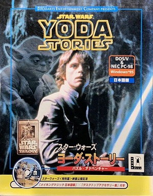
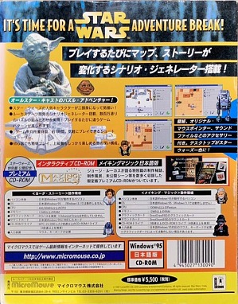
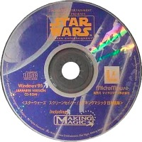
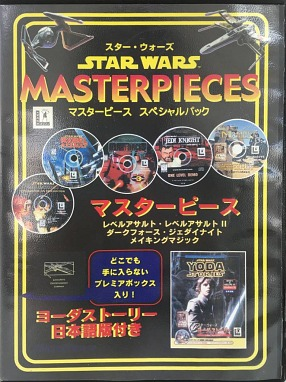
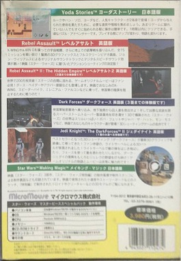
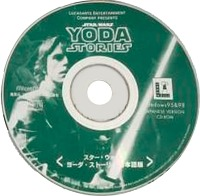

Star Wars - Yoda Stories (Jap) & Making Magic
=============================================

* Original title: `スターウォーズ ヨーダストーリー ＆ メイキングマジック`
* Region: `Japan`
* Language: `Japanese`
* Publisher: [`MicroMouse Company Ltd.`](http://web.archive.org/web/19980120082600/http://www.micromouse.co.jp/) (Japanese `マイクロマウス`)
* Release date: `18.07.1997` (Friday)
* Age rating: `none`
* UPC: `4 943027 130090`
* Platforms: `DOS/V`, `NEC PC-98`
* Price: `5,500 円`

The contents of the disc (according to the photo):

* `Star Wars: Yoda Stories (Japan)`
* `Star Wars: Making Magic (Japan)`
* `Star Wars: Screen Entertainment` (version unknown)
* Themed cursors, icons, wallpapers and sound effects for Windows.

The disc is blue, but instead of Luke, it has an X-Wing, attacking a Death Star.
This is part of the cover of `Star Wars: Screen Entertainment`.

There is no information about the contents of the disk yet, it has yet to be found.

The fact that the game translated into Japanese known from two sources:
[first](https://www.amazon.co.jp/%E3%83%9E%E3%82%A4%E3%82%AF%E3%83%AD%E3%83%9E%E3%82%A6%E3%82%B9-STAR-WARS-MasterPieces-%E3%82%B9%E3%83%9A%E3%82%B7%E3%83%A3%E3%83%AB%E3%83%91%E3%83%83%E3%82%AF/dp/B00008I14K),
[second](http://web.archive.org/web/20220703101647/https://www.pcgamingwiki.com/wiki/Star_Wars:_Yoda_Stories), 
but we need to verify this for ourselves.

The first mention of this version of the game found on the [Star Wars Collectors Archive (SWCA)](http://theswca.com/index.php?action=disp_item&item_id=66966) website.

It is also known about the re-release of the game:

The **Star Wars Masterpieces** (or `Star Wars Masterpiece Special Pack`) contains 6 discs:

* `Star Wars: Dark Forces` (English) trial version, 3 levels
* `Star Wars: Jedi Knight` (English) playable demo
* `Star Wars: Rebel Assault II` (English) trial version, 3 levels
* `Star Wars: Rebel Assault` (English)
* `Star Wars: Yoda Stories` (Japanese)
* `Star Wars: Making Magic` (Japanese)

The `Star Wars: Yoda Stories` disc is navy blue and depicts Luke.

* Release date: `16.07.1999`
* Age rating: `K-A: Kids to Adults`
* Publisher: `MicroMouse Company Ltd.` (Japanese `マイクロマウス`)
* ASIN:‎ `B00008I14K`
* Box: `22.4 x 16.6 x 4` cm; `521.63` grams
* Price: `3,980 円`

The age rating is confusing because the ESRB valid in the US, but not in Japan.

Runs on `Windows 95/98` (and `NEC PC-9800`), however, `Making Magic` may not run on a Japanese machine, we need to check.

A similar collection sold in the United States, but without the adventures of a young Jedi.

_To search the web, learn Japanese:_

* Star Wars: `スターウォーズ`
* Yoda Stories: `ヨーダストーリー` or `ヨーダ・ストーリー`
* Making Magic: `メイキングマジック`
* Micro Mouse: `マイクロマウス`
* Screen Entertainment Special Pack: `スクリーンエンターテイメント スペシャルパック`
