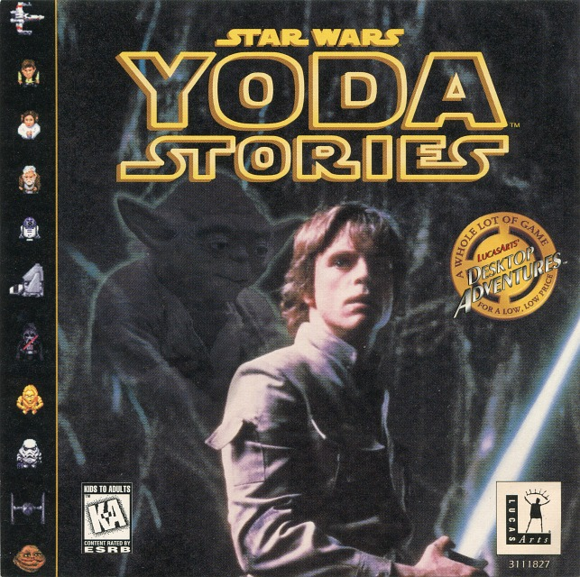
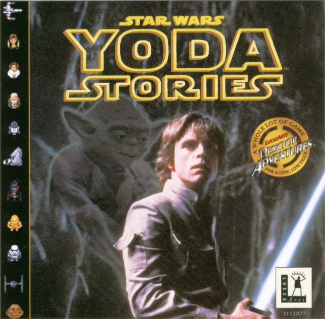
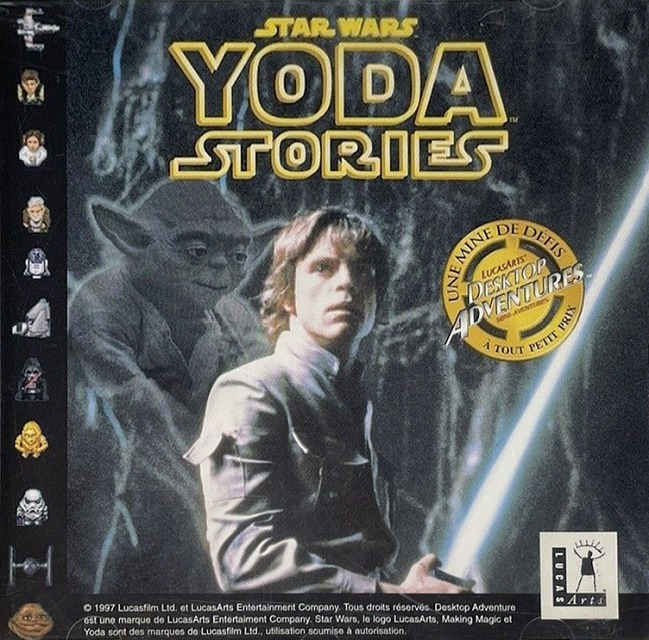
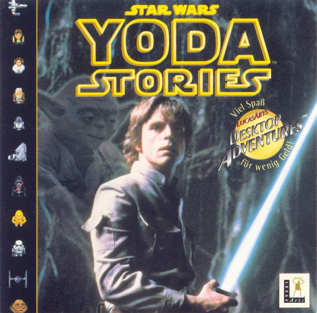
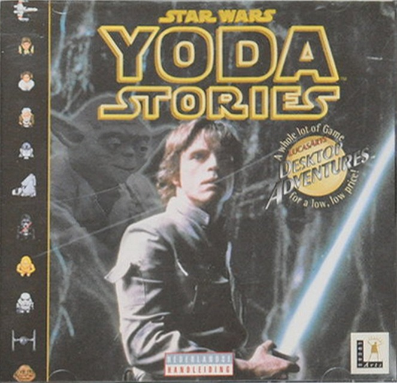
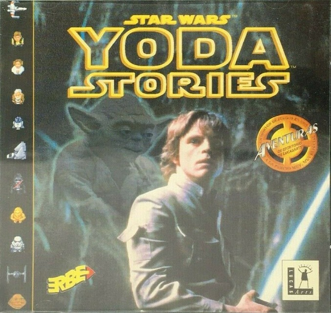
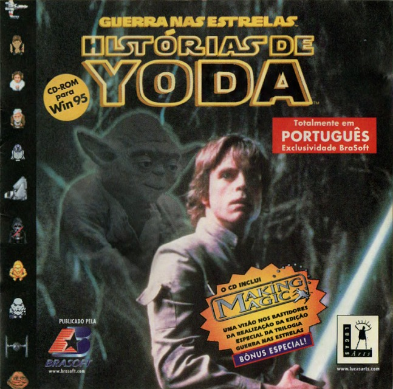
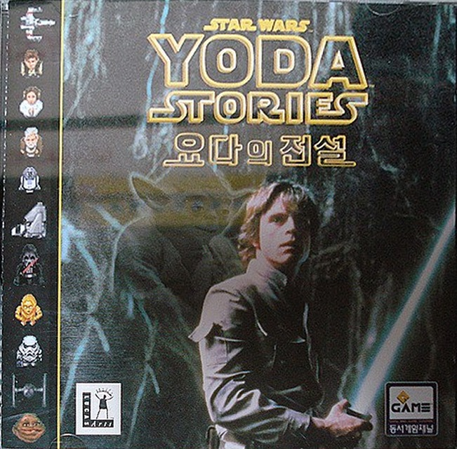

Коробка диска Yoda Stories - лицевая сторона
======================================

США (v1.0, v1.1)
----------------

Классическая обложка, исходный вариант.

Судя по неполным фотографиям, у ревизии игры упаковка аналогичная.

Австралия, Великобритания
-------------------------

Фотография коробки для Австралии ещё не найдена.

Франция, Италия
----------------

Текст на коробке, за исключением скриншотов полностью французский. Возрастного рейтинга на упаковке нет.
Скриншоты на коробке не переведены.
Это наводит на мысль, что и некоторые другие игры могли быть локализованы, 
но на коробке использовались скриншоты из американской версии.

Фотографии коробки для Италии ещё не найдены.

Германия, Нидерланды
--------------------

Игра полностью переведена на немецкий язык, включая упаковку, 
сопроводительные документы и даже скриншоты на коробке.

Возрастного рейтинга на упаковке нет.

Игра достаточно редкая, и в сети пока можно найти только фотографии коробки.
Текст на упаковке нидерландский, но есть две особенности, указывающие на то, что игру не переводили:

* Представлены скриншоты из американской версии.
* Явно указано, что переведён мануал к игре.

Испания, Бразилия
-----------------

Скриншоты на коробке и весь текст переведены на испанский. Возрастного рейтинга на упаковке нет.

Япония, Тайвань
---------------

Фотографии коробки для Тайваня ещё не найдены.

Корея
-----

На официальном сайте есть описание на корейском языке, но скриншоты не переведены.
В сети об этой версии игры нет информации.
На коробке скрины тоже не переведены. В мануале скрины и текст так же на английском. 
Есть вероятность, что игра англоязычная.

Yoda Stories в сборниках
========================

The LucasArts Archives Vol. IV: Star Wars Collection II (США)
-------------------------------------------------------------

Отдельной коробки нет.

Star Wars: Dark Forces + Yoda Stories + Star Wars Screen Entertainment (Италия)
-------------------------------------------------------------------------------

Отдельной коробки нет.

Star Wars: Rebel Assault II + Yoda Stories + Star Wars Screen Entertainment (Италия)
------------------------------------------------------------------------------------

Отдельной коробки нет.

Star Wars: Shadows of the Empire + Yoda Stories + Star Wars Screen Entertainment (Италия)
-----------------------------------------------------------------------------------------

Отдельной коробки нет.

Star Wars: X-Wing vs TIE Fighter + Yoda Stories + Star Wars Screen Entertainment (Италия)
-----------------------------------------------------------------------------------------

Отдельной коробки нет.

Star Wars Masterpieces (Япония)
-------------------------------

Отдельной коробки нет.

Yoda Stories для Game Boy Color
===============================

Есть жёлтая коробочка для картриджа, нно она не представляет большого интереса.