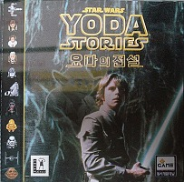

Star Wars - Yoda Stories (Kor) & Making Magic
=============================================

* Region: `Korea`
* Language: `unknown`
* Publisher: [`Dong Seo Interactive, Inc.`](http://web.archive.org/web/19980206133703fw_/http://www.dsnet.co.kr/dsnet/interact/review/yoda/yoda.html)
* Release date: `1997`
* Age rating: `none`
* UPC: `8 802341 062523`

There is no disk image on hand, we don’t know Korean, so we need help to learn more about this game.

This release only found because [lucasarts.com](http://web.archive.org/web/19980214043036/http://www.lucasarts.com/static/inside/index_international.htm) lists all foreign partners.

The official site has a description in Korean, but the screenshots not translated.
There is no information about this version of the game on the Internet.
On the box, the screenshots also not translated. In the manual, screenshots and text are also in English.
There is a possibility that the game is in English too.

The box unusually elongated and narrow. The layout is typical.

[source 1](http://cdgem.co.kr/m/product_detail.html?brand_uid=118742)
[source 2](https://m.blog.naver.com/laverne/50019054915)
[source 3](https://m.blog.naver.com/blosso/140136993763)
