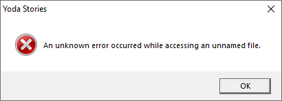

Patch 6
=======

Пакет исправлений `YOPATCH6.EXE` опубликовали на сайте [lucasarts.com](https://web.archive.org/web/20000304052609/http://support.lucasarts.com/patches/yoda.htm) в феврале 1997-го года.

_На самом деле, дата публикации вызывает большие сомнения. Мы предполагаем, что этот патч был готов только летом 1997-го года.
К сожалению, веб-архив не смог сохранить подтверждения в пользу нашей точки зрения._

Фактически это не патч, а самораспаковывающийся архив, внутри которого находится файл `yodesk.dta`.

* Размер: 1172 Кб

[Скачать yopatch.exe](files/yopatch6.exe)

Самораспаковывающийся архив WinZip имеет неверную дату в PE заголовке файла (`13.09.1996`),
поэтому мы не в состоянии узнать точное время его создания.

Дата распакованного файла `yodesk.dta`: `06.06.1997`.

* Объявлено об исправлениях в следующих зонах: `72, 236, 407, 473, 474, 572`.
* Фактически были исправлены следующие зоны: `72, 236, 266, 267, 271, 407, 472, 572`.

`Patch 6` на 100% соответствует DTA файлу из версии `1.2`, то есть, подходит только для англоязычных игроков.

Ради интереса мы подставляли его в Европейские версии, и наоборот.
В обоих случаях игра работала без проблем, хотя,
в Европейских версиях должны наблюдаться проблемы с родами предметов, это логично,
а версия для США, на удивление, уверенно работает, даже встретив незнакомый тег `TGEN` в конце DTA файла.

Единственное чего не стоит делать, так это сохраняться, подменять DTA файл и потом загружать игру.
Может возникнуть такая ошибка:

`An unknown error occured while accessing an unnamed file.`

Если вернуть прежний DTA файл, то ошибка исчезает.
