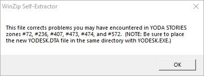

Patch 6
=======

The `YOPATCH6.EXE` patch package published on [lucasarts.com](https://web.archive.org/web/20000304052609/http://support.lucasarts.com/patches/yoda.htm) in February 1997.

_Actually, the publication date is highly questionable. We assume that this patch was only ready in the summer of 1997.
We assume that there is an error on the site.
Unfortunately, the web archive has not been able to maintain evidence in favor of our point of view.
[link1](https://web.archive.org/web/20000304052609/http://support.lucasarts.com/patches/yoda.htm), [link2](https://web.archive.org/web/20011014162056/http://support.lucasarts.com:80/patches/yoda.htm)..._

In fact, this is not a patch, but a self-extracting archive, inside of which is the `yodesk.dta` file.

* Size: 1172 Kb

[Download yopatch.exe](download.md)

WinZip self-extracting archive has wrong date in PE file header (`13.09.1996`),
therefore we are not able to know the exact time of its creation.

Date of unpacked file `yodesk.dta`: `06.06.1997`.

* Bug fixes announced for the following zones: `72, 236, 407, 473, 474, 572`.
* The following zones actually fixed: `72, 236, 266, 267, 271, 407, 472, 572`.

`Patch 6` is 100% consistent with the DTA file from version `1.2`, that is, it is only suitable for English-speaking players.

For the sake of interest, we tested it with European versions, and vice versa.

In both cases the game worked without problems though,
in the European versions there should be problems with quest items gender, this is logical,
but the US version works surprisingly well, even when it encounters an unfamiliar `TGEN` tag at the end of the DTA file.

The only thing no one should do is to save the game, replace the DTA file and then load the game.
The following error may occur:

`An unknown error occurred while accessing an unnamed file.`

However, if return the original DTA file, then the error disappears.
