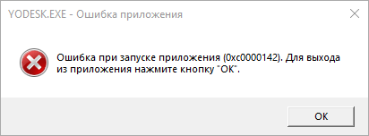
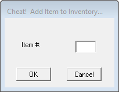

Системные требования: IBM PC, Windows 95, i486/66, 8MB RAM, 2x CD-ROM.

Проблемы совместимости

Были описаны [здесь](http://web.archive.org/web/20220703101647/https://www.pcgamingwiki.com/wiki/Star_Wars:_Yoda_Stories)
и [здесь](https://www.ntcompatible.com/compatibility/report/yoda-stories).

При запуске на операционных системах Windows `NT`, `XP` и выше случаются ошибки:

* Application Error (0xc0000142)
* Failed to write block to device

Всё дело в устаревшей сторонней библиотеке `WaveMix`. Её необходимо обновить.

1. Скачать последнюю версию [`WaveMix`](https://www.compuphase.com/wavemix.htm#DOWNLOADS).
2. Перезаписать имеющиеся файлы `WAVMIX32.DLL` и `WAVEMIX.INI` новыми.

Ошибка `2 WaveOut Devices have been detected` возникает из-а неверных настроек `WaveMix`. Способ исправления:

1. Открыть файл `wavemix.ini`.
2. Поменять `ShowDevices=1` на `ShowDevices=0`.
3. Сохранить файл и перезапустить игру.

Путь к файлу настроек игры:

`%WINDIR%\Yodesk.ini`

Однако, операционные системы Windows `Vista`, `7`, `10` и выше не позволяют писать в защищённые каталоги без прав администратора.
Любые попытки записи в `%PROGRAMFILES%`, `%PROGRAMDATA%` и `%WINDIR%` перенаправляются в `%LOCALAPPDATA%\VirtualStore`.

Для пользователя с никнеймом `user` файл настроек доступен по любому из следующих путей:

* `C:\Documents and Settings\user\AppData\Local\VirtualStore\Windows\yodesk.ini`
* `C:\Documents and Settings\user\Local Settings\VirtualStore\Windows\yodesk.ini`
* `C:\Users\user\AppData\Local\VirtualStore\Windows\yodesk.ini`
* `C:\Users\user\Local Settings\VirtualStore\Windows\yodesk.ini`

Star Wars - Yoda Stories (USA) & Making Magic
----------------------------------------------------------

Известно 3 полноценные версии игры Yoda Stories, выпущенные в США.
В каждой последующей были исправлены ошибки в нескольких зонах.
Чтобы не запутаться, мы так их и назвали: `1.0`, `1.1` и `1.2`.

Проект сохранения дисков Redump имеет свой формат именования:

* `1.0`: `Star Wars - Yoda Stories (USA)`
http://redump.org/disc/21160/
* `1.1`: `Star Wars - Yoda Stories (USA) (Rev 1)`
http://redump.org/disc/36442/
* `1.2`: `Star Wars - Yoda Stories (USA) (Rerelease)`
http://redump.org/disc/43758/

Названия дисков от Redump самодостаточные, но когда идёт речь о сохранении не только
образов дисков, но ещё и различных пиратских релизов, часто урезанных, 
то информации недостаточно. Поэтому, где это необходимо, мы в названии указываем дату записи диска
и наличие дополнительного программного обеспечения.

Star Wars - Yoda Stories (USA) (15.02.1997) & Making Magic
----------------------------------------------------------

* Регион: `США` (скорее всего и Канада)
* Язык: `английский`
* Издатель: [`LucasArts Entertainment Company`](https://web.archive.org/web/19980214042448/http://www.lucasarts.com/org_index.html)
* Дата выпуска: `12.03.1997`
* Рейтинг ESRB: `K-A: Kids to Adults, Animated Violence`
* UPC, MPN: `0 23272 31118 6`
* Цена: `19.95$`
* Версия: `1.0`

Так же в продаже была доступна специальная версия, в коробке с которой была 3.5' дискета с игрой `Indiana Jones and His Desktop Adventures`.

Оформление коробки:

* На лицевой стороне изображены Йода и Люк. Аналогичные обои есть на диске.
* На задней стороне коробки диска реклама `Indiana Jones and His Desktop Adventures`.

Диск:

* Дата записи: `15.02.1997 10:24:25`
* Volume Space Size (LBA): `249081`
* Volume Identifier: `YODA`
* Серийные номера: `3111827`, `3111830`
* Mastering codes:
  * `KAO OPTICAL PRODUCTS 3111830 ***RF105805-200*** IFPI L954`
  * `KAO OPTICAL PRODUCTS 3111830 ***RF105719-003*** IFPI L953`
  * `KAO OPTICAL PRODUCTS 3111830 ***RF105719-004*** IFPI L953`

Содержимое диска:

* `Star Wars: Yoda Stories (USA)`
* `Star Wars: Making Magic (USA)`
* Тематические курсоры, иконки, обои и звуковые эффекты для Windows.

Yoda Stories можно запустить прямо с компакт-диска, либо установить на жёсткий диск.

Making Magic отличается от оригинала, выпущенного годом ранее, одним файлом:

* `data\launch\launch.trs`

В секции "Where To Find Us On-Line" впервые упоминается интерактивный инструмент Yoda's Help Desk,
помогающий решить большинство типовых проблем. Версия QA1.03 от 03.09.1996.

Star Wars - Yoda Stories (USA) (20.03.1997) & Making Magic
----------------------------------------------------------

* Регион: `США` (скорее всего и Канада)
* Язык: `английский`
* Издатель: [`LucasArts Entertainment Company`](https://web.archive.org/web/19980214042448/http://www.lucasarts.com/org_index.html)
* Дата выпуска: `весна 1997`
* Версия: `1.1`

Пока в нашем распоряжении имеется только образ диска, без полиграфии.

Это достаточно редкий диск. В игре исправлены ошибки, найденные к тому времени. 
Эти же исправления реализованы в большинстве Европейских релизов.

Надо добавить, что позже подоспела вторая пачка исправлений.
Они нашли своё отражение в `Patch 6`, а так же в версии Yoda Stories `1.2`.

Диск:

* Дата записи: `20.03.1997 11:08:42`
* Volume Space Size (LBA): `249087`
* Volume Identifier: `YODA`
* Серийный номер: `3111830`
* Mastering codes:
  * `KAO OPTICAL PRODUCTS   3111830  ***RF105805-300***	IFPI L954`
  * `KAO OPTICAL PRODUCTS   311830   ***RF105805-200***	IFPI L954`

Содержимое диска:

* `Star Wars: Yoda Stories (USA) (Rev 1)`
* `Star Wars: Making Magic (USA)`
* Тематические курсоры, иконки, обои и звуковые эффекты для Windows.

Изменены файлы:

* `YODESK.DTA`
* `YODESK.EXE`

Добавлен не обязательный файл `YODESK.GID`.

Patch 6
-------

Пакет исправлений `YOPATCH6.EXE` опубликовали на сайте [lucasarts.com](https://web.archive.org/web/20000304052609/http://support.lucasarts.com/patches/yoda.htm) в феврале 1997-го года.
Фактически это не патч, а самораспаковывающийся архив, внутри которого находится файл `yodesk.dta`.

* Размер: 1172 Кб

Исполняемый файл представляет собой самораспаковывающийся архив WinZip.
Неверная дата в PE заголовке файла `13.09.1996` не позволяет узнать точное время его создания.

Дата распакованного файла `yodesk.dta`: `06.06.1997`. 
Может так быть, что патч обновлялся без объявления в новостях.

На самом деле весьма забавен тот факт, что патч выпустили в феврале 1997-го года, то есть,
достаточно задолго до момента нарезки версии `1.1` и уж тем более, всех Европейских версий,
и для нас остаётся загадкой, как так получилось, что изменения были проигнорированы.

Можно предположить, что фирмы-издатели, переводившие игру, не слишком тесно были связаны
с LucasArts, или связывались нерегулярно, и процесс перевода занимал два месяца или дольше.

* Объявлено об исправлениях в следующих зонах: `72, 236, 407, 473, 474, 572`.
* Фактически были исправлены следующие зоны: `72, 236, 266, 267, 271, 407, 472, 572`.

`Patch 6` на 100% соответствует DTA файлу из версии `1.2`, то есть, подходит только для англоязычных игроков.

Ради интереса мы подставляли его в Европейские версии, и наоборот.
В обоих случаях игра работала без проблем, хотя,
в Европейских версиях должны наблюдаться проблемы с родами предметов, это было предсказуемо,
а версия для США, на удивление, уверенно работает, даже встретив незнакомый тег `TGEN` в конце DTA файла.

Единственное чего не стоит делать, так это сохраняться, подменять DTA файл и потом загружаться.
Может вылететь такая ошибка:

`An unknown error occured while accessing an unnamed file.`

 

Star Wars - Yoda Stories (USA) (10.08.1998) & Behind The Magic - Vehicles Special Edition
-----------------------------------------------------------------------------------------

* Регион: `США` (скорее всего и Канада)
* Язык: `английский`
* Издатель: [`LucasArts Entertainment Company`](https://web.archive.org/web/19980214042448/http://www.lucasarts.com/org_index.html)
* Дата выпуска: `лето 1998`
* Рейтинг ESRB: `E: Everyone`
* UPC, MPN: `0 23272 31118 6`
* Версия: `1.2`
* Цена: 39.95$ (сборник из 6 дисков)

Входит в сборник из 6 дисков: `The LucasArts Archives Vol. IV: Star Wars Collection II`.

Год назад эта игра имела рейтинг `K-A`, а здесь уже используется его более современный аналог `E`.

В этой версии реализованы все исправления, которые ранее были доступны в `Patch 6`.

Диск:

* Дата записи: `10.08.1998 14:57:40`
* Volume Space Size (LBA): `123484`
* Volume Identifier: `YODA`
* Серийный номер: `8061834`
* Mastering code: `8061834   Technicolor   C2   132045-01	IFPI L892`

Содержимое диска:

* `Star Wars: Yoda Stories (USA) (Rerelease)`
* `Behind The Magic: Vehicles Special Edition (USA) (1.0) (28.07.1998)`
* Тематические курсоры, иконки, обои и звуковые эффекты для Windows.
* `DirectX 5.2`

Изменены ключевые файлы:

* `YODESK.DTA` - полное соответствие `Patch 6`
* `YODESK.EXE` - идентичен "версии" `1.1`
* `YODESK.HLP` - обновлённый файл справки

Добавлено несколько файлов, не влияющих на геймплей:

* `INSTALL\REGISTER.EXE`
* `INSTALL\WEBSITE.EXE`

Изменено несколько файлов, не влияющих на геймплей:

* `BITMAPS\LMMB.BMP`
* `BITMAPS\LMMY.BMP`
* `BITMAPS\SCREEN.BM`P
* `INSTALL\SETUP.INS`
* `YODESK.GID`

Изменения в файле справки и картинка связан с тем, что Making Magic был заменён более современной энциклопедией.

TODO картинка установки

Behind The Magic - Vehicles Special Edition

* Версия от `24.07.1998`

Это лишь часть интерактивной энциклопедии по вселенной Звёздных войн.
200 мегабайт уместили лишь информацию о транспортных средствах.

Полная коллекция `Behind the Magic` представляет собой исчерпывающий 
мультимедийный путеводитель по "Звездным войнам" как по фильмам оригинальной трилогии, 
так и обо всём, что осталось за кадром.

В ней есть ещё семь других столь же обширных тематических модулей: 
* Персонажи (главные герои, пришельцы и различные существа, группировки и организации); 
* Ещё больше технологий (оружие и устройства); 
* За кадром (о создателях фильма, процессе съёмок и компаниях); 
* События (полная временная шкала); 
* Локации и расширенная вселенная (игрушки, предметы коллекционирования и другие дополнения). 
Полная коллекция также включает в себя первый взгляд на грядущий фильм "Звездные войны: Эпизод I", 
а также раздел "Глоссарий", а так же различные викторины и опросники.

Системные требования: Windows 95/98 с DirectX 5.2, Pentium 133, 16MB RAM и 4x CD-ROM.
Но на свой страх и риск можно попытаться запустить энциклопедию даже в MS-DOS!
 
Надо добавить, что Star Wars: Behind the Magic, выпущенная осенью 1998 года,
поставляется в комплекте с DirectX 6.0 и занимает 2 диска.

* Версия энциклопедии: `31.08.1998`
* Дата записи диска: `02.09.1998 11:40:22`

Star Wars - Yoda Stories (Demo) (18.02.1997)
--------------------------------------------

Демонстрационная версия игры, которую можно было скачать совершенно бесплатно с сайта [lucasarts.com](http://web.archive.org/web/19980214043537/http://www.lucasarts.com/static/yodastories/yodastories.htm),
содержала только одну миссию по разрушению Имперского оружейного завода на скованной льдом планете Нештаб.

Самораспаковывающийся WinZip архив `yodademo.exe` занимает всего 3.2 Мб. 
Making Magic в комплекте не поставлялся.

Неверная дата в PE заголовке файла `13.09.1996` не позволяет узнать точное время его создания.

Разработчики сберегли время хакерам и кроме изменения скриптов попросту удалили почти всю неиспользуемую графику, 
так что, восстановить демку до полноценной игры не получится.

Если судить по датам, то демку стали готовить примерно 14-го февраля. Именно тогда был готов файл справки.
Доработка (вернее обрезка игры) заняла ещё 3-4 дня.

Самое примечательное то, что параллельно создавалась версия игры `1.1`, но в демо-версию попали только исправления для зимних зон, что ещё раз подтверждает параллельную разработку этих версий.  

* Исправленные зоны версии 1.1: `151, 176, 203, 430, 535`
* Исправленные зоны в демо-версии: `151, 176, 203`

В распакованном (установленном) виде демку можно встретить на многих сборниках того времени:

* `LucasArts Super Sampler, The (USA) (1997)`
* `LucasArts Super Sampler 2 (USA)`
* `Shamrock's Fall '97 CD-ROM (USA)`
* `Shamrock's Fall '97 CD-ROM (USA) (Older)` - по-сути, на этих двух дисках записан `LucasArts Super Sampler 2.1`
* `Computer Buyer Issue 75 CD-ROM`

и так далее...

Star Wars - Yoda Stories (UK) & Making Magic
--------------------------------------------

* Регион: `Великобритания`, вероятно, какие-то Европейские страны, ЮАР и ближний Восток
* Язык: `английский`
* Издатель: [`Virgin Interactive Entertainment`](http://web.archive.org/web/19980131112818/http://www.vie.co.uk/)
* Дата выпуска: `весна 1997`
* Рейтинг ELSPA: `3-10, 11-14, 15-17, 18+`
* UPC, MPN: `0 23272 31118 6`

Данная версия должна максимально совпадать с версией 1.0 для США,
но у нас нет образа диска для этого региона, чтобы в этом убедиться.

Найденные отличия:

Рейтинги ESRB на упаковке отсутствуют, а рейтинги ELSPA напечатаны на тыльной стороне коробок.

Диск:

* Серийный номер: `3111830`
* Mastering code: `CDD 15060 YODA STORIES PC MASTERED BY NIMBUS IFPI L127`

О содержимом диска пока нет никакой информации, но, как минимум, он печатался на другом предприятии и другим издателем.

Star Wars - Yoda Stories (AU) & Making Magic
----------------------------------------------------------

* Регион: `Австралия`, скорее всего Новая Зеландия и с небольшой вероятностью Бруней, Гонг Конг, Малайзия, Сингапур, Тайланд и Филипины
* Язык: `английский`
* Издатель: [`Playcorp PTY. Ltd`](http://web.archive.org/web/19981201201808/http://www.playcorp.com/) (или подразделение [`Metro Games`](http://web.archive.org/web/19981205025924/http://www.metrogames.com.au/))
* Дата выпуска: `14.04.1997`
* Рейтинг ACB (Australian Classification Board): `General (G)` (подходит всем, содержимое очень мягкое по воздействию)

Точная дата выпуска не известна, но именно 14 апреля игра [получила возрастной рейтинг](https://www.classification.gov.au/titles/yoda-stories).

На сайте Metro Games есть ссылки на сайты дистрибьюторов. Информацию о Yoda Stories мы там не нашли,
но дизайн и оформление невольно вызывают ностальгическую слезу.

Star Wars - Yoda Stories (USA) (15.02.1997) & Making Magic (NL)
---------------------------------------------------------------

Этот диск принёс больше вопросов, чем дал ответов. 
В сети он известен как `Star Wars - Yoda Stories (1997)(LucasArts)(NL)`.

Содержимое файловой системы полностью совпадает со `Star Wars - Yoda Stories (USA) (14.02.1997) & Making Magic`,
но в структуре самого диска есть небольшие различия.

Поскольку рядом с диском не было найдено никаких фотографий, либо пояснений, мы можем только предположить,
что это версия игры для Нидерландов, и, пока не доказано обратное, будем так считать.

* Регион: `Нидерланды`
* Язык: `английский`
* Издатель: [`Home Software Benelux B.V.`](http://web.archive.org/web/19981212025633/http://www.homesoft.nl/)
* Дата выпуска: `весна 1997`
* Возрастной рейтинг: `отсутствует`

Этот релиз достаточно редкий, и в сети пока можно найти только фотографии коробки.
Текст на упаковке нидерландский, но есть две особенности, указывающие на то, что игру не переводили:

* Представлены скриншоты из американской версии.
* Явно указано, что переведён мануал к игре.

Надо отметить, что это время компания `Home Software` принадлежала `FunSoft`.

`Star Wars - Yoda Stories (USA) & Making Magic (NL)` - достаточно странный диск.
Основное отличие от `Star Wars - Yoda Stories & Making Magic` это время записи (позже примерно на 2 часа).

| Property                      | Old date            | New date            |
|:------------------------------|:-------------------:|:-------------------:|
| RecordingDateAndTime          | 15.02.1997 10:26:39 | 15.02.1997 12:12:14 |
| VolumeCreationDateAndTime     | 15.02.1997 10:24:25 | 15.02.1997 12:07:48 |
| VolumeModificationDateAndTime | 15.02.1997 10:24:25 | 15.02.1997 10:24:25 |

Так же изменено время записи у корневых директорий.

В конце образа диска отсутствует 307200 байт (150 секторов). В оригинале они заполнены нулями, то есть, потери значимых данных нет.

* Дата записи: `15.02.1997 12:12:14`
* Volume Space Size (LBA): `249081`
* Volume Identifier: `YODA`

Если вам что-то известно об этом диске, то напишите нам.

Star Wars - Yoda Stories (Fra) & Making Magic
--------------------------------------------

* Регион: `Франция`, вероятно Бельгия, французские Канада и Швейцария
* Язык: `французский`
* Издатель: [`Ubi Soft Entertainment`](http://web.archive.org/web/19971010184138/http://www.ubisoft.fr/)
* Планируемая дата выпуска: `апрель 1997`
* Возрастной рейтинг: `отсутствует`
* UPC: `3 362932 248507`

Дату выпуска удалось найти на рекламном листке, который шёл в комплекте с игрой.

Любопытно, что скриншоты на коробке не переведены.
Это наводит на мысль, что и некоторые другие игры могли быть локализованы, 
но на коробке использовались скриншоты из американской версии.

Текст на коробке, за исключением скриншотов полностью французский. Возрастного рейтинга на упаковке нет.

Диск:

* Дата записи: `07.05.1997 10:21:28`
* Volume Space Size (LBA): `252658`
* Volume Identifier: `YODAFRENCH`

Содержимое диска:

* `Star Wars: Yoda Stories (France)`
* `Star Wars: Making Magic (France) (FD1.03) (22.09.1996)`
* Тематические курсоры, иконки, обои и звуковые эффекты для Windows.

Можно заметить, что диск был записан в начале мая, издатель не вписался в запланированные строки.

`Star Wars - Making Magic` на этом диске отличается от версии для США, готовой уже 3 сентября.
Интерфейс полностью переведён, так же можно встретить два десятка дополнительных файлов,
вероятно, с дополнительными материалами, и по файлам шрифтов мможно понять,
что где-то во вселенной ещё есть подобные энциклопедии на корейском и японском языках.

По результатам сравнения с Испанской версией становится понятно, что локализованы следующие файлы:

* `data\drivers\bootdisk.exe` [48346 bytes]
* `data\launch\launch.trs` [89807 bytes]
* `data\system\hope.trs` [64190 bytes]
* `support\bootdisk.exe` [48346 bytes]

Вероятно есть смысл попытаться перевести энциклопедию на русский язык, и если не удастся сделать это
с англоязычным вариантом, то взять за основу одну из Европейских версий.

Star Wars - Yoda Stories (Spa) & Making Magic
--------------------------------------------

* Регион: `Испания` и вероятно Португалия
* Язык: `испанский`
* Издатель: [`ERBE Software S.A.`](http://web.archive.org/web/19990209054839/http://www.teknoland.es/erbe/)
* Дата выпуска: `весна 1997`
* Возрастной рейтинг: `отсутствует`
* UPC: `8 420224 343103`
* MPN: `1997AYDP`
* EAN: `023272311186`
* DLM: `10314-1997`

Скриншоты на коробке и весь текст переведены на испанский. Возрастного рейтинга на упаковке нет.

Диск:

* Дата записи: `22.05.1997 11:14:33`
* Volume Space Size (LBA): `328840`
* Volume Identifier: `YODASPANISH`

Содержимое диска:

* `Star Wars: Yoda Stories (Spain)`
* `Star Wars: Making Magic (Spain) (FC1.03) (22.11.1996)`
* `Star Wars: Rebel Assault II Demo (Spain) (DT1.15) (22.11.1996)`
* Тематические курсоры, иконки, обои и звуковые эффекты для Windows.

Оформление диска тёмное, нестандартное, совпадает с оформлением на коробке.

`Star Wars - Making Magic` на этом диске отличается от предыдущих, причёмЮ не только своей версией.
Интерфейс полностью переведён, в остальном же версия не отличается от Французской, хотя...

В каталоге со `Star Wars - Making Magic` припрятана демо-версия игры `Rebel Assault II`.
Теперь понятно, почему размер диска вырос на 150 мб.
Эта игра новее первоначальной, которая шла на диске с Making Magic 1996-го года.

* `DT1.15` от `22.11.1996` вместо `DH1.15` от `03.10.1996`.

Демо-версия таак же переведена на испанский язык.

Star Wars - Yoda Stories (Bra) & Making Magic
--------------------------------------------

* Оригинальное название: `Guerra nas Estrelas: Histórias de Yoda`
* Регион: `Бразилия`
* Язык: `португальский`
* Издатель: [`BraSoft Produtos de Informatica Ltda`](http://web.archive.org/web/19980214043915/http://www.brasoft.com.br/)
* Дата выпуска: `июнь-июль 1997`
* Возрастной рейтинг: `отсутствует`
* Стоимость: `37 реалов`

`Guerra nas Estrelas: Historias de Yoda` - единственная версия Yoda Stories из 90-х,
в которой переведено практически всё, включая и название самой игры.
Из-за этого, в частности, данный релиз долгое время не удавалось найти.

Возрастного рейтинга на упаковке нет.

Игру продемонстрировали 04.07.1997 на 11-й выставке Fenasoft.

В настоящее время не известно, продавалась ли игра в большой коробке,
или в виде обычного jewel case. 

Диск:

* Дата записи: `19.06.1997 11:28:54`
* Volume Space Size (LBA): `328861`
* Volume Identifier: `YODABRAZIL`
* Числа на диске: 0824.04.0 06/97

Игра была готова ещё в мае поэтому непонятно, чем была вызвана задержка в 1 месяц.

Содержимое диска:

* `Star Wars: Yoda Stories (Brazil)`
* `Star Wars: Making Magic (Brazil) (FA1.04 от 28.01.1997)`
* `Star Wars: Rebel Assault II Demo (Brazil) (DX1.15 от 06.02.1996)`
* Тематические курсоры, иконки, обои и звуковые эффекты для Windows.

`Star Wars - Making Magic` на этом диске тоже отличается от предыдущих.
Интерфейс полностью переведён, в остальном же энциклопедия не отличается от Испанской, за исключением языка
и ссылки на домашний сайт. Версия демки игры `Rebel Assault II` так же уникальная.

Star Wars - Yoda Stories (Ger) & Making Magic
--------------------------------------------

* Регион: `Германия`, так же возможно Австрия, Нидерланды и Швейцария.
* Язык: `немецкий`
* Издатель: [`Funsoft GmbH`](http://web.archive.org/web/19980119214124fw_/http://www.funsoft-online.com/) (`Softgold Computerspiele GmbH`)
* Дата выпуска: `июнь-июль 1997`
* Рейтинг USK: `6`
* UPC: `4 005209 023795`

Игра полностью переведена на немецкий язык, включая упаковку, 
сопроводительные документы и даже скриншоты на коробке.

Возрастного рейтинга на упаковке нет.

Диск:

* Дата записи: `24.06.1997 18:20:18`
* Volume Space Size (LBA): `328929`
* Volume Identifier: `YODA_GERMAN`

Содержимое диска:

* `Star Wars: Yoda Stories (Germany)`
* `Star Wars: Making Magic (Germany) (FB1.04 от 14.09.1996)`
* `Star Wars: Rebel Assault II Demo (Germany) (FS1.15 от 14.10.1996)`
* Тематические курсоры, иконки, обои и звуковые эффекты для Windows.

Текст в `Star Wars - Making Magic` перевели на немецкий язык.
В остальном же энциклопедия не отличается от Испанской, за исключением языка
и ссылки на домашний сайт. Демо версия игры `Rebel Assault II` тоже уникальная.

На диск затесался ненужный файл `MAGIC/STATE.RST`.

Содержимое каталога `MAGIC` полностью совпадает с содержимым диска `Star Wars - Making Magic (Germany) & Rebel Assault 2 Demo`.

На [интернет аукционе](https://www.ebay.com/itm/313549180173?hash=item4900fccd0d:g:kxUAAOSw8~Zfoa1F&amdata=enc%3AAQAHAAAAsF%2FMcbk2q7HHknYk41bX%2Bb7ItlICBHiUBasPzzLylTyWqaijnCTTVO8Ijm2hFpV1VKDUg22cOWqa%2Fpi%2F7BKIYwHX9tpTGcN2xcno0flNLQwnKilpFKVa2i3%2BpRJN4Lj1V%2F4n5Hc2epkcGaAS2LiAebneTWwedWFon80e9hB02hWPSrBBDDvXRBH1Du2dGxXP1ZHHZzMzEzHvhfgIiza8GlNTiYheKeOeChb2Vb%2FRDyM5%7Ctkp%3ABk9SR8iGzsb2YA)
найден лот `Star Wars: Yoda Stories`, в котором `Star Wars: Making Magic` продаётся отдельным диском.
Надо перепроверить этот факт.

Star Wars - Yoda Stories (Ita) & Making Magic
--------------------------------------------

* Регион: `Италия` и вероятно часть Швейцарии
* Язык: `итальянский`
* Издатель: [`CTO, S.p.A.`](http://web.archive.org/web/19980526073707fw_/http://www.cto.it/Yodastor.html)
* Дата выпуска: `июнь 1997`, переиздание `1998 года`
* Возрастной рейтинг: `отсутствует`
* Serial: `FD005`, `LUC629`, `LUC630`
* UPC: `0 23272 31118 6` (отдельное издание)
* EAN: `8 015887 002209` (сборник)

Игра полностью переведена на итальянский язык, включая упаковку, 
сопроводительные документы и даже скриншоты на коробке.

Бумажный мануал отпечатан в апреле 1997 года.

Коробка типичная для Yoda Stories, возрастного рейтинга на упаковке нет.

Самое любопытное то, что предприимчивые менеджеры из C.T.O. так же продавали Yoda Stories в [комплекте](http://web.archive.org/web/19991007205410fw_/http://www.cto.it/collezione99/main.html) 
с более популярными играми от LucasArts:

* `Star Wars: Dark Forces + Yoda Stories + Star Wars Screen Entertainment`
* `Star Wars: Rebel Assault II + Yoda Stories + Star Wars Screen Entertainment` (3 CDs)
* `Star Wars: Shadows of the Empire + Yoda Stories + Star Wars Screen Entertainment` (2 CDs)
* `Star Wars: X-Wing vs TIE Fighter + Yoda Stories + Star Wars Screen Entertainment`

Последние два сборника в списке были выпущены первыми, до мая 1998 года. 
Видимо, этим и объясняется их хоть какая-то известность.

Белая книжка-коробка сборника раскрывалась дважды, демонстрируя сначала обложку с документацией, 
а потом сами диски.

Диск, выпущенный в 1997 году пока не найден. Известно лишь, что у него аскетичное оформление.
Поэтому давайте рассмотрим игру из сборника.

Диск:

* Дата записи: `11.03.1998 18:31:33`
* Volume Space Size (LBA): `332032`
* Volume Identifier: `Yoda+SWSE`
* Mastering code: `DADC AUSTRIA   A0100241137-0303   13	IFPI L553`

Содержимое диска:

* `Star Wars: Yoda Stories (Italy)`
* `Star Wars: Making Magic (Italy) (FA1.15 от 03.09.1996)`
* `Star Wars: Rebel Assault II Demo (Italy) (DX1.14 от 30.01.1997)`
* `Star Wars: Screen Entertainment (Rev 1)`
* Тематические курсоры, иконки, обои и звуковые эффекты для Windows.
* Два мануала в `PDF` формате. По-идее, они же отпечатаны на бумаге.

`Star Wars: Making Magic` на этом диске аналогичен другим Европейским версиям.
Интерфейс полностью переведён, уникальная ссылка на домашний сайт на домашний сайт.
Версия демки игры Rebel Assault II так же переведена на Итальянский язык.

`Star Wars: Screen Entertainment` - набор хранителей экрана по кинофильму "Новая надежда", 
созданный `Presage Software Development` и опубликованный `LucasArts Entertainment Company` летом 1994 года для Windows 3.0. 
Помимо чисто визуальных скринсейверов, в комплекте имеются хранители экрана, 
содержащие справочные сведения по персонажам и транспортным средствам "Звёздных войн".
Смотрятся весьма достойно даже по меркам 21-го века.

Хранители экрана сделаны в формате, отличном от формата, принятого в Windows (scr),
так что, отдельно их использовать не получится, нужен полный дистрибутив.

На этом сборнике - англоязычное переиздание `Screen Entertainment`, 
лучше приспособленное под более современные системы (Windows 95).
В частности, обновлена библиотека `Win-G` (предшественник Direct X).

Так же изменены следующие хранители экрана:

* `Cantina`
* `Character Biographies`
* `Hyperspace`
* `Poster Art`
* `Scrolling Text`
* `Storyboards`

Отсутствует библиотека `SWSFX.DLL` и файл `SWSESET.EXE`.

Надо сказать, что уже через несколько лет некоторые данные с этих заставок потеряли свою актуальность.

Star Wars - Yoda Stories (Jap) & Making Magic
--------------------------------------------

* Оригинальное название: `スターウォーズ ヨーダストーリー ＆ メイキングマジック`
* Регион: `Япония`
* Язык: `японский`
* Издатель: [`MicroMouse Company Ltd.`](http://web.archive.org/web/19980120082600/http://www.micromouse.co.jp/) (яп. `マイクロマウス`)
* Дата выпуска: `18.07.1997` (пятница)
* Возрастной рейтинг: `отсутствует`
* UPC: `4 943027 130090`
* Платформы: `DOS/V`, `NEC PC-98`
* Цена: `5,500円`

Содержимое диска (согласно фотографии):

* `Star Wars: Yoda Stories (Japan)`
* `Star Wars: Making Magic (Japan)`
* `Star Wars: Screen Entertainment` (версия неизвестна)
* Тематические курсоры, иконки, обои и звуковые эффекты для Windows.

Диск оформлен синим, но вместо Люка на нём нарисована звезда смерти и атакующий её X-Wing. Это часть обложки  `Star Wars: Screen Entertainment`.

О содержимом диска пока нет никакой информации, его ещё предстоит найти.

О том что игра переведена на Японский язык известно из двух источников: 
[первый](https://www.amazon.co.jp/%E3%83%9E%E3%82%A4%E3%82%AF%E3%83%AD%E3%83%9E%E3%82%A6%E3%82%B9-STAR-WARS-MasterPieces-%E3%82%B9%E3%83%9A%E3%82%B7%E3%83%A3%E3%83%AB%E3%83%91%E3%83%83%E3%82%AF/dp/B00008I14K),
[второй](http://web.archive.org/web/20220703101647/https://www.pcgamingwiki.com/wiki/Star_Wars:_Yoda_Stories), 
но в этом нужно убедиться лично.

Так же известно о переиздании игры.

**Star Wars Masterpieces** (или `Star Wars Masterpiece Special Pack`) - сборник из 6 дисков:

* `Star Wars: Dark Forces` (английский), пробная версия, 3 уровня
* `Star Wars: Jedi Knight` (английский), играбельная демо-версия
* `Star Wars: Rebel Assault II` (английский), пробная версия, 3 уровня
* `Star Wars: Rebel Assault` (английский)
* `Star Wars: Yoda Stories` (японский)
* `Star Wars: Making Magic` (японский)

Диск `Star Wars: Yoda Stories` окрашен в цвет морской волны, на нём изображён Люк.

* Дата выпуска: `16.07.1999`
* Возрастной рейтинг: `K-A: Kids to Adults`
* Издатель: `MicroMouse Company Ltd.` (яп. マイクロマウス)
* ASIN:‎ `B00008I14K`
* Коробка: `22.4 x 16.6 x 4` см; `521.63` грамм

Возрастной рейтинг смущает, поскольку ESRB действует в США, но никак не в Японии.

Запускается на `Windows 95/98` (и `NEC PC-9800`), однако, `Making Magic` может не запустится на Японской машине, надо проверять.

Похожий сборник продавался и в США, но без приключений юного джедая.

_Для поиска в сети учим Японский:_

* Star Wars: `スターウォーズ`
* Yoda Stories: `ヨーダストーリー` либо `ヨーダ・ストーリー`
* Making Magic: `メイキングマジック`
* Micro Mouse: `マイクロマウス`
* Screen Entertainment Special Pack: `スクリーンエンターテイメント スペシャルパック`

Star Wars - Yoda Stories (Tw) & Making Magic
--------------------------------------------

* Регион: `Тайвань`
* Язык: `неизвестно`
* Издатель: [Unalis Corporation](http://web.archive.org/web/19980126015500/http://www.unalis.com.tw/) (кит. `松崗電腦圖書資料股份有限公司`)
* Дата выпуска: `1997`
* Возрастной рейтинг: `отсутствует`
* Цена: `NT$ 540`

Образа диска на руках нет, китайского не знаем поэтому нужна помощь, чтобы выяснить об этой игре побольше.

Известно, что Unalis в основном специализировалась на офисном программном обеспечении, 
игр было издано в районе десяти.

Star Wars - Yoda Stories (Kor) & Making Magic
--------------------------------------------

* Регион: `Корея`
* Язык: `неизвестно`
* Издатель: [`Dong Seo Interactive, Inc.`](http://web.archive.org/web/19980206133703fw_/http://www.dsnet.co.kr/dsnet/interact/review/yoda/yoda.html)
* Дата выпуска: `1997`
* Возрастной рейтинг: `отсутствует`
* UPC: `8 802341 062523`

Образа диска на руках нет, корейского не знаем поэтому нужна помощь, чтобы узнать об этой игре больше.

Этот релиз удалось найти только потому, что на сайте [lucasarts.com](http://web.archive.org/web/19980214043036/http://www.lucasarts.com/static/inside/index_international.htm) были перечислены все зарубежные партнёры LucasArts.

На официальном сайте есть описание на корейском языке, но скриншоты не переведены.
В сети об этой версии игры нет информации.
На коробке скрины тоже не переведены. В мануале скрины и текст так же на английском. 
Есть вероятность, что игра англоязычная.

Коробка необычно вытянутая и узкая. Оформление типичное.

[источник 1](http://cdgem.co.kr/m/product_detail.html?brand_uid=118742)
[источник 2](https://m.blog.naver.com/laverne/50019054915)
[источник 3](https://m.blog.naver.com/blosso/140136993763)

Диалоги

Большая часть этой информации найдена [здесь](https://tcrf.net/Star_Wars:_Yoda_Stories_(Windows)).

В файле YODESK.EXE находится 15 диалоговых окон, из которых 12 унаследованы из игры Indiana Jones and His Desktop Adventures, а 3 уникальных.

С нашей точки зрения интересно несколько диалогов, использовавшихся для отладки или ввода читов.
К сожалению, лишь один из них можно задействовать.

Диалог 100 открывается из меню Help -> About...

Диалог 111 открывается из меню Options -> Combat Difficulty...

Диалог 134 имеет неизвестное предназначение и недоступен в игре. Три кнопки: DNA, UPA, CLOSE и блок текста.
Не виден в большинстве редакторов ресурсов.

Диалог 147 недоступен в игре. Предназначался для быстрого перехода в требуемую зону.

Диалог 191 открывается комбинацией клавиш Ctrl+Shift+F8.
Он показывает номер текущей зоны, координаты и значение E.

Диалог 193 недоступен в игре. Предназначался для добавления предмета в инвентарь.

Диалог 204 недоступен в игре. Предназначался для назначения квестовых предметов определённому NPC.

Диалог 206 недоступен в игре. Назначение неизвестно. На нём расположен один компонент CTEXT.

Диалог 207 недоступен в игре. Назначение не совсем очевидное. Генерировались повторяющиеся миры. Видимо, возможность генерировать мир по уникальному номеру.

Диалог 215 открывается из меню Options -> Game Speed...

Диалог 218 открывается из меню Options -> World Control...

Следующие три диалога уникальны для Yoda Stories.

Диалог 223 недоступен в игре. Предназначался для создания и настройки тестового мира, а так же тестирования различных концовок.
   

Диалог 224 недоступен в игре. Назначение неизвестно.

Диалог 225 открывается из меню Options -> Statistics...

Диалог 30721 недоступен в игре. Вероятно, просто какое-то типовое окно.

Неиспользуемые метаданные столкновения

На карте 0 (начальная заставка) голова, тело Йоды и текст "Yoda Stories" представляют собой препятствия, вроде стен.
Но они остаются незамеченными из-за того, что игра запускает сценарий IACT карты при запуске и тут выходит из карты, не позволяя игроку исследовать ее.

Пароли

В игре доступно всего два чита, доступных с экрана Локатора.

При вводе этих паролей надо помнить, что этот экран следует открывать мышкой, кликнув по Локатору.
Если открыть экран с помощью клавиши "L", то эта буква будет учтена как часть пароля и ничего не получится.

* goyoda: неуязвимость
* gojedi: получить пять Thermal Detonators, а так же Blaster Rifle, Blaster и THE FORCE.
    
 
