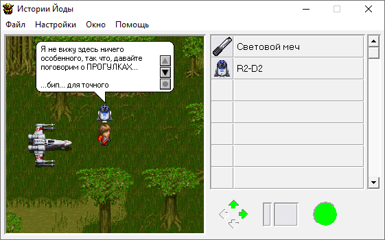

Yoda Stories EXE Translation Guide
==================================

[Содержание](translation-guide.md)

Чтобы получить полностью переведенный исполняемый файл YS, надо локализовать/изменить следующие ресурсы:

* Меню
* Диалоги
* Строки
* Необязательно изменённый размер окна
* Необязательно изменённый прямоугольник диалогов
  
Изначально планировалось, что Yoda Stories Translation Tool (YSTT) будет переводить текст и в EXE-файле тоже.
Однако структура заголовков Windows PE достаточно сложна, чтобы её можно было быстро реализовать.

Существует множество сторонних редакторов Portable Executables, и на самом деле основная сложность заключается в выборе наиболее подходящего.

Наш выбор остановился на утилите Restorator, но она платная, поэтому мы опубликуем список еще нескольких инструментов в алфавитном порядке,
чтобы вы выбрали тот, который позволит вам с комфортом выполнить перевод. Любой редактор поможет полностью перевести текстовые строки, меню и диалоговые окна.

* PE Explorer (129$)
* ResEdit (Free)
* Resource Builder (59$)
* Resource Hacker (Free)
* Resource Tuner (49$)
* Restorator (72$)
* XN Resource Editor (Free)

YSTT сообщает эту же информацию, но дополнительно может открыть сайт выбранной утилиты.


## Перевод текста

В рамках этого руководства мы не в состоянии описать принцип работы каждого редактора PE ресурсов.
Ограничимся лишь несколькими советами.

Характеристики хорошего редактора:

* Изменение меню, диалогов и строковых ресурсов
* Возможность менять строки пачкой, а не по одной
* Визуальный редактор диалогов
* Создание резервных копий исполняемого файла

При переводе строк следует учитывать некоторые особенности. В частности, одни строковые ресурсы используются в самой игре, 
обычно это фразы R2-D2. Другие можно увидеть при появлении каких-то предупреждений и ошибок.

Диалоги R2-D2 форматируются автоматически, однако, некоторые фразы вручную отформатированы с помощью принудительных переносов строк: "\r\n".
Их желательно оставить.

О переносе строк предупреждений следует позаботиться самостоятельно: "\n". 
Практика показала, что эти строки можно делать длиннее чем в оригинальной игре, диалоговое окно автоматически растягивается.


## Ширина окна и диалогов

Основная цель этих изменений - расширить элементы управления окна, чтобы уместить более длинный текст.

* Читать статью [Hacking Yoda Stories article (Eng)](http://tv-games.ru/forum/blog.php?b=2683)
* Читать статью [Hacking Yoda Stories article (Rus)](http://tv-games.ru/forum/blog.php?b=2682)

Все найденные смещения действительны для `Yoda Stories (10.08.1998) (Eng) (v1.2) (Patch v6)`.

`Yoda Stories Translation Tool` способен вносить эти изменения прямо из коробки - нет необходимости редактировать файл вручную.

Пример оригинала:



После изменений: 


## Главное окно

При переводе игры Yoda Stories на русский язык выяснилось, что названия предметов не помещаются в инвентарь и уходят на полосу прокрутки.

Необходимо расширить:

* Главное окно
* Таблицу инвентаря

Сдвинуть вправо: 

* Полосу прокрутки инвентаря

### Размер окна

Окно имеет ширину 525 пикселей. Это 0x20D (0D020000 в LittleEndian)

Для однозначного поиска значения необходимо найти следующую последовательность байтов:

Смещение: 0x52E2

```
vvvv
0D020000 6A08FF     (width)  	
```

Значение так же следует заменить и по этому адресу:  

Смещение: 0x5393

```
       vvvv
C74708 0D020000 C7470C
```

### Таблица инвентаря

Таблица инвентаря имеет ширину 489 пикселей. Это 0x1E9 (E9010000 в LittleEndian)

Для однозначного поиска значения необходимо найти следующую последовательность байтов:

Смещение: 0x1CA5D

```
             vvvv
C7828C320000 E9010000 C78294	(правая координата)		
```

### Полоса прокрутки инвентаря

Для перемещения вправо, необходимо изменить левую и правую координаты полосы прокрутки.

Их текущие значения:

* Лево: 496. Это 0x1F0 (F0010000 в LittleEndian)
* Право: 512. Это 0x200 (00020000 в LittleEndian)

Для однозначного поиска значения необходимо найти следующую последовательность байтов:

Смещение: 0x1CA67

```
             vvvv 
C78294320000 F0010000 B8FC00		(лево)		offset: 0x1CA67
```

Смещение: 0x1CA87

```
			 vvvv
C7829C320000 00020000 C782A4		(право)		offset: 0x1CA87
```


## Диалоги в игре

Чтобы упростить чтение и уменьшить необходимость прокрутки текста, необходимо изменить ширину диалогового окна.

Для этого необходимо расширить:

* Белый скруглённый прямоугольник
* Область текста (EDIT)

Сдвинуть вправо:

* Кнопки управления диалогом

Исследования показали, что достаточно изменить размер области текста, и все остальные элементы управления адекватно отреагируют на эти изменения.

Поскольку ширина текстовой области не является постоянной и рассчитывается во время выполнения, необходимо заменить часть кода:

Этот: 

```
lea     edx, [ebx+ebx*4]
add     eax, edx
```

На этот: 

```
mov    eax, 0xA2
```

Для однозначного поиска значения необходимо найти следующую последовательность байтов:

Смещение: 0x8B17

```
8D149B03C2
```

Заменить на: 

```
b8a2000000          
```


## Шрифт диалогов в игре

Этот баг Windows 10 был обнаружен совершенно случайно.


Он происходит, если в настройках региона системы включить "Beta: Use Unicode UTF-8 for worldwide language support".

Внимание! Ни в коем случае не включайте у себя эту настройку. В моём случае пришлось исправлять в реестре,
так как даже после перезагрузки не удавалось снять эту чёртову галочку!

Если она у вас УЖЕ стоит, то попытайтесь снять здесь:

Control Panel -> Region -> Administrative -> Change system locale...


Если нет - то придётся менять значения в реестре, а это опасно поэтому даже не подскажу где искать.

YSTT предлагает возможность поменять размер шрифта диалогового окна для тех случаев, если у вас эта галочка уже стоит.
Или, если вам нравятся большие буквы. Достаточно увеличить высоту шрифта на 3 или 4, чтобы текст прекрасно читался.

Если менять в HEX редакторе, то будет необходимо изменить в двух местах, найдя следующие данные:

```
5668900100005656566A F8 FF15

0100006A006A006A006A F8 FF15
```

Одно значение чтобы, указать высоту шрифта для EDIT, второе используется для расчёта габаритов диалогового окна.

Значение F8 на самом деле это -8, не пугайтесь, так тоже можно указывать высоту шрифта.


## Таймеры прокрутки текста

`Не реализовано.`

Значение задержки таймера составляет 64 миллисекунды.

Было найдено 4 таймера, но эксперименты по уменьшению задержек приводят к тому, что после клика текст прокручивается на 1-2 строки,
и для стабильной прокрутки на 1 или на 2 строки необходимо сфокусироваться на мыши.

```
  vv
6A646A018B481C
```
