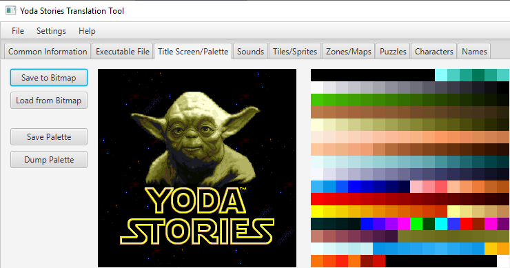
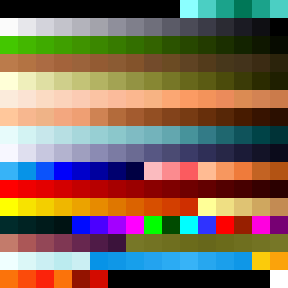
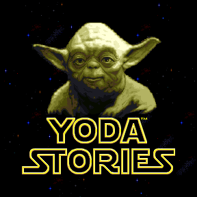

Yoda Stories Graphics Translation Guide
==============================

[Содержание](translation-guide.md)

Игра считается переведённой на 100%, когда локализованы следующие ресурсы:

* Загрузочный экран
* Экраны Start, Win и Lose

## Загрузочный экран

Этот экран можно увидеть при загрузке игры. На самом деле, он идентичен тому, что можно увидеть в Зоне #0,
и это немного упростит нашу работу.

_Скажем сразу — не все поддерживают идею перевода названия игры.
В интернете достаточно рассуждений на эту тему, и приводятся достаточно веские аргументы
в пользу того, что следует оставлять оригинальное название._

_Мы дадим такой совет. Если носители вашего языка произносят название игры как "Yoda Stories",
то этот экран лучше не трогать. В русском языке обычно название игры переводят, поэтому
мы всё-таки изменили название._

Здесь необходимо решить две задачи:

* Нарисовать отсутствующие буквы.
* Правильно сократить количество цветов до палитры Yoda Stories.

Я выложу исходники своей работы, чтобы вам было проще: [font-resources.zip](../font-resources.zip)

### Перерисовка шрифта

Чтобы соответствовать существующему стилю, мы советуем максимально заимствовать уже существующие решения
и собирать отсутствующие буквы на основе уже имеющихся.

YSTT позволяет сохранить как загрузочный экран, так и палитру:

Ищите сгенерированные файлы в каталоге output-eng-1.2.

Выбор графических редакторов огромен, но вполне хватает уровня бесплатных Paint или Paint.Net и Irfan View.

В них реализованы операции копирования-вставки, а так же рисования карандашом.

Как вы уже успели заметить, шрифт нарисован всего двумя цветами - белым и бледно-жёлтым.
То есть, для любых прямых линий, а их будет большинство, достаточно провести две параллельные
полосы этих цветов и потом поворачивать их на нужный угол.

Закруглённых участков в оригинале вполне хватает, чтобы не придумывать что-то от себя. Используйте в качестве основы буквы: "O", "S", "R".

Буквы в каждом языке могут иметь свою ширину, поэтому постарайтесь выдерживать пропорции, чтобы текст выглядел органично.

Все работы следует выполнять на чёрном фоне. После того, как шрифт готов, сохраните файл в BMP формате.

Далее открывайте эту картинку в Irfan View. Необходимо заменить палитру на 256-ти цветную. Она была сгенерированы ранее.

Image -> Palette -> Import Palette.

Затем сохраните файл, важно, чтобы его формат оставался BMP.

Осталась последняя часть - вставить переведённый текст в startup.bmp. Впрочем, чтобы не потерять время зря,
мы советуем вам зайти с другой стороны. Дело в том, что загрузочный экран визуально идентичен Zone #0,
а все Зоны состоят из Тайлов. Можно:

1. Перерисовать тайлы
2. Загрузить startup.bmp в Clipboard image
3. Перенести тайлы букв в Clipboard image
4. Сохранить изображение
5. Переименовать clipboard.bmp в startup.bmp

Подробности работы с тайлами описаны ниже.

### Палитра

Вся графика в игре нарисована палитрой из 256 цветов. Хотя, фактически, уникальных цветов ещё меньше.

НИКОГДА не используйте при рисовании цвет с индексом 0.

Цвет с индексом 0 - это прозрачный цвет, то есть, независимо от того, какой цвет на этом месте,
в игре он выводиться не будет. Это цвет, которым следует заливать прозрачные области вокруг букв.

Irfan View позволяет увидеть индекс цвета пикселя, если кликнуть на него.

Так же есть неиспользуемые цвета, их тоже лучше не использовать: 3, 4, 5, 6, 7, 8, 196, 197, 198, 199, 206, 246, 247, 248, 249, 250, 251, 252, 253, 254

И самое главное. В игре не так много анимации, но часть её реализована за счёт изменения цветов в палитре:

Если вы будете использовать красно-оранжевые цвета из диапазона изменяющихся цветов, то при повторном прохождении
игры это может испортить графику. Чтобы такого не происходило, мы генерируем так же "safe" палитры, в которых
проблемные цвета попросту удалены.

#### Прозрачный цвет

Мы рекомендуем после всех преобразований заливать фон цветом Fuchsia, поскольку, он яркий и выделяющийся.

Соответственно, лучше использовать палитру, у которой нулевой цвет тоже Fuchsia: palette-fuchsia.pal или palette-fuchsia-safe.pal.

В YSTT прозрачный цвет выбирается в верхнем меню: Settings -> Transparent Color.

Необходимо выбрать один цвет в начале работы и использовать его для сохранения и замены ресурсов. Установите его как Fuchsia.

## Экраны Start, Win и Lose

На самом деле, эти экраны реализованы так же, как и все игровые Зоны в игре. Их номера: 0, 76, 77.

  

Обратите внимание, что Зона #0 очень напоминает стартовый экран. Она отображается в начале каждой игры,
и на ней можно видеть полёт X-Wing.

Все Зоны состоят из тайлов. На практике, обычно накладывается по 3 тайла на одну область, они составляют Zone Spot.

Zone Spot имеет 3 уровня, наша цель - промежуточный уровень, именно на нём отображаются буквы.

Зоны имеют размер: либо 8x8, либо 16x16 тайлов.

YSTT позволяет редактировать графику любой Зоны в игре.

Последовательность действий такая:

1. Выбрать требуемый слой (варианты top, middle, bottom). Нам нужен middle.
2. Последовательно перетащить тайлы в нужные места Зоны

При редактировании Зон часто возможны ошибки, состояние можно вернуть кнопкой Undo.

Чтобы ваша работа не пропала зря, её необходимо сохранить: File -> Save.

### Tiles

Последовательность работы с тайлами такая:

1. Экспортировать тайлы
2. Перерисовать их
3. Импортировать обратно, заменив существующие, и при необходимости добавляя новые

#### Экспорт тайлов

В начале этой операции лучше замените прозрачный цвет на чёрный: Settings -> Transparent Color. Это упростит вашу работу.

Перетащите мышкой нужные тайлы в Clipboard image, затем сохраните его (файл clipboard.bmp в каталоге output-eng-1.2).

Нас интересуют фразы:

* YODA STORIES
* YOU WIN!
* TRY AGAIN...
* FORCE FACTOR

Последние 3 фразы используют другой шрифт.

#### Перерисовка тайлов

О том, как перерисовать шрифт для Зоны #0 мы уже рассказывали выше.

Инструменты не меняются, это по-прежнему Paint и Irfan View. Однако, чтобы работа получилась качественной,
очень советуем воспользоваться редактором векторной графики: Inkscape или Corel Draw. Идея такая:

1. Сделать наклонный шрифт вертикальным. Необходимо выполнить Horizontal Skew со значением 19.5.
2. Увеличить шрифт в несколько раз, например в 5 или 10
3. Подобрать похожий системный шрифт без засечек
4. В Inkscape написать текст поверх графики
5. Отредактировать вектора под стилистику шрифта из игры
6. Залить буквы градиентом
7. Наклонить буквы: Horizontal Skew со значением 19.5 в другую сторону
8. Уменьшить буквы до требуемой высоты
9. Отцентрировать текст относительно игрового окна
10. Импортировать SAFE палитру
11. Сгладить переходы между цветами градиента
12. Буквы внутри залить чёрным цветом, снаружи - прозрачным
13. Сохранить изображение в BMP формате

Некоторые советы:

Не стесняйтесь выбрать шрифт покрупнее: 

* 11-12 px для force factor
* 31-32 px для остального шрифта

Главное правило - уложиться в 288 пикселей игрового экрана. YSTT позволяет добавлять новые тайлы в игру.

В качестве источника вдохновения можно воспользоваться образцами букв из любых доступных переводов игры.

TODO ссылку на мой перевод

Обратите внимание - чтобы буквы "O" или "C" смотрелись органично, они должны быть немного больше остальных букв.
В русском переводе обычные буквы фразы YOU WIN имеют высоту 32 пикселя. Буква "О" на 1 пиксель выступает вниз.
Она рисуется на тайлах FORCE FACTOR. Естественно, слова совсем другие: ПОБЕДА, ФАКТОР СИЛЫ.

#### Импорт тайлов

* Загрузить изменённый clipboard.bmp
* Перетащить тайлы
* Добавить пустые тайлы, если закончились свободные

Каждый добавляемый тайл автоматически получает атрибут Object (transparent).
Менять его следует только в том случае, если вы хотите сделать глубокий хак игры (контекстное меню тайла, правый клик мышкой). 
Но для перевода это не нужно.

### Zones

После импортирования тайлов ещё раз откройте Зоны. Если буквы чётко соответствуют оригиналу, то все Зоны
будут отображаться корректно, и достаточно сохранить результат вашей работы.

Иначе же, перетаскиванием тайлов с буквами на middle уровень Зоны добейтесь того, чтобы слова выглядели
и читались так, как вы это запланировали.
