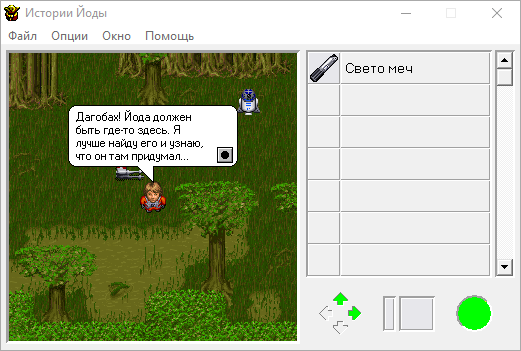
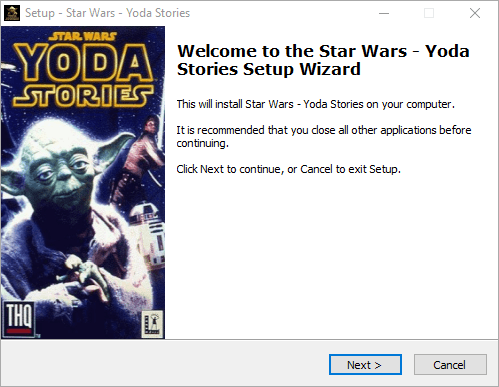
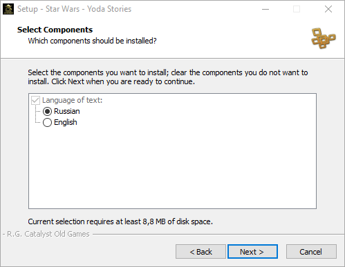

Yoda Stories Russian Translations
=================================

The game translated into Russian twice.
The first option has not stood the test of time,
the second implemented using all the advanced knowledge about the internal organization of the game,
and is of the highest quality and completeness.

T-Rus PRO
---------

* Translator: `PRO`
* Date: `19.08.2006`
* Based on version 1.2 (aka Patch 6).

Two minor changes for unused action arguments in zones `562` and `578`. Probably manual.

The graphics are not translated, and the tile names only partially translated.

The translation was included on the disc `Yoda Stories (R. G. Catalyst Old Games)`.

T-Rus Leonis
------------

Based on version 1.2 (aka Patch 6).

This translation has been in the making for many years and is qualitatively different from its predecessor.

Thanks to the complete information about the structure of the DTA file, it was possible to translate all the graphics and all the text.

TODO pictures

TODO compare with 1.2
