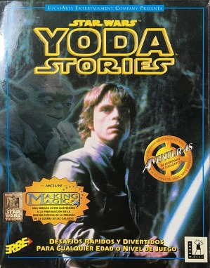
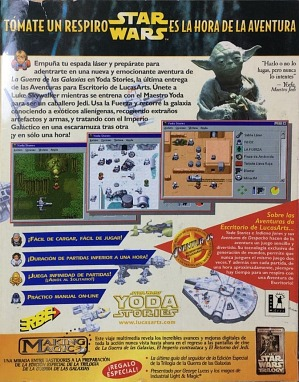
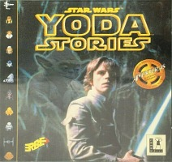
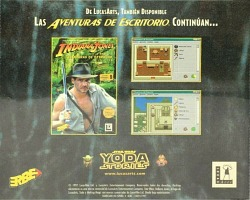
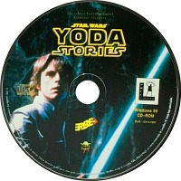
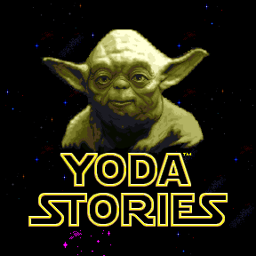
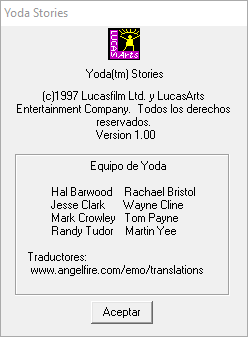

Star Wars - Yoda Stories (Spa) & Making Magic
=============================================

* Region: `Spain` and probably Portugal
* Language: `Spanish`
* Publisher: [`ERBE Software S.A.`](http://web.archive.org/web/19990209054839/http://www.teknoland.es/erbe/)
* Release date: `Spring 1997`
* Age rating: `none`
* UPC: `8 420224 343103`
* MPN: `1997AYDP`
* EAN: `023272311186`
* DLM: `10314-1997`

Screenshots on the box and all text translated into Spanish. There is no age rating on the packaging.

Disk:

* Recording date: `22.05.1997 11:14:33`
* Volume Space Size (LBA): `328840`
* Volume Identifier: `YODASPANISH`

Disc content:

* `Star Wars: Yoda Stories (Spain)`
* `Star Wars: Making Magic (Spain) (FC1.03) (11/22/1996)`
* `Star Wars: Rebel Assault II Demo (Spain) (DT1.15) (11/22/1996)`
* Themed cursors, icons, wallpapers and sound effects for Windows.

The design of the disc is dark, non-standard, it matches the design on the box.

`Star Wars - Making Magic` here differs from the previous ones, and not only by the version number.
The interface completely translated, otherwise the version does not differ from the French one, although...

A demo version of the game `Rebel Assault II` is hidden in the catalog with `Star Wars - Making Magic`.
Now it is clear why the disk size has grown by 150 MB.
This game is newer than the original one that was on the original Making Magic CD from 1996.

* `DT1.15` from `22.11.1996` instead of `DH1.15` from `03.10.1996`.

The demo version also translated into Spanish.

The Spanish version vs 1.1 
--------------------------

The Spanish version not released first, but among the European versions of Yoda Stories, 
it appeared on the Internet earlier than others.
Therefore, it will become the basis for comparison with other European versions.

The Spanish version of Yoda Stories is between `1.1` and `1.2` in terms of the number of implemented fixes.

* Implemented fixes: `72, 236, 407, 472, 572`
* Missing fixes: `266, 267, 271`

So, adding melodies in zones `266, 267, 271` will be enough for the game to match `Patch 6`.

Changed categories:

* `Startup screen`
* `Tiles`
* `Zones`
* `Puzzles`
* `Characters`
* `Tile names`
* `Tile genders`

**Startup screen**:

The pink areas show where the stars were.
For some unknown reason, the tiles `1079` and `1078` at the bottom of the screen have been changed to `1084` (100% black square).

It should be understood that there is a similar change in Zone 0.

**Tiles**:

To accommodate all text, the number of tiles has been increased from 2123 to 2126.

* Changed tiles: 2090-2108
* 3 new tiles: 2123-2125

These tiles used in zones 76-77.

**Zones 76-77**:

 

**Zone 72**: an important fix identical to version 1.2

**Zone 236**: an important fix identical to version 1.2

**Zone 407**: an important fix identical to version 1.2

**Zone 472**: an important fix identical to version 1.2, however, the new actions added at the end of the zone, not in the middle.

**Zone 572**: an important fix identical to version 1.2

Other sections:

* **Puzzles**: 100% difference in the text, but expected.
* **Characters**: differences only in unused data.
* **Tile names**: 100% difference in text, but expected.
* **Tile genders**: This is a new data structure, TGEN, typical for languages that use the article to change the gender.

On the Internet can also be find a version of this game from "Spanish translators".
Truth, [`Selva Translators`](https://www.angelfire.com/emo/translations/traducciones/yoda/traducciones_yoda.htm)
only the "About" screen in the existing Spanish version has changed.

News published 13.12.2001, but they write that they finished in November 2001. What was their motivation is not clear.
