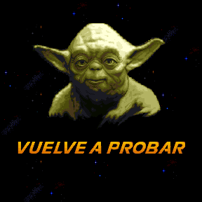

Star Wars - Yoda Stories (Spa) & Making Magic
=============================================

* Регион: `Испания` и вероятно Португалия
* Язык: `испанский`
* Издатель: [`ERBE Software S.A.`](http://web.archive.org/web/19990209054839/http://www.teknoland.es/erbe/)
* Дата выпуска: `весна 1997` года
* Возрастной рейтинг: `отсутствует`
* UPC: `8 420224 343103`
* MPN: `1997AYDP`
* EAN: `023272311186`
* DLM: `10314-1997`

Скриншоты на коробке и весь текст переведены на испанский. Возрастного рейтинга на упаковке нет.

Диск:

* Дата записи: `22.05.1997 11:14:33`
* Volume Space Size (LBA): `328840`
* Volume Identifier: `YODASPANISH`

Содержимое диска:

* `Star Wars: Yoda Stories (Spain)`
* `Star Wars: Making Magic (Spain) (FC1.03) (22.11.1996)`
* `Star Wars: Rebel Assault II Demo (Spain) (DT1.15) (22.11.1996)`
* Тематические курсоры, иконки, обои и звуковые эффекты для Windows.

Оформление диска тёмное, нестандартное, совпадает с оформлением на коробке.

`Star Wars - Making Magic` здесь отличается от предыдущих, причём, не только номером версии.
Интерфейс полностью переведён, в остальном же версия не отличается от Французской, хотя...

В каталоге со `Star Wars - Making Magic` припрятана демо-версия игры `Rebel Assault II`.
Теперь понятно, почему размер диска вырос на 150 мб.
Эта игра новее первоначальной, которая шла на оригинальном диске Making Magic 1996-го года.

* `DT1.15` от `22.11.1996` вместо `DH1.15` от `03.10.1996`.

Демо-версия так же переведена на испанский язык.

The Spanish version vs 1.1 
--------------------------

The Spanish version was not released first, but among the European versions of Yoda Stories, 
it appeared on the Internet earlier than others.
Therefore, it will become the basis for comparison with other European versions.

The Spanish version of Yoda Stories is between `1.1` and `1.2` in terms of the number of implemented fixes.

* Implemented fixes: `72, 236, 407, 472, 572`
* Missing fixes: `266, 267, 271`

So, adding melodies in zones `266, 267, 271` will be enough for the game to match `Patch 6`.

Changed categories:

* `Startup screen`
* `Tiles`
* `Zones`
* `Puzzles`
* `Characters`
* `Tile names`
* `Tile genders`

**Startup screen**:

The pink areas show where the stars were.
For some unknown reason, the tiles `1079` and `1078` at the bottom of the screen have been changed to `1084` (100% black square).

It should be understood that there is a similar change in Zone 0.

**Tiles**:

To accommodate all text, the number of tiles has been increased from 2123 to 2126.

* Changed tiles: 2090-2108
* 3 new tiles: 2123-2125

These tiles used in zones 76-77.

**Zones 76-77**:

 

**Zone 72**: an important fix identical to version 1.2

**Zone 236**: an important fix identical to version 1.2

**Zone 407**: an important fix identical to version 1.2

**Zone 472**: an important fix identical to version 1.2, however, the new actions added at the end of the zone, not in the middle.

**Zone 572**: an important fix identical to version 1.2

* **Puzzles**: 100% difference in the text, but expected.
* **Characters**: differences only in unused data.
* **Tile names**: 100% difference in text, but expected.
* **Tile genders**: This is a new data structure, TGEN, typical for languages that use the article to change the gender.

On the Internet you can also find a version of this game from "Spanish translators".
Truth, [`Selva Translators`](https://www.angelfire.com/emo/translations/traducciones/yoda/traducciones_yoda.htm)
only the "About" screen in the existing Spanish version has changed..

News publlished 13.12.2001, but they write that they finished in November 2001. What was their motivation is not clear.
