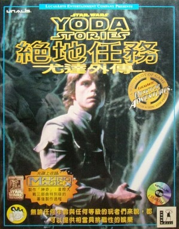
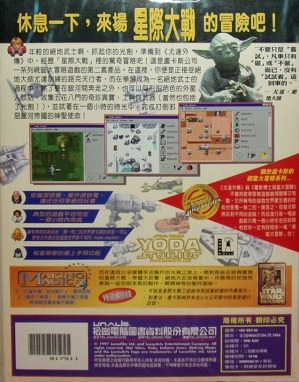
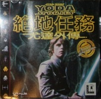
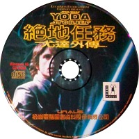

Star Wars - Yoda Stories (Tw) & Making Magic
============================================

* Регион: `Тайвань`
* Язык: `неизвестно`
* Издатель: [Unalis Corporation](http://web.archive.org/web/19980126015500/http://www.unalis.com.tw/) (кит. `松崗電腦圖書資料股份有限公司`)
* Дата выпуска: `1997` год
* Возрастной рейтинг: `отсутствует`
* Цена: `NT$ 540`

Образа диска на руках нет, китайского не знаем поэтому нужна помощь, чтобы выяснить об этой игре побольше.

Известно, что Unalis в основном специализировалась на офисном программном обеспечении, 
игр было издано в районе десяти.
