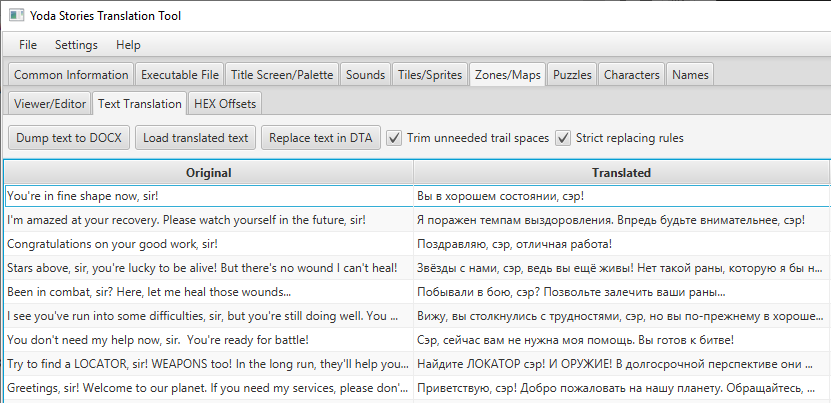

Yoda Stories Graphics Translation Guide
==============================

[TOC](translation-guide.md)

A fully translated game has its own localized ones: 

* Zone Actions
* Puzzles
* Tile names

The Yoda Stories Translation Tool (YSTT) fully automates the process of extracting and pasting text.



One universal algorithm is used for all groups of text:

1. Save the original text into a text document
2. Translate text
3. Load the text back into YSTT
4. Replace text in DTA file

## Text file

Files with original text have the DOCX extension. They can be opened in Open Office or Microsoft Word.
This format was chosen so that the original can be seen immediately as a reference.
In addition, this format makes it easier to check the translation and replace phrases in the game.

In addition to the text itself, the document contains service data:

* String identifiers
* CRC32
* Source character encoding
* Destination character encoding

String IDs are required to correctly replace text in the game.

CRC32 is the checksum of the YODESK.DTA file. You don't need to change it. If the translation was performed for another version of the game, a warning will be displayed.

Source character encoding is the original game encoding. You don't need to change it.

Destination character encoding is the encoding of the language into which the game will be translated.
If your encoding is not indicated here, then replace it with your own, this is important.

A few tips:

1. Don't touch strings identifiers. They are necessary for the correct replacement of the text in the game.
2. Be sure to leave special characters untouched: ¥ and ¢
3. To check spelling, select your text and select the language for it in the text editor.
4. If, after loading the text into YSTT, the translation has an incorrect encoding, then change it in the utility settings.
5. After loading any text document, destination character encoding is changed to the value specified in it.


## Zone Actions

All the game logic of each Zone is implemented in Actions. There are absolutely non-interactive Zones in the game,
but there are those that can have up to 15 Actions, and even more.

Each Action consists of Conditions and Instructions. If all the Conditions are satisfied, then all Instructions are executed.

Instructions may be accompanied by text. Thus, all dialogues between Luke, NPCs and enemies are implemented.

When translating text, pay attention to the Zone ID.
If you don't understand what the text is about, but such places exists, then in YSTT you can look at the Zone and refresh your memory.

File: actions.docx


## Puzzles

Puzzles are another way to interact with NPCs.

Each puzzle can contain up to 5 phrases with the following content:

* REQUEST
* THANK
* OFFER
* MISSION
* UNUSED

For example:

* REQUEST: My hyperdrive needs a new ALLUVIAL DAMPER! Do you think you could find one for me?
* THANK: My hyperdrive is as good as new!
* OFFER: In return, I can let you have this ALLUVIAL DAMPER... it's just the thing for your hyperdrive.

Mission is authorized to tell only Yoda, for example:

Luke! Great danger there is!

The Imperial Fleet has learned of the HIDDEN REBEL BASE on icy planet Thaldo. Attack is their plan! You must WARN the Rebels, Luke!

Only this can I give you...

Knowing how Puzzles work, you are less likely to make a translation mistake.

File: puzzles.docx


## Tile Names

This is the simplest and at the same time the most painstaking part of the translation. Perhaps it is better to start with it,
because these names are found in abundance in the text of the game, and there should be no discrepancies.

The game uses 245 unique items and creatures!

File: tilenames.docx


### Character encodings

Despite the fact that Unicode already existed at the time of the creation of the game, the operating systems of the Windows 9x family have very limited support for it.
Regional encodings, or code pages, were actively used, this is a practice that has been known since the days of DOS.
The idea is that depending on the language of the system, the same extended ASCII characters have different typeface.

The first 127 ASCII characters remained unchanged, but all subsequent ones could be very different:

```
windows-1252: € ‚ƒ„…†‡ˆ‰Š‹Œ Ž  ‘’“”•–—˜™š›œ žŸ ¡¢£¤¥¦§¨©ª«¬­®¯°±²³´µ¶·¸¹º»¼½¾¿ÀÁÂÃÄÅÆÇÈÉÊËÌÍÎÏÐÑÒÓÔÕÖ×ØÙÚÛÜÝÞßàáâãäåæçèéêëìíîïðñòóôõö÷øùúûüýþÿ
windows-1250: € ‚ „…†‡ ‰Š‹ŚŤŽŹ ‘’“”•–— ™š›śťžź ˇ˘Ł¤Ą¦§¨©Ş«¬­®Ż°±˛ł´µ¶·¸ąş»Ľ˝ľżŔÁÂĂÄĹĆÇČÉĘËĚÍÎĎĐŃŇÓÔŐÖ×ŘŮÚŰÜÝŢßŕáâăäĺćçčéęëěíîďđńňóôőö÷řůúűüýţ˙
windows-1251: ЂЃ‚ѓ„…†‡€‰Љ‹ЊЌЋЏђ‘’“”•–— ™љ›њќћџ ЎўЈ¤Ґ¦§Ё©Є«¬­®Ї°±Ііґµ¶·ё№є»јЅѕїАБВГДЕЖЗИЙКЛМНОПРСТУФХЦЧШЩЪЫЬЭЮЯабвгдежзийклмнопрстуфхцчшщъыьэюя
```

This led to certain difficulties at the time, but even when translating the game, this should be paid attention to.

Since Java (the language in which the Yoda Stories Translation Tool is written) natively uses Unicode, then
for correct extraction and subsequent replacement of the text, it is necessary to choose the correct encodings, since the following transformations are performed:

Source character encoding (dumping) -> Unicode (internal representation) -> Destination character encoding (inserting)

For the original game in English, any encoding is suitable, since the first 127 characters (almost) are enough.


#### Variables

The exception is two characters: ¥ (0xA5; Ґ cyrillic) and ¢ (0xA2; ў cyrillic), which are used in Zone Actions to substitute item names.
A kind of variable values.

When translating, it is important that these special characters remain unchanged. The code implements such a check.

Therefore, the original encoding will not be ASCII, but windows-1252 (Latin-1). This encoding is automatically matched
for Western European variants such as Spanish, Italian and French.

Currently, no French and Italian translations of the game have been found. Email me at tv-games@mail.ru if you have these games.


#### Genders

There are no problems with genders in English. Masculine, feminine and neuter words are spelled the same.

But at least in the German and Spanish versions of the game, the change of the genders of objects is implemented. For example, in the Germanic version
the article "der" before the variable will be replaced with "der"/"das" if the tile of this item has the corresponding TGEN value:

0. Masculine: der
1. Feminine: der
2. Neutral: das

[Details here](http://tv-games.ru/forum/blog.php?b=2685)

In Spanish, there are only masculine and feminine gender, and the change of the article will be as follows:

el -> la
un -> una

If the language into which the game is being translated follows the same rules, then you should take the German or Spanish version as a basis.

The gender of a tile can be changed on the tile editing screen (right click).

Currently, no French and Italian translations of the game have been found. Email me at tv-games@mail.ru if you have these games.


#### Word files

If you pay attention to the file [crcs.json](https://github.com/LeonisX/yoda-stories-translation-tool/blob/main/src/main/resources/crcs.json), 
then it just describes the source encodings for every known release of the game.

It is used when dumping text from the yodesk.dta data file.

In DOCX files, this value is indicated for reference purposes as "Source character encoding", and it makes no sense to change it to something else.

But it makes sense to change the value of "Destination character encoding" if the game is translated into a language that does not belong to the windows-1252 encoding.


#### Encodings (code pages)

| Encoding | Name  |
|:-:|---|
| windows-1250 | Eastern European (Latin 2) |
| windows-1251 | Cyrillic (Slavic) |
| windows-1252 | Western European (Latin-1, ANSI) |
| windows-1253 | Greek |
| windows-1254 | Turkish (Latin 5) |
| windows-1255 | Hebrew |
| windows-1256 | Arabic |
| windows-1257 | Baltic |
| windows-1258 | Vietnamese |
| x-windows-874 | Thai |
| windows-31j | Japanese |
| x-windows-iso2022jp | Japanese ISO-2022 |
| x-mswin-936 | Chinese Simplified |
| x-windows-950 | Chinese Traditional |
| x-MS950-HKSCS | Chinese Traditional + Hong Kong |
| x-windows-949 | Korean |
| x-Johab | Korean (Johab) |

The rest of the encoding names can be found in [this document](https://docs.oracle.com/javase/8/docs/technotes/guides/intl/encoding.doc.html) (second column).

If the program does not have the encoding you need, then add it manually to the [charsets.json](https://github.com/LeonisX/yoda-stories-translation-tool/blob/main/src/main/resources/charsets.json) file. 
