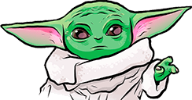
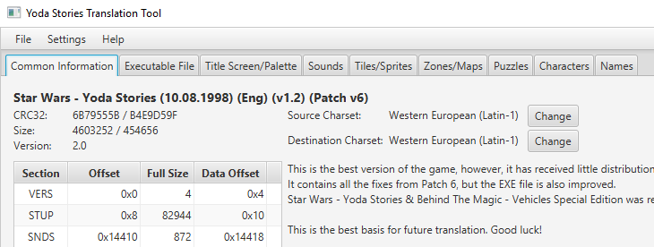

Yoda Stories Translation Guide
==============================

A fully translated game has its own localized ones: 

* Startup screen
* Start, Win and Lose screens
* Text in Actions
* Text in Puzzles
* Tile names
* Fully translated executable file
* Fully translated Help file

The task is not easy, but very exciting. The most important thing is that two people can translate the game, for example, one graphics, another text.

We have prepared a documentation for you, where each operation is described in steps. Good luck!

* [Graphics](graphics-translation-guide.md)
* [Text](text-translation-guide.md)
* [YODESK.EXE](exe-translation-guide.md)
* YODESK.HLP

## Which version to translate?

The following versions of Yoda Stories are currently known:

* Star Wars - Yoda Stories (14.02.1997) (Eng) (v1.0)
* Star Wars - Yoda Stories (14.02.1997) (Eng) (v1.0) (Patch v6)
* Star Wars - Yoda Stories (18.02.1997) (Eng) (v1.1)
* Star Wars - Yoda Stories (18.02.1997) (Eng) (Demo)
* **Star Wars - Yoda Stories (10.08.1998) (Eng) (v1.2) (Patch v6)**
* Star Wars - Yoda Stories (22.05.1997) (Spa)
* Star Wars - Yoda Stories (25.06.1997) (Ger)
* Star Wars - Yoda Stories (13.12.2001) (T-Spa_Selva Translators)
* Star Wars - Yoda Stories (12.11.2006) (T-Rus_PRO)
* TODO My translation

They are identified by the checksums of the yodesk.exe and yodesk.dta files.

Yoda Stories Translation Tool (hereinafter referred to as YSTT) after loading the game displays all information
about the version, and also gives the necessary recommendations.

**If YSTT was unable to identify your version of the game, then be sure to send it to us for study.**

We strongly recommend taking as a basis ONLY the version of Star Wars - Yoda Stories (10.08.1998) (Eng) (v1.2) (Patch v6),
as it contains the most recent fixes.

Search for this game in the collection Star Wars - Yoda Stories & Behind The Magic - Vehicles Special Edition, which,
in turn was included in the collection LucasArts Archives Vol. IV: Star Wars Collection II.

All other versions were sold as a compilation Star Wars - Yoda Stories & Making Magic.

Alternatively, you can take the Russian translation from Leonis, but you need to understand that the translation of the translation can
be even further from the original.

## DTA file translation algorithm

1. Dump all resources from yodesk.dta
2. Translate and paste them back

Among the dumped resources for translation, you will need the following files:

* startup.bmp
* *.pal
* clipboard.bmp
* actions.docx
* puzzles.docx
* tilenames.docx

They are all grouped in the `translation` directory.

YSTT is intended not only for translating the game, but also for researching it. In order not to mislead you,
all research functions are disabled by default. They can be enabled in the Settings menu.

If the operation of inserting resources is not performed at one time, that is, let's say that the graphics were inserted first, and the file
yodesk.dta has been saved, then its CRC32 will change, and there will be difficulties with inserting text the next time YSTT starts.
The utility will look for resources in the `output-unk` directory.
In this case, move all translated assets to the `output-unk` directory.

After translating the game, be sure to send it to us so that it can be added to the Yoda Stories database of famous translations. 
