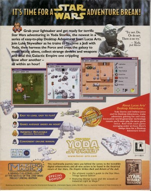
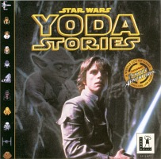
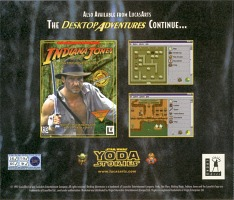
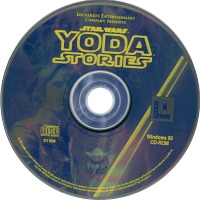

Star Wars - Yoda Stories (UK) & Making Magic
============================================

* Регион: `Великобритания`, вероятно, какие-то Европейские страны, ЮАР и ближний Восток
* Язык: `английский`
* Издатель: [`Virgin Interactive Entertainment`](http://web.archive.org/web/19980131112818/http://www.vie.co.uk/)
* Дата выпуска: `весна 1997` года
* Рейтинг ELSPA: `3-10, 11-14, 15-17, 18+`
* UPC, MPN: `0 23272 31118 6`

Данная версия должна максимально совпадать с версией 1.0 для США,
но у нас нет образа диска для этого региона, чтобы убедиться наверняка.

Найденные отличия:

Рейтинги ESRB на упаковке отсутствуют, а рейтинги ELSPA напечатаны на тыльной стороне коробок.

Диск:

* Серийный номер: `3111830`
* Mastering code: `CDD 15060 YODA STORIES PC MASTERED BY NIMBUS IFPI L127`

О содержимом диска пока нет никакой информации, но, как минимум,
он печатался на другом предприятии и другим издателем.
