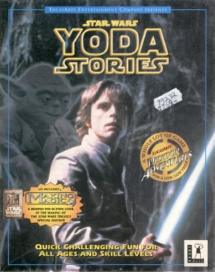

Star Wars - Yoda Stories (UK) & Making Magic
============================================

* Region: `UK`, probably some European countries, South Africa and the Middle East
* Language: `English`
* Publisher: [`Virgin Interactive Entertainment`](http://web.archive.org/web/19980131112818/http://www.vie.co.uk/)
* Release date: `Spring 1997`
* ELSPA rating: `3-10, 11-14, 15-17, 18+`
* UPC, MPN: `0 23272 31118 6`

This version should be as close as possible to US version 1.0,
but we don't have a disk image for that region to be sure.

Found differences:

There are no ESRB ratings on the packaging, and ELSPA ratings are printed on the back of the boxes.

Disk:

* Serial number: `3111830`
* Mastering code: `CDD 15060 YODA STORIES PC MASTERED BY NIMBUS IFPI L127`

There is no information about the contents of the disc yet, but at least
it was printed by a different company and by a different publisher.