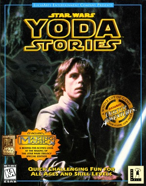
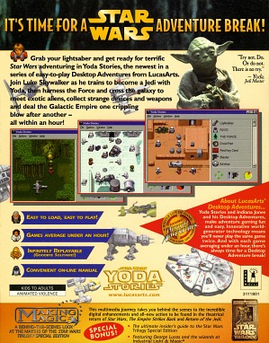
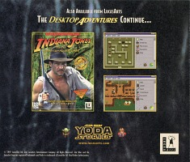
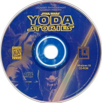
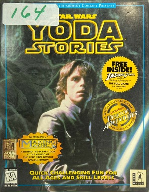
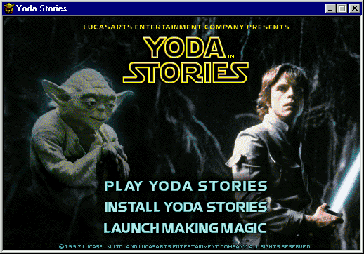

Star Wars - Yoda Stories (USA) (15.02.1997) & Making Magic
==========================================================

* Регион: `США` (скорее всего и Канада)
* Язык: `английский`
* Издатель: [`LucasArts Entertainment Company`](https://web.archive.org/web/19980214042448/http://www.lucasarts.com/org_index.html)
* Дата выпуска: [`12.03.1997`](https://web.archive.org/web/20001204035600/http://www.ogr.com/news/news0397.html)
* Рейтинг ESRB: `K-A: Kids to Adults, Animated Violence`
* UPC, MPN: `0 23272 31118 6`
* Цена: `19.95$`
* Версия: `1.0`

Так же известно о специальном издании, в коробке с которым была 3.5' дискета с игрой `Indiana Jones and His Desktop Adventures`.

Оформление коробки:

* На лицевой стороне изображены Йода и Люк. Аналогичные обои есть на диске.
* На задней стороне коробки диска реклама `Indiana Jones and His Desktop Adventures`.

Диск:

* Дата записи: `15.02.1997 10:24:25`
* Volume Space Size (LBA): `249081`
* Volume Identifier: `YODA`
* Серийные номера: `3111827`, `3111830`
* Mastering codes:
  * `KAO OPTICAL PRODUCTS 3111830 ***RF105805-200*** IFPI L954`
  * `KAO OPTICAL PRODUCTS 3111830 ***RF105719-003*** IFPI L953`
  * `KAO OPTICAL PRODUCTS 3111830 ***RF105719-004*** IFPI L953`

Содержимое диска:

* `Star Wars: Yoda Stories (USA)`
* `Star Wars: Making Magic (USA)`
* Тематические курсоры, иконки, обои и звуковые эффекты для Windows.

Yoda Stories можно запустить с компакт-диска, либо установить на жёсткий диск.

`Making Magic` отличается от оригинала, выпущенного годом ранее, одним файлом:

* `data\launch\launch.trs`

В секции "Where To Find Us On-Line" впервые упоминается интерактивный инструмент `Yoda's Help Desk`,
помогающий решить большинство типовых проблем. Версия QA1.03 от 03.09.1996.
