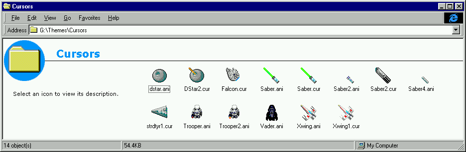
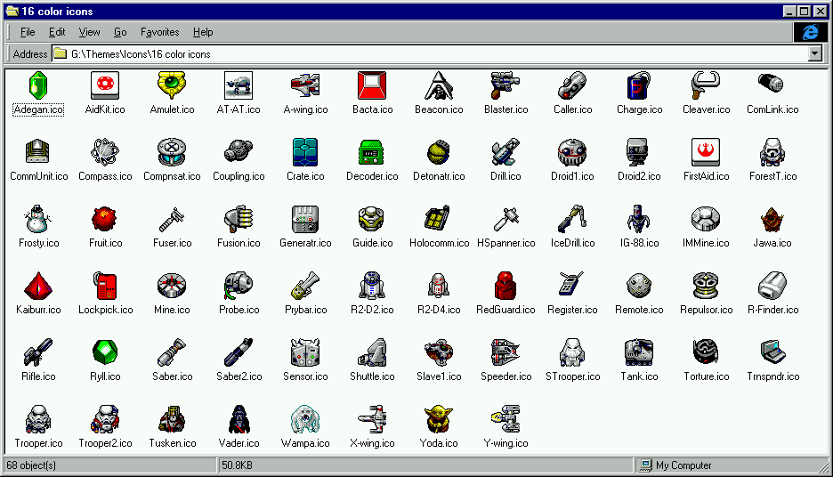
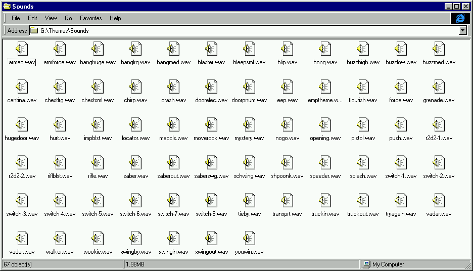
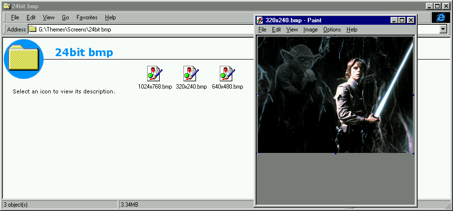

Star Wars - Yoda Stories (USA) (15.02.1997) & Making Magic
==========================================================

* Region: `USA` (most likely Canada)
* Language: `English`
* Publisher: [`LucasArts Entertainment Company`](https://web.archive.org/web/19980214042448/http://www.lucasarts.com/org_index.html)
* Release date: [`12.03.1997`](https://web.archive.org/web/20001204035600/http://www.ogr.com/news/news0397.html)
* ESRB rating: `K-A: Kids to Adults, Animated Violence`
* UPC, MPN: `0 23272 31118 6`
* Price: `19.95$`
* Version: `1.0`

It is also known about a special edition, in the box with which there was a 3.5'
floppy disk with the game `Indiana Jones and His Desktop Adventures`.

Box layout:

* The front of the box features a shot of Luke lighting his way through a creepy cave.
A translucent image of Yoda was layered on top. Similar wallpapers are on the disk.
* `Indiana Jones and His Desktop Adventures` advertisement on the back of the disc box.

Disk:

* Recording date: `15.02.1997 10:24:25`
* Volume Space Size (LBA): `249081`
* Volume Identifier: `YODA`
* Serial numbers: `3111827`, `3111830`
* Mastering codes:
  * `KAO OPTICAL PRODUCTS 3111830 ***RF105805-200*** IFPI L954`
  * `KAO OPTICAL PRODUCTS 3111830 ***RF105719-003*** IFPI L953`
  * `KAO OPTICAL PRODUCTS 3111830 ***RF105719-004*** IFPI L953`

Disc content:

* `Star Wars: Yoda Stories (USA)`
* `Star Wars: Making Magic (USA)`
* Themed cursors, icons, wallpapers and sound effects for Windows.

Yoda Stories can be run from a CD or installed on a hard drive.

`Making Magic` differs from the original released a year earlier in only one file:

* `data\launch\launch.trs`

The section "Where To Find Us On-Line" first mentions the interactive tool `Yoda's Help Desk`,
helping to solve most typical problems. Version `QA1.03` dated 03.09.1996.

Themes
------

