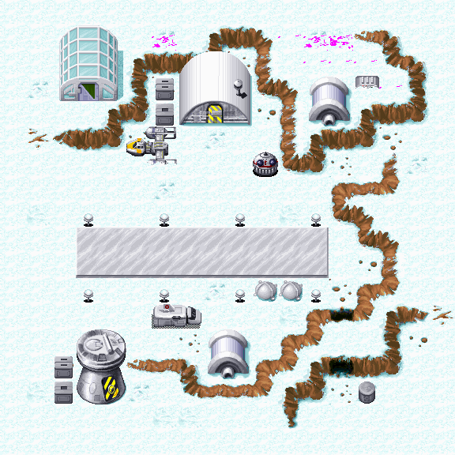

Star Wars - Yoda Stories (USA) (20.03.1997) & Making Magic
==========================================================

* Регион: `США` (скорее всего и Канада)
* Язык: `английский`
* Издатель: [`LucasArts Entertainment Company`](https://web.archive.org/web/19980214042448/http://www.lucasarts.com/org_index.html)
* Дата выпуска: `весна 1997` года
* Версия: `1.1`

Пока в нашем распоряжении имеется только образ диска, без полиграфии.

Это достаточно редкий диск. В игре исправлены ошибки, найденные к тому времени. 
Аналогичные исправления реализованы в большинстве Европейских релизов.

Надо добавить, что позже подоспела вторая пачка исправлений.
они были реализованы в `Patch 6`, а так же в версии Yoda Stories `1.2`.

Диск:

* Дата записи: `20.03.1997 11:08:42`
* Volume Space Size (LBA): `249087`
* Volume Identifier: `YODA`
* Серийный номер: `3111830`
* Mastering codes:
  * `KAO OPTICAL PRODUCTS   3111830  ***RF105805-300***	IFPI L954`
  * `KAO OPTICAL PRODUCTS   311830   ***RF105805-200***	IFPI L954`

Содержимое диска:

* `Star Wars: Yoda Stories (USA) (Rev 1)`
* `Star Wars: Making Magic (USA)`
* Тематические курсоры, иконки, обои и звуковые эффекты для Windows.

Изменены файлы:

* `YODESK.DTA`
* `YODESK.EXE`

Добавлен не обязательный файл `YODESK.GID`.


USA 1.1 version vs 1.0
----------------------

Since comparing changes in EXE files is quite time-consuming, we will focus our attention on the differences between DTA files.

Compared to the very first version of the game, several game locations have been fixed in 1.1: `151, 176, 203, 430, 535`.

**Zone 151**: Actions 4, 5

It was:

* Remove tile [11; 1; 2] (x, y, z coordinates)
* Remove tile [11; 2; 1]

Became:

* Place tile 1787 at [11; 1; 2] (x, y, z coordinates)
* Place tile 1787 at [11; 2; 2]
* Remove tile [11; 2; 1]


This is a story with a `Tauntaun` randomly appearing on the right side of the screen.
Nice secret, you can find something in the equipment of that two-legged riding animal.


Changed snowdrifts at the top of the map `151` (pink areas).



**Zone 176**: new Monster `61` [7; 6] loot: 65535; dropsLoot: 0


Added a robot of the `R2` series, I do not remember whether something falls from it or not.
Much more interesting is the following fix:

`izx4:_unnamed2: 1 -> 0`

So far, one can only guess what the developers have changed here.

**Zone 203**: new Monster `61` [1; 3] loot: 65535; dropsLoot: 0


Another `R2` robot in a snowy location.

Also, in two places, tile `678` was replaced with tile `680`, but in fact these tiles are identical.

 

**Zone 430**: Action 4: fix in a rather long action, specifically in the NPC dialogue:


Invalid Y coordinate of the dialog.


**Zone 535**: New Action 50 with 1 condition and 3 instructions:


```
Action 50
if
    placed-item-is: 5 5 1 780 809
then
    play-sound: 0
    remove-item: 809
    speak-npc: 5 5 "Han! Good to see him safe. Friends you cannot forget, mmm?"
```

 

The code is easy enough to understand. `Yoda` (tile `780`) is located at coordinates [5, 5, 1].
When you give `Han` to him (tile `809`), then Yoda delivers his speech.
In this case, tile `809` is removed from the inventory.
