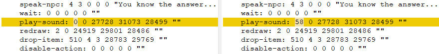
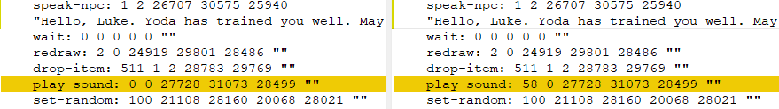
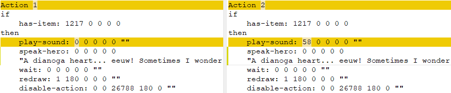

Star Wars - Yoda Stories (USA) (10.08.1998) & Behind The Magic - Vehicles Special Edition
=========================================================================================

* Region: `USA` (most likely Canada)
* Language: `English`
* Publisher: [`LucasArts Entertainment Company`](https://web.archive.org/web/19980214042448/http://www.lucasarts.com/org_index.html)
* Release date: `summer 1998`
* ESRB Rating: `E: Everyone`
* UPC, MPN: `0 23272 31118 6`
* Price: $39.95 (for a 6-disc collection)
* Version: `1.2`

Part of `The LucasArts Archives Vol. IV: Star Wars Collection II`.

[](images/cover/lucas-arts-archives-iv-box-front.jpg)
[](images/cover/lucas-arts-archives-iv-box-back.jpg)
[](images/cover/lucas-arts-archives-iv-disk-front-yoda-stories.jpg)

A year ago, the game was rated `K-A`, and now its more modern counterpart `E` is used.

Implemented all fixes that were available in `Patch 6` a year earlier.

**Disk:**

* Recording date: `10.08.1998 14:57:40`
* Volume Space Size (LBA): `123484`
* Volume Identifier: `YODA`
* Serial number: `8061834`
* Mastering code: `8061834 Technicolor C2 132045-01 IFPI L892`

**Disc content:**

* `Star Wars: Yoda Stories (USA) (Rerelease)`
* `Behind The Magic: Vehicles Special Edition (USA) (1.0) (28.07.1998)`
* Themed cursors, icons, wallpapers and sound effects for Windows.
* `DirectX 5.2`

**Key files:**

* `YODESK.DTA`: full match `Patch 6`
* `YODESK.EXE`: identical to "version" `1.1`
* `YODESK.HLP`: updated help file

**New files that do not affect gameplay:**

* `INSTALL\REGISTER.EXE`
* `INSTALL\WEBSITE.EXE`

**Changed files that do not affect gameplay:**

* `BITMAPS\LMMB.BMP`
* `BITMAPS\LMMY.BMP`
* `BITMAPS\SCREEN.BMP`
* `INSTALL\SETUP.INS`
* `YODESK.GID`

Changes in the help file and pictures are related to the fact that
that `Making Magic` has been replaced by a more modern encyclopedia.


Behind The Magic - Vehicles Special Edition
-------------------------------------------

This is just part of an interactive encyclopedia of the Star Wars universe.
200 megabytes of vehicle data.

The Complete Encyclopedia `Star Wars: Behind the Magic` is the definitive multimedia guide to Star Wars,
both from the films in the original trilogy and beyond.

Seven other equally extensive thematic modules are available:
* Characters (main characters, aliens and various creatures, groups and organizations);
* Even more technologies (weapons and devices);
* Behind the scenes (about the filmmakers, the filming process and companies);
* Events (full timeline);
* Locations and the expanded universe (toys, collectibles and other additions).

The complete collection also includes previews of the upcoming `Star Wars: Episode I `movie,
as well as the "Glossary" section, various quizzes and questionnaires.

System requirements: Windows 95/98 with DirectX 5.2, Pentium 133, 16MB RAM and 4x CD-ROM.
But the developers are hinting that the encyclopedia can work even in MS-DOS!
 
The full version of `Star Wars: Behind the Magic`, released in the fall of 1998,
comes bundled with DirectX 6.0 and occupies 2 disks:

* Version: `31.08.1998`
* Recording date of the disc: `02.09.1998 11:40:22`

USA 1.2 vs 1.1
--------------

* Fixes have been declared for the following zones: `72, 236, 407, 473, 474, 572`.
* The following zones have actually been fixed    : `72, 236, 266, 267, 271, 407, 472, 572`.

Differences found in: `Tiles`, `Zones`, `Characters`.

**Tile 1543**:

The fix is pretty funny, check it out for yourself.
Below are the tiles - original, corrected and difference.

  

```CGW SUCKS!```

Easter egg?

We are talking about the Computer Gaming World magazine, which probably got their hands on a demo version of the game.
In the July 1997 issue, the game received only 1 out of 5 stars ([see page 190](https://www.cgwmuseum.org/galleries/issues/cgw_156.pdf)).

    "The dull side of the Force wins in LucasArts' new desktop adventure."

One thing is confusing - how did one of the LucasArts employees find out about this February verdict?

**Zones 409, 445, 526, 567, 595**: slight difference under the bunker door (see pink dots).

Graphical changes related to tile `1543`.


**Characters**: changes in the unused part of the character names.
This value has a fixed length of 16, that is,
the maximum name length is 15, and the last byte is 0x00.
If the length of the character's name is less than 15, then unused data looks out.
They are ordered and are probably some kind of overwritten data structure. Examples:

```
1F440002000000 804CBE00 -> 1F440002000000 0072BE00
1F440002000000 304DBE00 -> 1F440002000000 B072BE00
```

In the demo version of the game, by the way, the address is much smaller, for example: `207ABD00`.

The only thing that can be added is that the distances between these offsets is 0xB0 (176).
Given that one Character record is 84 bytes long.


**Zone 72**: Action 14: +1 instruction


The NPC drops the quest item at [10, 12].


**Zone 236**: There was a problem with the hotspot on the transport, apparently, it was not possible to take the item.


**Zone 266**: New Action 1:


When the zone has not yet been initialized, the Mystery theme music plays. This, and two subsequent locations
Yoda shows Luke every 5 wins. After completing the quest, the young Jedi becomes stronger.

```
if
    zone-not-initialised
then
    play-sound: 60
```

Action 14 (15):

Play `Flourish` theme song.



**Zone 267**: New Action 0:


When the zone has not yet been initialized, the `Mystery` theme music plays.

```
if
    zone-not-initialised
then
    play-sound: 60
```

Action 9 (10): 

Fixed sound here: `Hello, Luke. Yoda has trained you well. May the FORCE be with you...!`

Play `Flourish` theme song.


	
**Zone 271**: New Action 0:


Correction of sounds again (`Empire` theme).

```
if
    zone-not-initialised
then
    play-sound: 60
```

Action 1 (2) - `play-sound 58` (`Flourish` theme).

`A dianoga heart... eeuw! Sometimes I wonder about old Yoda!"`



**Zone 407**: Small graphics errors


This is where the ice placement logic works until the zone has not yet been initialized.


Three permutations of tiles at the top of the map:

* [1; 3]: [678, 65535, 1248] -> [678, 681, 65535]
* [1; 4]: [678, 65535, 1248] -> [678, 681, 65535]
* [2; 5]: [678, 681, 65535] -> [2; 5]: [678, 65535, 1248]

There are no visual differences, as these tiles are identical.
Another thing is important - 2 obstacles appeared in the invisible part of the map, and one removed.

**Zone 472**: a lot of fixes


This is a complex map, and a decent amount of errors and flaws crept into its work.
There is a bold assumption that not all errors have been found so far.
It is worth writing a script interpreter to be sure of this.

Action 6 is now numbered 3.

Actions 3, 4: depending on certain conditions, a tile with a crack is placed on the map: 


A lot of new actions:

```
Action 6
if
    zone-entered
    is-variable: 1 16 4 0
then
    set-sector-counter: 1

Action 7
if
    zone-entered
    is-variable: 2 16 4 0
then
    set-sector-counter: 2

Action 8
if
    zone-entered
    is-variable: 3 16 4 0
then
    set-sector-counter: 3

Action 9
if
    zone-entered
    is-variable: 4 16 4 0
then
    set-sector-counter: 4

Action 10
if
    zone-entered
    is-variable: 5 16 4 0
then
    set-sector-counter: 5

Action 11
if
    zone-entered
    is-variable: 6 16 4 0
then
    set-sector-counter: 6

Action 12
if
    zone-entered
    is-variable: 7 16 4 0
then
    set-sector-counter: 7

Action 13
if
    zone-entered
    sector-counter-is: 1
    is-variable: 0 16 4 0
then
    set-variable: 16 4 0 1

Action 14
if
    zone-entered
    sector-counter-is: 2
    is-variable: 0 16 4 0
then
    set-variable: 16 4 0 2

Action 15
if
    zone-entered
    sector-counter-is: 3
    is-variable: 0 16 4 0
then
    set-variable: 16 4 0 3

Action 16
if
    zone-entered
    sector-counter-is: 4
    is-variable: 0 16 4 0
then
    set-variable: 16 4 0 4

Action 17
if
    zone-entered
    sector-counter-is: 5
    is-variable: 0 16 4 0
then
    set-variable: 16 4 0 5

Action 18
if
    zone-entered
    sector-counter-is: 6
    is-variable: 0 16 4 0
then
    set-variable: 16 4 0 6

Action 19
if
    zone-entered
    sector-counter-is: 7
    is-variable: 0 16 4 0
then
    set-variable: 16 4 0 7

Action 20
if
    zone-entered
    has-item: 1280
then
    set-variable: 17 17 0 2
    set-tile-needs-display: 17 17
```

There were 85 actions in total. It's not the most interactive map in the game, but it's not the easiest either.

**Zone 572**: Fixed two hotspots


This wooded area also became a source of errors when it was not possible to get a quest item.


### Sound usage statistic

* `0` (schwing.wav): 493 (-3)
* `58` (flourish.wav): 79 (+3)
* `60` (mystery.wav): 26 (+3)
